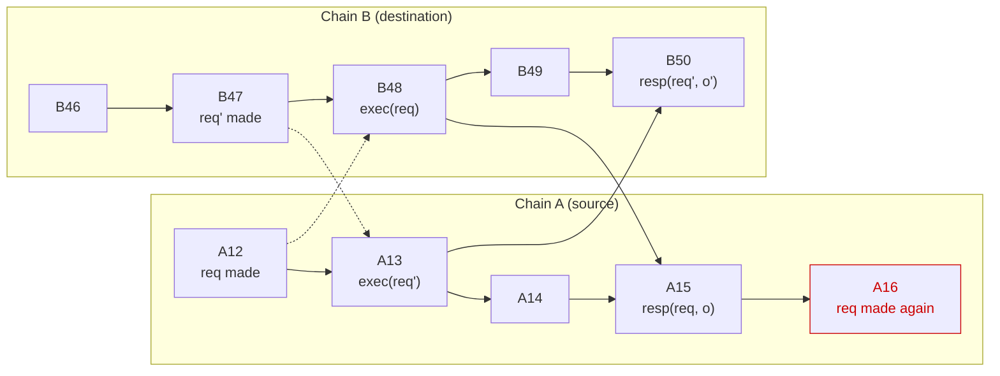

# Bidirectional calls: entities, API, properties

## TL;DR

A contract on the source chain asks for a transaction to be signed and
executed on a destination chain, and gets at most one response. The
response is final when it comes: the transaction executed, it reverted, or
it can never execute. Until then nothing arrives, and a transaction that
never executes is never answered. The rest of the document is what the
MPC, the signet contract and the library have to do for that to hold.

Organization:

* Section 1 names the entities and walks through the happy path.
* Section 2 defines the terms.
* Section 3 states what the application gets and what is assumed of the
  chains.
* Section 4 describes the library, signet contract and MPC nodes.
* Section 5 argues that Section 4 delivers Section 3.
* Section 6 collects notes: limits of the design and what is still open.

## 1. Entities and happy path

* *Source chain*: where the application contract lives and where requests,
  signatures and responses are published.
* *Destination chain*: where the signed transaction executes. One contract
  may use several.
* *Application contract*: the contract a developer writes on the source
  chain. "The contract" below means this one.
* *Library*: code we ship, embedded in the application contract. Everything
  in Sections 4.1 and 4.2 runs inside the application contract's own
  transactions and storage. A contract that bypasses the library is on its
  own.
* *Signet contract*: our contract on the source chain, through which
  requests, signatures and responses are published. It holds no per-
  application state.
* *MPC network*: the nodes that sign and attest.
* *Broadcaster*: whoever submits the signed transaction to the destination
  chain. Untrusted; the design does not depend on who it is.

Happy path:

1. The application contract calls the library, which records the request
   and asks the signet contract to emit it.
2. The MPC signs the transaction, publishes the signature on the source
   chain, and starts looking for the transaction on the destination chain.
3. Any entity can broadcast the signed transaction to the destination chain.
4. When the transaction is in a final destination block, the MPC attests
   the outcome and publishes the attestation to the signet contract.
5. Once delivered to the application contract, the library accepts or drops
   it, and on acceptance runs the contract's response handler.

## 2. Vocabulary

* *Transaction*: the bytes of an unsigned destination-chain transaction.
* *Transaction ID*: the identifier under which the destination chain records
  a submitted transaction, computable from the transaction and the signature
  in the encoding that chain accepts. One transaction can be signed more
  than once, for instance by two signing rounds for one request (Section
  4.4), and each signature gives a different transaction ID. Replay
  protection (Section 3.3) lets at most one of them execute, and all of
  them belong to the same request.
* *Request*: what the contract asks for, the tuple (tx, dest, key, schemas):
  the transaction, its destination chain, the key parameters to sign it
  with (a derivation path, key version and signing scheme), and the schemas
  for decoding its output and encoding the response. Written `req`, with
  fields `req.tx`, `req.dest`, `req.key` and `req.schemas`. A request is
  *made* when the contract passes it to `sign_bidirectional` (Section 3.1).
  The same tuple can be made again, and then it is the same request.
* *Request ID*: rid(contract, req.tx, req.dest, req.key), a collision-
  resistant hash in a length-committing encoding, so within one source
  chain two requests have the same rid exactly when they agree on all four.
  The key version is part of req.key, so it is in the rid. One rid names
  one execution, and one execution names one rid: the executed transaction
  gives tx and dest, and its sender address gives the contract and key
  parameters, since different ones derive different addresses (Section 5).
  Two things keep that a one-to-one mapping. Leaving the schemas out of
  the hash is necessary: they are the only part of a request that does not
  change the execution, so they are the only way two requests for one
  execution could get two rids; with them in, both would be outstanding
  and signed, and the single execution would be attested twice. Canonical
  key parameters make it sufficient: otherwise two encodings of one key
  would be two rids for one execution.
* *Outcome*: a pair (kind, data), with three kinds.

  | kind | what happened to req.tx | data |
  |---|---|---|
  | Executed | included in a final destination block, succeeded, and its return data decodes against req.schemas | the decoded return data |
  | Failed | included in a final destination block and reverted | empty |
  | Unviable | can never be included, because a different transaction from the same key has already used up its replay protection (Section 3.3) | empty |

  Empty data is a zero-length field; the kind is the whole information.
  Every outcome is final: once req.tx has executed or its replay protection is
  used up, no later block changes that. A transaction can become unviable in
  other ways on some chains, an expiry height or a timebound; the MPC detects
  only the replay-protection case, and that one best-effort (Section 4.4).
  An expired transaction goes unanswered, as does one nobody broadcasts.

  A transaction that succeeded but whose return data does not decode
  against req.schemas, because the schema is wrong or the destination
  contract changed its return type, has no outcome. The MPC reports
  nothing, drops the request and logs why (Section 4.4). A node
  cannot tell a wrong schema from a changed contract, and the contract
  could not act on bytes it cannot decode.
* *Attestation key*: a signing key the MPC derives from its root key, the
  source chain, the contract, a reserved path and the request's key version,
  used for nothing but attestations to that contract.
* *Attestation*: a statement (rid, height, outcome) signed with the
  attestation key of rid's contract at the request's key version, each field
  length-committed. `height` is the height, in the destination chain's own
  numbering (a slot on Solana), of the final block that holds the transaction
  the outcome describes: req.tx for Executed and Failed, the transaction that
  used up its replay protection for Unviable.
* *Response*: an attestation delivered to the contract that made rid's
  request.

How a request ends, as seen by the application contract:

* *Refused*: the library rejects it inside `sign_bidirectional`, and the
  caller learns it from the return value.
* *Accepted*: the library takes a response as the answer to the request,
  removes the request and runs the contract's response handler (Section
  3.1). A response the library does not accept is dropped without a trace:
  there is no rejected ending, and the contract is not told.
* *Unanswered*: no response is ever accepted, because none is ever
  published (the transaction never executes, its output does not decode,
  or the MPC did not admit the request) or because every published one is
  dropped.

A request is *outstanding* from the moment it is made until a response to
it is accepted; the library records it as an entry in `outstanding`
(Section 4.1). An unanswered request is outstanding forever, and from
inside the contract this is indistinguishable from a response that has not
arrived yet. Making it again is refused while it is outstanding (Section
4.1), so a retry needs a different transaction. Nor may a request be made
again once it was answered: its execution happens-before the second
making, so the causal-order guarantee (Section 3.2) forbids answering it,
and the library cannot refuse it without remembering every answered rid.
The application has to keep that rule.

*Happens-before*, for one application contract, is the smallest transitive
relation with these edges:

* on one chain, an earlier block, transaction or step within a transaction
  happens-before a later one;
* across chains, a destination block happens-before the source transaction
  in which this contract accepts a response attesting that block.

Nothing else is an edge. A request being made does not happen-before its
execution, a dropped response adds no edge, and another contract's
acceptance adds none for this contract. Destination state reaches this
contract only through the responses it accepts, and the causal-order
guarantee in Section 3.2 is a promise about that channel.

## 3. API and guarantees

### 3.1 API offered to the application contract

```
sign_bidirectional(
    transaction: SerializedTransaction,
    destination: ChainId,
    key:         (DerivationPath, KeyVersion, SigningScheme),
    schemas:     (OutputDeserialization, ResponseSerialization),
) -> RequestId | Refused
// the four arguments together are the request, written req below

// implemented by the application contract, called by the library
on_response(rid: RequestId, outcome: (kind, data))
```

The application configures the library with its attestation public key
(Section 2) and adds each new key version (Section 4).

The transaction is passed in full rather than as a commitment. On EVM the
transaction ID is computable only from the bytes and the signature. Where
the bytes travel, call data or an event, is a cost question this design does
not settle.

### 3.2 Guarantees

G1 to G3 are safety, G4 is liveness. G2 and G4 together give "exactly one
accepted response per request that meets G4's premise".

* G1 Causal order: an accepted response to req reports destination state
  that does not happen-before req was made.
* G2 At-most-once: for each execution, at most one response reporting it
  as the outcome of its own transaction is ever accepted, however often its
  request is made and however often it is attested. All attestations of one
  execution carry one rid (Section 2), so this is a statement about that
  rid.
* G3 Integrity and finality: an accepted response to req carries the true,
  final outcome of req.tx, never of another transaction.
* G4 Delivery: if req.tx is included in a final destination block, whether
  it succeeded or reverted, under a signature the MPC issued and published
  for this making of req, and its return data, if any, decodes against
  req.schemas, then a response to req is eventually accepted.

Nothing is promised for a transaction that never executes, for an execution
whose return data does not decode, for a request the MPC does not admit
(both Section 4.4), or for a request made again after its transaction ran
(Section 2). Reporting any of them needs machinery the rest of this design
does without. G1 and G2 have one transitional exception, after the library
upgrade that introduces last_seen (Section 4.1).

### 3.3 Assumptions

* Finality. A block the MPC treats as final stays in the chain. The MPC
  reads requests and attests outcomes only from such blocks.
* Replay protection. Executing a transaction uses up its replay protection:
  the account nonce on EVM, the spent output on a UTXO chain,
  the durable nonce on Solana. Each can be used up only once, and a
  transaction whose replay protection is used up can never execute. So the
  same bytes, however often they are signed, execute at most once, and a
  different transaction using the same nonce or output blocks ours for
  good. A Solana transaction with a recent blockhash has no such
  protection; see Section 6.
* Progress. All source and destination chains keep producing final blocks.
  An outage delays delivery and changes nothing else.
* One id per chain. Two different chain ids the MPC accepts never name the
  same chain. Otherwise the same transaction could be made once under each
  id: two rids and two entries for one execution, with last_seen split
  between the ids.

## 4. Pseudocode and properties per entity

Each entity is an event handler over its own state. `drop` means the event
has no effect. The library keeps the attestation key of every key version
it has been given, and each entry records the key version its request
named; a response is verified only under that key, so a key version
cannot answer requests made under another. A key version may change the
root key or only the derivation path; a resharing changes neither, so it
keeps the key version.

### 4.1 Library (inside the application contract)

```
state (per application contract):
    attestation_key: KeyVersion -> PublicKey   // Section 3.1
    last_seen:   ChainId -> Height       // 0 for every chain, see below
    outstanding: RequestId -> Entry
    Entry = { dest: ChainId, known: Height, key_version: KeyVersion }
    // a rid is a hash and cannot yield dest or key_version

on sign_bidirectional(req) from the application logic:
    rid = request_id(self, req)
    if rid in outstanding:                                // C1
        return Refused
    outstanding[rid] = { req.dest, known: last_seen[req.dest],   // C2
                         req.key.key_version }
    signet.sign_bidirectional(rid, req)
    return rid

on response(rid, att = (kind, height, data), sig):
    if rid not in outstanding:                          // C3a
        drop
    e = outstanding[rid]
    if not verify(sig, H(rid || att),                   // C3b
                  attestation_key[e.key_version]):
        drop
    if height <= e.known:                               // C3c
        drop
    last_seen[e.dest] = max(last_seen[e.dest], height)  // C3d
    delete outstanding[rid]                             // C4
    self.on_response(rid, (kind, data))
```

The check is here and not in the MPC because the nodes have no agreed
mapping between source and destination heights, so no node can say what the
destination looked like when a request was made; the contract can, from the
responses it has accepted. On chains where `response` and the
application's handler run in one transaction, a failing handler reverts
the whole transaction, C3d and C4 included: the entry stays outstanding and
the same response can be delivered again (Section 6).

last_seen starts at 0 for every destination, and so does `known` for any
entry already outstanding when a contract upgrades to this design. Until
an acceptance raises last_seen[dest] above every execution from before the
upgrade, G1 and G2 are suspended for that destination: a request made
again for a transaction that executed before the upgrade can accept a
replay of its old response. A start height supplied by an operator would
avoid that, but set too high it drops every execution at or below it for
good (C4).

The library relies on its state surviving contract upgrades and
migrations: a contract that keeps its key and loses `outstanding` and
`last_seen` will accept a response to a request it already answered
when a request with a rid used earlier is made again.
It also relies on every published response eventually reaching `response`.
Who delivers it is in Section 4.2 for Midnight and 4.3 elsewhere.

Properties:

* C1 A request is refused while an entry with the same rid is outstanding.
* C2 Every outstanding entry records last_seen[dest] at creation.
* C3 A response is accepted only if it verifies, an entry for its rid is
  outstanding, and its height is strictly above that entry's recorded
  height. Acceptance raises last_seen to at least that height.
* C4 Entries are removed by acceptance only. No timers.

### 4.2 Library on Midnight: inbox and processing

Midnight has two programming languages, Compact and Impact.

Compact generates a proof against a snapshot of the contract's state and
fails at inclusion if any state it read has changed; it then issues Impact
instructions to change the state of the ledger. Some of our circuits take
30 seconds to prove. Section 4.1 reads last_seen on every request (C2) and
writes it on every response (C3d), so a response landing while a request is
being proven fails that request, and the contract handles at most one
message per proving time.

Impact runs on the tip of the chain and is a simple stack machine.

To avoid this, ordering and processing are separated:

First we put the request, or validated response, into the inbox/outbox, as
a Compact call.

We then issue Impact ops which stamp with and update the last seen on these
requests/responses.

```
case message of
    Request(rid, dest) =>
        outstanding[rid].known <- copy last_seen[dest]
    Response(rid, chain_id, height, outcome, sig) =>
        last_seen[chain_id] <- max height last_seen[chain_id]
```

We then emit the sign_bidirectional request, or process the response.

* A request is made, in the sense of C2, when it is processed rather than
  enqueued, so its known height is last_seen at processing time. A Request
  message carries the application's continuation, which runs then with the
  return value of sign_bidirectional, Refused included: this is where a
  Midnight caller learns of a refusal.

What must hold is that every message enters through the inbox, is processed
exactly once, and that `process` touches only the entries it deletes.

Property:

* C5 On Midnight, requests and responses are enqueued without touching
  shared state and processed in one total order; C1 to C4 hold for the
  processed sequence.

### 4.3 Signet contract (per source chain)

It holds no per-application state, verifies nothing, and anyone may call
it. It records the caller of `sign_bidirectional` as `contract` in the
event it emits, which is all that `authentic` in Section 4.4 rests on. It
emits three events:

* `SignRequest { contract, rid, req }`, when a contract asks for a
  signature.
* `Signature { rid, signature }`, when a signature is published, for the
  broadcaster and for nodes that were not in the signing round.
* `Response { contract, rid, att, sig }`, when an attestation is published.
  Where the chain allows it, the contract's `response` handler is called in
  the same transaction, with a bounded gas allowance, since it runs on the
  MPC's gas, and without letting its failure suppress the event. The
  library verifies what it receives (C3), so anyone may call `response`
  directly, which is how a response is delivered where the signet contract
  cannot call it, and again after a failed handler.

### 4.4 MPC network

Written as if the network were one process; the real one is a threshold
protocol whose result is what this process outputs, and Section 5 says what
that rests on. The state below is per source chain, so a rid from one chain
never meets a rid from another.

```
authentic(contract, rid, req): bool
    the request provably comes from `contract`, and rid recomputes from it

processable(req): bool
    req.dest parses to a chain this MPC can watch
    key derivation is valid: parameters canonical, key derivable for the
      source chain, path not the attestation key's
    req.tx is non-empty, parses as an unsigned transaction in dest's
      format, commits to dest (EVM: carries its chain id), and attaching
      any signature yields a well-formed signed transaction
    req.schemas are valid for dest and source chain respectively

state:
    tracked: RequestId -> Entry
    Entry = { req, contract, signatures: Set<Signature>, attestation? }
    // a set: a second signature for one request is a second
    // transaction ID to watch (see below)

on SignRequest { contract, rid, req } finalised on the source chain:
    if not authentic(contract, rid, req):                 // M1
        drop
    if rid in tracked or not processable(req):            // M4
        drop
    tracked[rid] = { req, contract, signatures: {} }
    signature = threshold_sign(req.tx, derived_key(contract, req.key))   // M1
    tracked[rid].signatures.add(signature)
    publish_signature(rid, signature)

on Signature { rid, signature } finalised on the source chain:
    e = tracked[rid] if rid in tracked
    if e and signature verifies over e.req.tx
      under derived_key(e.contract, e.req.key):
        e.signatures.add(signature)

on destination block at height h finalised on chain dest:
    for (rid, e) in tracked for dest and no e.attestation:
        ours = { txid(s, e.req.tx) for s in e.signatures }
        account = derived_address(e.contract, e.req.key)
        if some id in ours has a receipt r in a final block at height h',
          this block or any earlier one,                            // M3
          or this block holds a transaction sent by account with
          receipt r whose unsigned bytes are e.req.tx, with h' = h:
            if decode(r, e.req.schemas) gives (kind, data):
                attest(rid, (kind, h', data))
            else:
                delete tracked[rid], log why                // M5
        else if this block holds a transaction sent by account that uses
          up e.req.tx's replay protection and whose unsigned bytes are not
          e.req.tx:
            attest(rid, (Unviable, h, empty))               // M6

attest(rid, att):
    e = tracked[rid]
    e.attestation = att
    sig = threshold_sign(H(rid || att), attestation_key(e.contract))     // M2
    publish_response(e.contract, rid, att, sig)

on Response { contract, rid, att, sig } finalised on the source chain:
    if sig verifies under attestation_key(contract):
        delete tracked[rid]
```

The MPC looks for a request's execution in two ways. (i) By transaction ID,
under every signature it holds for the request, in any final block, so a
node that starts looking late still finds it. There can be several
signatures, for instance when a node whose share went into one run
restarts and joins another, and replay protection lets at most one of them
execute. And (ii) in the block being processed, by sender and unsigned bytes:
the sender is the request's own account, which only the network controls,
and the bytes alone would not do, since another contract or key may have
requested the same bytes.

(ii) is an optimisation. A node that was not in the signing
round does not know the signature until the `Signature` event is published
on the source chain and indexed, and the attestation may need such nodes
when some participants of the round are faulty. The block scan lets them
attest from the destination block alone, so the attestation does not wait
on the source chain.

Unviable is detected only in the blocks being processed after admission,
So replay protection used up soon after the request is made may be seen
by fewer than t nodes: Unviable is best-effort.

A node keeps `tracked` and its position on every chain durably, advances
the position only once an event's effects are persisted, and resumes from
it, so no block is skipped and a restart repeats at most the step in
progress. A repeated attestation has the same content (Section 5) and is
dropped (C3a).

A request made again after it was answered (Section 2) is signed again, or
dropped as still tracked. Its transaction cannot execute again, and the
old execution is under another signature in a past block, so no lookup
matches: the entry stays tracked forever, as does the library's.

Properties:

* M1 The MPC signs a request only if it provably comes from the contract it
  names, with a key derived from that contract. The attestation key is
  derived from the contract, its source chain and the request's key version
  under a reserved path that no request on any signing API may name
  (`processable` covers this one); otherwise a contract could have its own
  attestation key sign an arbitrary hash and forge a response to itself.
* M2 An attestation binds rid, kind, height and data as separate
  length-committed fields, and describes only destination state final at
  that height.
* M3 The MPC attests an outcome only from a transaction in a final block
  sent by the request's own account, which only the network controls: the
  receipt of one whose unsigned bytes are req.tx, or, for Unviable, one
  whose unsigned bytes are not req.tx and that used up req.tx's replay
  protection. Nothing else.
* M4 The MPC drops a request that is not authentic, that it cannot process,
  or whose rid is still tracked, and keeps no new state for it. A rid still
  tracked is the same transaction, already being watched, so nothing is
  lost.
* M5 An execution whose return data does not decode is not attested, and
  the MPC drops the request.
* M6 Unviable is attested only from a block a node processed after
  admitting the request, so replay protection used up before that is not
  reported.

## 5. Why the guarantees hold (sketch)

The sketches treat the MPC as one process, as Section 4.4 writes it. Three
properties of the network make that legitimate. None is specific to this
design.

* Threshold (Section 2 of protocol_properties.md). Fewer than t nodes cannot
  produce a signature or an attestation, honest nodes alone can, and honest
  nodes eventually publish what they produce.
* Agreement. Honest nodes admit the same requests and compute the same
  attestation for a rid, as a function of final destination state and the
  request's schemas only.
* Distinct keys (ACCOUNT_DERIVATION.md). The derivation path contains the
  source chain and the requesting contract, so different (source chain,
  contract, key parameters) derive different keys, and the sender of an
  executed transaction tells the MPC which contract and key parameters
  asked for it. Assumed here: the attestation key sits on a path no request
  may name, and two signing schemes never share a key.

* G1, in short: an execution this contract has already accepted is at or below
  last_seen, so a request made later records it as known and C3c drops any
  response about it. In full: an accepted response to req describes a
  destination block at height h (M2) with h > e.known (C3c). Suppose that
  block happens-before the making of req. The only edges into the source chain
  are this contract's acceptances, so the path runs along the destination
  chain to a block at height h'' >= h, from there to the transaction in which
  this contract accepted a response attesting h'', and along the source chain
  to the making of req. That acceptance raised last_seen[dest] to at least h''
  (C3d) before req recorded it (C2; C3d runs before the handler), so e.known
  >= h and C3c drops the response. Contradiction. The diagram shows the case
  where the accepted response answered an earlier making of the same request.



Caption: Solid arrows are happens-before for the two contracts involved,
one on each chain; dashed arrows are cross-chain requests, which are
deliberately not part of the relation. The second making of req at A16 has
a path from B48 through A15; the first at A12 has none.

* G2, in short: one execution has one rid, so a second entry for it was
  created after the first acceptance and records a height at or above the
  execution. In full: suppose two responses reporting the same execution
  (height h) are accepted by entries e1 and e2. An accepted response is for a
  rid the MPC admitted (C3b), so its key parameters are canonical (M4) and its
  dest names one chain (Section 3.3). Both then carry the same rid: the
  execution fixes the transaction and the destination, and its sender fixes
  the contract and key (distinct keys, above). By C1 they were not outstanding
  together, so e2 was created after e1 was removed, after the first
  acceptance. By C3d last_seen[dest] was already at least h then, so by C2
  e2.known >= h, and C3c drops the second response. Contradiction. The
  execution itself happening at most once is the replay-protection assumption,
  not something the library enforces.

* G3: the attestation key binds the source chain and the contract (M1), the
  attestation binds the rid (M2), the rid binds the transaction (a length-
  committing hash), and the MPC reports only the receipt of a transaction
  with req.tx's bytes from req.tx's account (M3). So the reported receipt
  is req.tx's own, and final (M2, finality assumption). For Unviable, M3
  and M6 report a transaction from req.tx's account using up req.tx's
  replay protection, which blocks req.tx for good (Section 3.3).

* G4, in three steps.
  1. The execution is above e.known: the signature was issued after this
     making of req was final (Section 4.4, signing follows the finalised
     SignRequest), and e.known is a height some accepted response attested
     before req was made (C2, C3d), hence final by then (M2).
  2. It is attested: the MPC finds the execution by its transaction ID or
     in its own block (M3), whenever it started looking; the return data
     decodes (G4's premise), so M5 does not apply; and honest nodes compute
     the same attestation and publish it (threshold and agreement, above).
  3. It is accepted: by C4 the entry is still outstanding unless a
     response for the rid of req was accepted first, and any such response
     reports this execution too, since at most one signature executes and
     no Unviable can follow an execution (replay protection, Section 3.3),
     and M3 attests only that receipt. So a response reporting the
     execution passes C3 and is accepted.

## 6. Notes

* Solana with a recent blockhash has no replay protection in the sense of
  Section 3.3. It can be made to work if the MPC remembers completed rids
  for as long as a differently signed copy could still execute, about a
  minute.
* Unviability by expiry. A transaction that expires by height or timebound
  never executes and uses up no replay protection, so nothing in Section
  4.4 notices, and the request stays outstanding on both sides. Reporting it
  needs a per-chain expiry rule and a block to attest it at.
* Agreement has no enforcement point. A change to `authentic`,
  `processable` or the attestation function must apply only to requests
  made at or after a source height the upgrade names; applied to requests
  in flight, it leaves them unanswered. Nothing in a request names the
  function version, so a misconfigured node splits the network silently.
* A failing `on_response`. The entry stays outstanding and the MPC has
  closed the request (Section 4.3), so the re-delivery is anyone calling
  `response` again. On Midnight a handler that always fails blocks every
  `process` batch carrying its message, so `process` has to isolate
  handler failures. Removing the entry before the handler runs is not an
  alternative, since C3a would then drop the re-delivery.
* A dropped request strands its rid. After M4 or M5 the MPC keeps nothing
  while the library's entry stays outstanding, so C1 refuses that rid for
  good and the application can only retry with a different transaction.
* A key version can be retired only once no entry that recorded it is
  outstanding, and an unanswered request is outstanding forever. Until
  then a compromised key can forge responses to the requests made under
  it, and to no others (C3b).
* `tracked` and `outstanding` can grow without bound. An entry lives until a
  verified Response, and a request whose signature nobody broadcasts never
  produces one. A cancel transaction that uses up the replay protection
  ends the MPC's entry when enough nodes see it (M6), and the library's
  when that is attested, so an application has a way out, but nothing
  bounds the entries nobody clears. Checking old entries less often bounds
  the work per block, which is the part that matters.


## 7. Canonical Protocol Structures

The Midnight protocol structures are the canonical structures.

### Request Id

```compact
new type RequestIdV1 = Bytes<32>;
```

### Sign Bidirectional Event

```compact
struct SignBidirectionalEventV1<TxParams, #LenOutputDeserialization, #LenRespondSerialization> {
  // hashed into the request id
  keyVersion: Uint<8>;
  sender: ContractAddress;
  path: Bytes<32>;
  algo: MPCSignatureAlgorithm;
  txParamType: TxParamType;       // which transaction type
  txParams: TxParams;             // the transaction parameters
  executionDest: Bytes<32>;       // CAIP-2 id of the destination chain

  // not hashed into the request id
  signatureDest: MPCDestination;  // where signatures and response attestations are posted
  params: Bytes<64>;
  outputDeserializationSchema: Bytes<LenOutputDeserialization>;
  respondSerializationSchema: Bytes<LenRespondSerialization>;
}
```

#### Request Id

```compact
struct RequestIdPreimageV1<TxParams> {
  keyVersion: Uint<8>;
  sender: ContractAddress;
  path: Bytes<32>;
  algo: MPCSignatureAlgorithm;
  txParamType: TxParamType;
  txParams: TxParams;
  executionDest: Bytes<32>;
}

pure circuit calculateRequestIdV1<TxParams, #LenOutputDeserialization, #LenRespondSerialization>(
    request: SignBidirectionalEventV1<TxParams, LenOutputDeserialization, LenRespondSerialization>
): RequestIdV1 {
    const preimage = RequestIdPreimageV1<TxParams> {
      keyVersion: request.keyVersion,
      sender: request.sender,
      path: request.path,
      algo: request.algo,
      txParamType: request.txParamType,
      txParams: request.txParams,
      executionDest: request.executionDest,
    };

    return upgradeFromTransient(transientHash<RequestIdPreimageV1<TxParams>>(preimage)) as RequestIdV1;
}
```

### Signature Responded Event

```compact
struct SignatureRespondedEventV1 {
    requestId: RequestIdV1;
    signature: Signature;
}
```

### Respond Bidirectional Event

```compact
export enum OutputKindV1 {
  executed,
  failed,
  unviable
}

struct RespondBidirectionalEventV1 {
    requestId: RequestIdV1;
    blockHeight: Uint<64>;
    outputKind: OutputKindV1;
    serializedOutputLength: Uint<64>;
    digest: Bytes<32>; // output of calculateSignetAttestationDigestV1
    signature: Signature;
}
```

#### Response Attestation

```compact
pure circuit calculateSignetAttestationDigestV1<#serializedOutputLength>(
    requestId: RequestIdV1,
    blockHeight: Uint<64>,
    outputKind: OutputKindV1,
    serializedOutput: Bytes<serializedOutputLength>,
): Bytes<32> {
  return upgradeFromTransient(transientHash<[
      RequestIdV1,
      Uint<64>,
      OutputKindV1,
      Uint<64>,
      Bytes<serializedOutputLength>,
    ]>([
      requestId,
      blockHeight,
      outputKind,
      serializedOutputLength as Uint<64>,
      serializedOutput,
  ]));
}
```