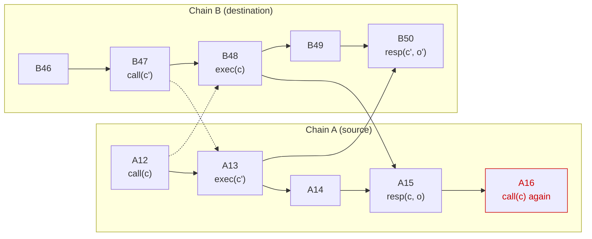

# Bidirectional calls: entities, API, properties

## TL;DR

A contract on the source chain makes an asynchronous call to a destination
chain, and gets at most one response. The response is final when it comes:
the call executed, it reverted, or it can never execute. Until then nothing
arrives, and a call that never executes is never answered. The rest of the
document is what the MPC, the signet contract and the library have to do
for that to hold.

## 1. Entities and Happy Path

* *Application contract*: the contract a developer writes on the source
  chain. "The contract" below means this one.
* *Library*: code we ship, embedded in the application contract. Everything
  in section 4.1 runs inside the application contract's own transactions and
  storage. A contract that bypasses the library is on its own.
* *Signet contract*: our contract on the source chain, through which
  requests, signatures and responses are published. It holds no per-
  application state.
* *MPC network*: the nodes that sign and attest.
* *Broadcaster*: whoever submits the signed transaction to the destination
  chain. Untrusted; the design does not depend on who it is.

Happy path:

1. The application contract calls the library, which records the call and
   asks the signet contract to emit a sign request.
2. The MPC signs the transaction, publishes the signature on the source
   chain, and starts looking for the transaction on the destination chain.
3. Any entity can broadcast the signed transaction to the destination chain.
4. When the transaction is finalised on the destination chain, the MPC
   attests the outcome and publishes the attestation to the signet contract.
5. Once delivered to the application contract, the library accepts or drops
   it, and on acceptance runs the contract's response handler.

## 2. Vocabulary

* *Transaction*: the bytes of an unsigned destination-chain transaction.
* *Transaction ID*: the identifier under which the destination chain records
  a submitted transaction, computable from the transaction and the signature
  in the encoding that chain accepts.
* *Request*: what a call asks for, the tuple (tx, dest, key, schemas): the
  transaction, its destination chain, the key parameters to sign it with,
  a derivation path, key version and signing scheme (section 3.1),
  and the schemas for decoding its output and encoding the response. Written
  `req` in the pseudocode.
* *Request ID* (rid): a collision-resistant hash over (contract, tx, dest,
  key) in a length-committing encoding, so within one source chain
  rid(a) = rid(b) exactly when a and b agree on all four. One rid names one
  execution, and by key derivation (section 3.3) one execution
  names one rid. The schemas are outside it, so that two calls for one
  transaction cannot both be outstanding. The key parameters must be
  canonical, or two rids could name one execution.
* *Outcome*: a pair (kind, data), with three kinds.
  * *Executed*: the transaction was finalised, succeeded, and its return
    data decoded against the contract's schema; data is that decoded return
    data.
  * *Failed*: the transaction was finalised and reverted; data is empty.
  * *Unviable*: a finalised transaction carrying other bytes took tx's
    nonce, so tx can never be included (section 3.3); data is empty. The
    nonce is whatever replay protection tx consumes (account nonce, spent
    output). Unlike the other two, this outcome is best-effort: section 4.4
    says when it is missed.
  * A transaction that succeeded but whose return data does not decode has
    no outcome: the MPC reports nothing.
* *Attestation key*: a signing key the MPC derives from its root key, the
  source chain, the contract, a reserved path and the request's key version,
  used for nothing but attestations to that contract.
* *Attestation*: a statement (rid, key version, height, outcome) signed
  with rid's contract's attestation key at that key version, each field
  length-committed. height is
  the height of the block that includes the transaction the outcome
  describes, attested once that block is final, in the destination chain's
  own numbering (a slot on Solana): the execution's block, or for Unviable
  the block that took the nonce.
* *Response*: an attestation delivered to its contract.

Events for a call c made by the application contract:

* call(c): the contract asks for transaction tx(c) to be signed and executed
  on destination chain dest(c), naming it rid(c). Making the same request
  again is a new call with the same rid.
* exec(c): tx(c) is included in a finalised destination block.
  height(exec(c)) is that block's height.
* resp(c, o): a response for rid(c) carrying outcome o.

How a call ends, as seen by the application contract:

* *Refused*: the library rejects call(c), and the caller learns it at once.
* *Accepted*: the contract takes a resp(c, o) as the answer to call(c) and
  runs its response handler (section 3.1).
* *Unanswered*: no response is ever accepted. A retry must be a new
  transaction: the same bytes give the same rid, which C1 refuses.

A call is *outstanding* from the moment it is made until a response to it is
accepted; the library records it as an entry in `outstanding` (section 4.1).
An unanswered call is outstanding forever, and from inside the contract this
is indistinguishable from a response that has not arrived yet.

*Happens-before*, for one application contract: the transitive closure of
two kinds of edge. On one chain, an earlier block, transaction or step
within a transaction happens-before a later one. Across chains, a
destination block happens-before the source transaction in which this
contract accepts a response attesting it. Nothing else is an edge, not a
cross-chain call, not a dropped response, not another contract's
acceptance: destination state reaches this contract only through a
response it accepts.

## 3. API and guarantees

### 3.1 API offered to the application contract

```
sign_bidirectional(
    transaction: SerializedTransaction,
    destination: ChainId,
    key:         (DerivationPath, KeyVersion, SigningScheme),
    schemas:     (OutputDeserialization, ResponseSerialization),
) -> RequestId | Refused
// the four arguments together are the request, written req below

// implemented by the application contract, called by the library
on_response(rid: RequestId, outcome: (kind, data))
```

The application configures the library with its attestation public key
(section 2) and adds each new key version (section 4).

The transaction is passed in full rather than as a commitment. On EVM the
transaction ID is computable only from the bytes and the signature. Where
the bytes travel, call data or an event, is a cost question this design does
not settle.

### 3.2 Guarantees

G1 to G3 are safety, G4 is liveness. G2 and G4 together give "exactly one
accepted response per call that meets G4's premise".

* G1 Causal order: an accepted resp(c, o) reports destination state that
  does not happen-before call(c).
* G2 At-most-once: for each execution, at most one response reporting it
  as the outcome of its own transaction is ever accepted, however many calls
  named that transaction and however many times it is attested.
* G3 Integrity and finality: an accepted resp(c, o) carries the true, final
  outcome of tx(c), never of another transaction.
* G4 Delivery: if tx(c) is finalised under a signature the MPC issued and
  published for call(c), and its return data, if any, decodes against the
  contract's schema, a resp(c, o) is eventually accepted.

After the upgrade that introduces last_seen, G1 and G2 are suspended per
destination until an acceptance raises last_seen[dest] above every earlier
execution (section 4.1).

Nothing is promised for a transaction that never executes, for an execution
whose return data does not decode (M5), or for a request the MPC refuses to
process. Reporting any of them needs machinery the rest of this design does
without.

### 3.3 Assumptions

* Chains
  * Finality: no re-orgs on source or destination chain below the finality
    criterion the MPC uses to index requests and attest outcomes.
  * Payload-level replay protection: once a transaction has executed on the
    destination chain under a key, no transaction with the same bytes executes
    again under that key, whatever signature it bears (EVM account nonce, spent
    UTXO, Solana durable nonce), and a nonce consumed by one transaction blocks
    every other that names it. Solana transactions using a recent blockhash
    do not qualify; see open points.
  * Source and destination chains eventually make progress: an outage only
    delays delivery
  * Chain identifiers are injective: two ChainIds the MPC accepts never name
    the same chain.
* Contracts and library
  * Durable contract state: the library's state (section 4.1) survives upgrades
    and migrations. A contract that keeps its key and loses this state can be
    replayed against everything it ever executed.
  * Every published response is delivered, and again if the library dropped
    it: on Midnight someone enqueues it and runs `process` (section 4.2),
    elsewhere the signet contract or anyone calls `response` (section 4.3).
    A handler that runs inside `response` may fail, since that reverts the
    acceptance; one that runs outside must not, since the entry is already
    gone.
* MPC
  * at most f of the n nodes are faulty, a signature or attestation needs a
    threshold t of participants with f < t <= n - f, so faulty nodes alone
    cannot produce one and honest nodes alone can, and honest nodes eventually
    publish. The contract sets t = floor(2n/3) + 1, which is 2f+1 at n = 3f+1.
  * Honest nodes observe the same finalised destination state, receipts and
    return data included, and compute the attestation content as the same pure
    function of what they read and the schemas, which an upgrade does not
    change for requests already made; otherwise nodes split and no
    attestation reaches the threshold. The same holds for `authentic` and
    `processable`: a request admitted by too few nodes is never attested.
  * A change to `authentic`, `processable` or the attestation function
    applies only to requests made at or after a source height the upgrade
    names; applied to requests in flight it leaves them unanswered.
  * Key derivation is collision-resistant: distinct (source chain, contract,
    key parameters) derive distinct keys, so the sender of an executed
    transaction identifies the contract and key it was signed for. A key
    version may change the root key or only the derivation path; a resharing
    changes neither, so it keeps the key version. Two signing schemes never
    share a key.

## 4. Pseudocode and properties per entity

Each entity is an event handler over its own state. `drop` means the event
has no effect. Key versions are omitted throughout: an attestation names
the key version it is signed under, and the library keeps the key of every
key version it has been given, since an attestation published under one key
version may be delivered after the next.

### 4.1 Library (inside the application contract)

```
state (per application contract):
    attestation_key: KeyVersion -> PublicKey   // section 3.1
    last_seen:   ChainId -> Height       // 0 for every chain, see below
    outstanding: RequestId -> Entry
    Entry = { dest: ChainId, known: Height }

on sign_bidirectional(req) from the application logic:
    rid = request_id(self, req)
    if rid in outstanding:                                // C1
        return Refused
    outstanding[rid] = { req.dest, known: last_seen[req.dest] }   // C2
    signet.sign_bidirectional(rid, req)
    return rid

on response(rid, att = (key_version, kind, height, data), sig):
    if rid not in outstanding:                          // C3a
        drop
    e = outstanding[rid]
    if not verify(sig, H(rid || att),                   // C3b
                  attestation_key[att.key_version]):
        drop
    if height <= e.known:                               // C3c
        drop
    last_seen[e.dest] = max(last_seen[e.dest], height)  // C3d
    delete outstanding[rid]                             // C4
    self.on_response(rid, (kind, data))
```

The check is here and not in the MPC because the nodes have no agreed
mapping between source and destination heights, so no node can say what the
destination looked like when a call was made; the contract can, from the
responses it has accepted. The entry keeps `dest` because the rid is a hash
and cannot yield it, and C3d needs it to pick the last_seen to raise. Where
the chain runs the handler in the response transaction, `response` is
atomic: a handler that fails reverts C3d and C4 with it, so the entry
stays outstanding and the response can be delivered again (section 6).

last_seen starts at 0 for every destination, and so does `known` for any
entry already outstanding when a contract upgrades to this design. The
cost: a rid whose transaction already executed through this API, and that
is issued again with the same bytes, can accept one replayed old response,
a stale answer for a call that could never execute again, and a second
accepted response for that execution (G2). A start height an operator
supplies instead would, if too high, drop every execution at or below it
with no way back (C4).

Properties:

* C1 A call is refused while an entry with the same rid is outstanding.
* C2 Every outstanding entry records last_seen[dest] at creation.
* C3 A response is accepted only if it verifies, an entry for its rid is
  outstanding, and its height is strictly above that entry's recorded
  height. Acceptance raises last_seen to at least that height.
* C4 Entries are removed by acceptance only. No timers.

### 4.2 Library on Midnight: inbox and processing

Midnight has two programming languages, Impact and Compact

Compact generates a proof against a snapshot of the contract's state and fails at inclusion if any state it read has changed, it then issues impact instructions to change the state of the ledger. Some of our circuits take 30 seconds to prove. Section 4.1 reads last_seen on every call (C2) and writes it on every response (C3d), so a response landing while a call is being proven fails that call, and the contract handles at most one message per proving time.

Impact runs on the tip of the chain, and is a simple stack machine.

To avoid this, ordering and processing are separated:

First we put the call, or validated response into the inbox/outbox, as a compact call.

We then issue Impact ops which stamp with and update the last seen on these calls/responses.

```
case message of
    Call(rid, dest) =>
        outstanding[rid].known <- copy last_seen[dest]
    Response(rid, chain_id, height, outcome, sig) =>
        last_seen[chain_id] <- max height last_seen[chain_id]
```

We then emit the call_bidirectional request, or process the response.

* A call is made, in the sense of C2, when it is processed rather than
  enqueued, so its known height is last_seen at processing time. A Call
  carries the application's continuation, which runs then with the return
  value of sign_bidirectional, Refused included: this is where a Midnight
  caller learns of a refusal.

What must hold is that every message enters through the inbox, is processed
exactly once, and that `process` touches only the entries it deletes.

Property:

* C5 On Midnight, calls and responses are enqueued without touching shared
  state and processed in one total order; C1 to C4 hold for the processed
  sequence.

### 4.3 Signet contract (per source chain)

It holds no per-application state, verifies nothing, and anyone may call
it. It records the caller of `sign_bidirectional` as `contract` in the
event it emits, which is all that `authentic` in section 4.4 rests on. It
emits three events:

* `SignRequest { contract, rid, req }`, when a contract asks for a
  signature.
* `Signature { rid, signature }`, when a signature is published, for the
  broadcaster and for nodes that were not in the signing round.
* `Response { contract, rid, att, sig }`, when an attestation is published.
  Where the chain allows it, the contract's `response` handler is called in
  the same transaction, with a bounded gas allowance, since it runs on the
  MPC's gas, and without letting its failure suppress the event. The
  library verifies what it receives (C3), so anyone may call `response`
  directly, which is how a response is delivered where the signet contract
  cannot call it, and again after a failed handler.

### 4.4 MPC network

Written as if the network were one process; the real one is a threshold
protocol whose result is what this process outputs. The state below is per
source chain, so a rid from one chain never meets a rid from another.

```
authentic(contract, rid, req): bool
    the request provably comes from `contract`, and rid recomputes from it

processable(req): bool
    req.dest parses to a chain this MPC can watch
    key derivation is valid: parameters canonical, key derivable for the
      source chain, path not the attestation key's
    req.tx is non-empty, parses as an unsigned transaction in dest's
      format, commits to dest (EVM: carries its chain id), and attaching
      any signature yields a well-formed signed transaction
    req.schemas are valid for dest and source chain respectively

state:
    pending: RequestId -> Entry
    Entry = { req, contract, signatures: Set<Signature>, attestation? }

on SignRequest { contract, rid, req } finalised on the source chain:
    if not authentic(contract, rid, req):                 // M1
        drop
    if rid in pending or not processable(req):            // M4
        drop
    pending[rid] = { req, contract, signatures: {} }
    signature = threshold_sign(req.tx, derived_key(contract, req.key))   // M1
    pending[rid].signatures.add(signature)
    publish_signature(rid, signature)

on Signature { rid, signature } finalised on the source chain:
    e = pending[rid] if rid in pending
    if e and signature verifies over e.req.tx
      under derived_key(e.contract, e.req.key):
        e.signatures.add(signature)

on destination block at height h finalised on chain dest:
    for (rid, e) in pending for dest and no e.attestation:
        ours = { txid(s, e.req.tx) for s in e.signatures }
        account = derived_address(e.contract, e.req.key)
        if some id in ours has a receipt r in a block at height h' that is
          now final, or this block holds a transaction sent by account with
          receipt r whose unsigned bytes are e.req.tx, with h' = h:   // M3
            if decode(r, e.req.schemas) gives (kind, data):
                attest(rid, (kind, h', data))
            else:
                delete pending[rid]                         // M5
        else if this block holds a transaction sent by account that uses
          e.req.tx's nonce and whose unsigned bytes are not e.req.tx:
            attest(rid, (Unviable, h, empty))               // M6

attest(rid, att):
    e = pending[rid]
    e.attestation = att
    sig = threshold_sign(H(rid || att), attestation_key(e.contract))     // M2
    publish_response(e.contract, rid, att, sig)

on Response { contract, rid, att, sig } finalised on the source chain:
    if sig verifies under attestation_key(contract):
        delete pending[rid]
```

A request's execution is found two ways. By transaction ID, at any height,
under every signature the MPC issued for it: there can be several, for
instance when a node whose share went into one run restarts and joins
another, and replay protection lets at most one execute. And in the block
being processed, by sender and unsigned bytes, holding no signature: the
sender is the request's own account, which only the network controls, and
the bytes alone would not do, since another contract or key may have
requested the same bytes.

The second way is what keeps an attestation off the critical path of the
source chain. A signing round has t participants, at most f of them
faulty, so it leaves fewer than t nodes holding the signature and the
attestation always needs nodes that were not in it. Without the block
scan those nodes must wait for the `Signature` event to be published and
indexed, on every request.

Unviable is attested only by nodes that process the block taking the nonce
after admitting the request. Finding that block later would mean querying
historical account state, which the lookup by transaction ID does not
need. Whether a node has admitted the request by then depends on how far
its destination indexing runs ahead of its source indexing, so a nonce
taken soon after the request is made may be seen by fewer nodes than the
threshold: Unviable is best-effort.

Restarts. A node keeps `pending` and its position on every chain durably,
advancing the position only once the event's effects are persisted, and
resumes indexing from that position, so what it admitted survives, what it
dropped stays dropped (M4), no destination block goes unprocessed, and
each entry resumes at the step it is missing: signing, lookup or
publishing, the last retried with the recorded attestation until the
Response event is finalised, since the block-scan tests see only the block
being processed. A duplicate attestation has the same content
(section 3.3) and is dropped (C3a). Restarting at any point is therefore
harmless.

Properties:

* M1 The MPC signs a request only if it provably comes from the contract it
  names, with a key derived from that contract. The attestation key is
  derived from the contract, its source chain and the request's key version
  under a reserved path that no request on any signing API may name
  (`processable` covers this one);
  otherwise a contract could have its own attestation key sign an arbitrary
  hash and forge a response to itself.
* M2 An attestation binds rid, key version, kind, height and data as
  separate length-committed fields, and describes only destination state
  finalised at that height.
* M3 The MPC attests an outcome only from a finalised transaction sent by
  the request's own account, which only the network controls: the receipt
  of one whose unsigned bytes are tx(c), or, for Unviable, one whose
  unsigned bytes are not tx(c) and that took tx(c)'s nonce. Nothing else.
* M4 The MPC drops a request that is not authentic, that it cannot process,
  or whose rid is still pending, and keeps no new state for it; a re-issued
  rid cannot execute, so nothing is lost.
* M5 An execution whose return data does not decode is not attested, and
  the MPC drops the request.
* M6 Unviable is attested only from a block a node processed, so a nonce
  taken before the request was admitted is not reported.

## 5. Why the guarantees hold (sketch)

* G1: an accepted response for c describes a destination block at height h
  (M2) with h > e.known (C3c). Suppose that block happens-before call(c).
  The only edges into the source chain are this contract's acceptances, so
  the path runs along the destination chain to a block at height h'' >= h,
  from there to the transaction in which this contract accepted a response
  attesting h'', and along the source chain to call(c). That acceptance
  raised last_seen[dest] to at least h'' (C3d) before call(c) recorded it
  (C2; C3d runs before the handler), so e.known >= h and C3c drops the
  response. Contradiction. The diagram shows the case where the accepted
  response answered an earlier call with the same rid.



Caption: Solid arrows are happens-before for the two contracts involved,
one on each chain; dashed arrows are cross-chain calls, which are
deliberately not part of the relation. The second call(c) at A16 has a path
from B48 through A15; the first at A12 has none.

* G2: suppose two responses reporting the same execution (height h) are
  accepted by entries e1 and e2. An accepted response is for a rid the MPC
  admitted (C3b), so its key parameters are canonical (M4) and its dest
  names one chain (section 3.3). Both then carry the same rid: the
  execution fixes the transaction and the destination, and its sender fixes
  the contract and key (key derivation, section 3.3). By C1 they were not
  outstanding together, so e2 was created after e1 was removed, after the
  first acceptance. By C3d last_seen[dest] was already at least h then,
  so by C2 e2.known >= h, and C3c drops the second response. Contradiction.
  exec(c) itself happening at most once is the replay-protection assumption,
  not something the library enforces.

* G3: the attestation key binds the source chain and the contract (M1), the
  attestation binds the rid (M2), the rid binds the transaction (a length-
  committing hash), and the MPC reports only the receipt of a transaction
  with tx(c)'s bytes from tx(c)'s account (M3). So the reported receipt is
  tx(c)'s own, and final (M2, finality assumption). For Unviable, M3 and M6
  report a transaction from tx(c)'s account taking tx(c)'s nonce, which
  blocks tx(c) for good (section 3.3).

* G4: the signature was issued after call(c) was finalised (section 4.4,
  signing follows the finalised SignRequest), and e.known is a height some
  accepted response attested before call(c) (C2, C3d),
  hence finalised by then (M2), so height(exec(c)) > e.known. The MPC finds
  the execution by its transaction ID or in its own block (M3), whenever it
  started looking; the return data decodes (G4's premise), so M5 does not
  apply, and honest nodes compute the same attestation and publish it
  (assumptions).
  By C4 the entry is still outstanding unless a response for rid(c) was
  accepted first, and any such response reports exec(c) too, since at most
  one signature executes and no Unviable can follow an execution (replay
  protection, section 3.3), and M3 attests only that receipt. So a response
  reporting exec(c) passes C3 and is accepted.

## 6. Open design points

* Which replay protection to assume. This draft assumes once a transaction
  has executed, the same bytes never execute again under that key. EVM
  nonces, spent UTXOs and Solana durable nonces give this. Using a recent
  blockhash can be made to work if the MPC remembers completed rids for as
  long as a differently signed copy could still execute, about a minute on
  Solana.
* A failing `on_response`. The entry stays outstanding and the MPC has
  closed the request (section 4.3), so the re-delivery is anyone calling
  `response` again. On Midnight a handler that always fails blocks every
  `process` batch carrying its message, so `process` has to isolate
  handler failures. Removing the entry before the handler runs is not an
  alternative, since C3a would then drop the re-delivery.
* A dropped request strands its rid. After M4 or M5 the MPC keeps nothing
  while the library's entry stays outstanding, so C1 refuses that rid for
  good and the application can only retry with a different transaction.
* A key version can be retired only once no call using it is outstanding,
  and an unanswered call is outstanding forever. Until then C3b accepts any
  key version the library holds, for any rid, so a compromised old key forges
  responses to current calls.
* `pending` grows without bound. An entry lives until a verified Response,
  and a request whose signature nobody broadcasts never produces one. A
  cancel transaction that takes the nonce ends the MPC's entry when enough
  nodes see it (M6), and the library's when that is attested, so an
  application has a way out, but nothing bounds the entries nobody clears.
  `outstanding` and an entry's `signatures` grow the same way. Checking old
  entries less often bounds the work per block, which is the part that
  matters.

