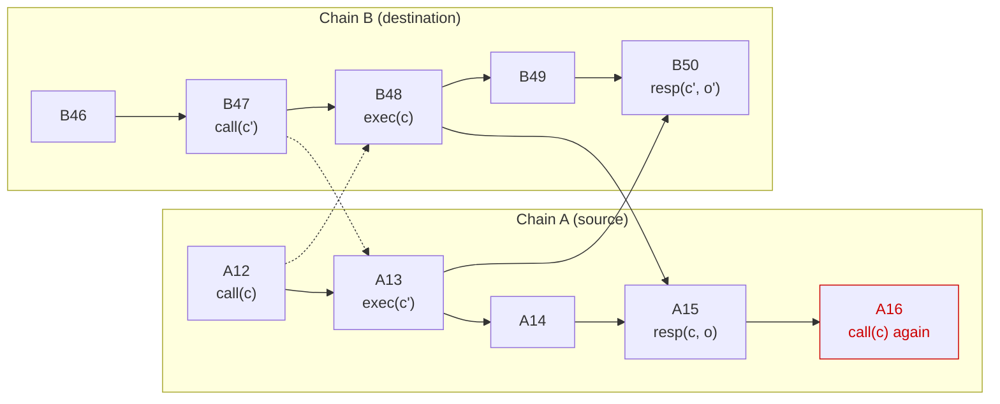

# Bidirectional calls: entities, API, properties

Status: draft, to be moved to github

## 1. Entities and Happy Path

* *Application contract*: the contract a developer writes on the source
  chain. "The contract" below means this one.
* *Library*: code we ship, embedded in the application contract. Everything
  in section 4.1 runs inside the application contract's own transactions and
  storage. A contract that bypasses the library is on its own.
* *Signet contract*: our contract on the source chain, through which
  requests, signatures and responses are published. It holds no per-
  application state.
* *MPC network*: the nodes that sign and attest.
* *Broadcaster*: whoever submits the signed transaction to the destination
  chain. Untrusted; the design does not depend on who it is.

Happy path:

1. The application contract calls the library, which records the call and
   asks the signet contract to emit a sign request.
2. The MPC signs the transaction, publishes the signature on the source
   chain, and starts looking for the transaction on the destination chain.
3. Any entity can broadcast the signed transaction to the destination chain.
4. When the transaction is finalised on the destination chain, the MPC
   attests the outcome and publishes the attestation to the signet contract.
5. Once delivered to the application contract, the library accepts or drops
   it, and on acceptance runs the contract's response handler.

## 2. Vocabulary

* *Transaction*: the bytes of an unsigned destination-chain transaction.
* *Transaction ID*: the identifier under which the destination chain records
  a submitted transaction, computable from the transaction and the signature
  in the encoding that chain accepts. ECDSA has two encodings that verify
  alike, of which EVM takes the low-s one, so a re-encoded signature names
  the same transaction rather than a new one.
* *Request*: what a call asks for, the tuple (tx, dest, key, schemas): the
  transaction, its destination chain, the key parameters to sign it with,
  and the schemas for decoding its output and encoding the response. Written
  `req` in the pseudocode.
* *Request ID* (rid): a collision-resistant hash over (contract, tx, dest,
  key) in a length-committing encoding, so within one source chain a rid
  names one execution and nothing else. I.e.,  rid(a) = rid(b) <=> a.tx = b.tx. The schemas are outside it, so that
  two calls for one transaction cannot both be outstanding. The key
  parameters must be canonical, or two rids could name one execution.
* *Outcome*: a pair (kind, data). kind is Executed or Failed.
  * *Executed* means the transaction was finalised, succeeded, and its
    return data decoded against the contract's schema; data is that decoded
    return data.
  * *Failed* means the transaction was finalised and reverted; data is a
    bounded prefix of the revert reason. (Appendix A adds two more reasons
    as extensions.)
  * A transaction that succeeded but whose return data does not decode has
    no outcome: the MPC reports nothing.
* *Attestation key*: a signing key the MPC derives from its root key, the
  source chain and the contract, used for nothing but attestations to that
  contract.
* *Attestation*: a statement (rid, height, outcome) signed with the
  attestation key of rid's contract, each field length-committed. height is
  the height of the execution's block.
* *Response*: an attestation delivered to its contract.

Events for a call c made by the application contract:

* call(c): the contract asks for transaction tx(c) to be signed and executed
  on destination chain dest(c). It is identified by rid(c).
* exec(c): tx(c) is included in a finalised destination block.
  height(exec(c)) is that block's height.
* resp(c, o): a response for rid(c) carrying outcome o.

How a call ends, as seen by the application contract:

* *Refused*: the library rejects call(c), and the caller learns it at once.
* *Accepted*: the contract takes a resp(c, o) as the answer to call(c) and
  runs its response handler (section 3.1).
* *Unanswered*: no response is ever accepted.

A call is *outstanding* from the moment it is made until a response to it is
accepted; the library records it as an entry in `outstanding` (section 4.1).
An unanswered call is outstanding forever, and from inside the contract this
is indistinguishable from a response that has not arrived yet.

*Happens-before*: A happens-before B if A caused B. On one chain, an earlier
block happens-before a later one. Across chains, an execution happens-before
the source block in which a response attesting it lands. The relation is
transitive.

## 3. API and guarantees

### 3.1 API offered to the application contract

```
sign_bidirectional(
    transaction: SerializedTransaction,
    destination: ChainId,
    key:         (DerivationPath, KeyVersion, SigningScheme),
    schemas:     (OutputDeserialization, ResponseSerialization),
) -> RequestId | Refused
// the four arguments together are the request, written req below

// implemented by the application contract, called by the library
on_response(rid: RequestId, outcome: (Executed | Failed, data))
```

### 3.2 Guarantees

G1 to G4 are safety, G5 is liveness. G2 and G5 together give "exactly one
accepted response per call whose transaction executes".

* G1 Causal order: an accepted resp(c, o) reports destination state that
  does not happen-before call(c).
* G2 At-most-once: for each execution, at most one response reporting it is
  ever accepted, however many calls named its transaction and however many
  times it is attested.
* G3 Finality: an outcome is reported only once the destination state it
  describes is final.
* G4 Integrity: an accepted resp(c, o) carries the true outcome of tx(c),
  never of another transaction.
* G5 Delivery: if tx(c) is finalised under a signature the MPC issued for
  call(c), and its return data, if any, decodes against the contract's
  schema, a resp(c, o) is eventually accepted.

### 3.3 Assumptions

* Chains  
  * Finality: no re-orgs on source or destination chain below the finality criterion the MPC uses to index requests and attest outcomes.  
  * Payload-level replay protection: once a transaction has executed on the destination chain under a key, no transaction with the same bytes executes again under that key, whatever signature it bears (EVM account nonce, spent UTXO, Solana durable nonce). Solana transactions using a recent blockhash do not qualify; see open points.  
  *  Source and destination chains, eventually make progress: outages only delay delivery
* Contracts and library:  
  * Durable contract state: the library's state (section 4.1) survives upgrades and migrations. A contract that keeps its key and loses this state can be replayed against everything it ever executed.  
  * On Midnight, someone enqueues every published response and runs `process` (section 4.2).  
* MPC:   
  * at most f of the nodes are faulty and every signature or attestation needs 2f+1 participants and honest nodes eventually publish.  
  * Honest nodes observe the same finalised destination state, receipts and return data included, and compute the attestation content as the same pure function of receipt and schemas, which an upgrade does not change for requests already made; otherwise nodes split and no attestation reaches 2f+1.

## 4. Pseudocode and properties per entity

Each entity is an event handler over its own state. `drop` means the event
has no effect. Key versions are omitted throughout: `attestation_key(self)`
stands for the key at the version the contract uses.

### 4.1 Library (inside the application contract)

```
state (per application contract):
    last_seen:   ChainId -> Height       // initialised as described below
    outstanding: RequestId -> Entry
    Entry = { dest: ChainId, known: Height }

on sign_bidirectional(req) from the application logic:
    rid = request_id(self, req)
    if rid in outstanding:                                // C1
        return Refused
    outstanding[rid] = { req.dest, known: last_seen[req.dest] }   // C2
    signet.sign_bidirectional(rid, req)
    return rid

on response(rid, att = (kind, height, data), sig):
    if rid not in outstanding:                          // C3a
        drop
    e = outstanding[rid]
    if not verify(sig, H(rid || att)):                  // C3b
        drop
    if height <= e.known:                               // C3c
        drop
    last_seen[e.dest] = max(last_seen[e.dest], height)  // C3d
    delete outstanding[rid]                             // C4
    self.on_response(rid, (kind, data))
```

The entry keeps `dest` because the rid is a hash and cannot yield it, and
C3d needs it to pick the last_seen to raise.

When the library starts tracking a destination, last_seen[dest] starts at
dest's finalised height at that moment. At deployment and on the first call
to a new destination 0 is equivalent, since nothing has executed under the
contract's key there yet. At an upgrade from a version without last_seen a
lower start would let a response to a call answered before the upgrade be
accepted again.

Properties:

* C1 A call is refused while an entry with the same rid is outstanding.
* C2 Every outstanding entry records last_seen[dest] at creation.
* C3 A response is accepted only if it verifies, an entry for its rid is
  outstanding, and its height is strictly above that entry's recorded
  height. Acceptance raises last_seen to at least that height.
* C4 Entries are removed by acceptance only. No timers.

### 4.2 Library on Midnight: inbox and processing

On Midnight a transaction is proven against a snapshot of the contract's
state and fails at inclusion if any state it read has changed since. Some of
our circuits take 30 seconds to prove. Section 4.1 reads last_seen on every
call (C2) and writes it on every response (C3d), so a response landing while
a call is being proven fails that call, and the contract handles at most one
message per proving time. To fix this, enqueueing and processing are
separated:

```
state (per application contract, in addition to 4.1):
    inbox: Key -> Message            // Message = Call(req) | Response(rid, att, sig)

on enqueue(key, message):
    if key in inbox: fail            // the key is already in use
    inbox[key] = message             // touches no state any other transaction reads

on process(keys) from anyone:        // keys: a witness listing inbox entries to process
    for key in keys:
        if key not in inbox: fail
        run the 4.1 handler for inbox[key]
        delete inbox[key]
```

* Whoever enqueues chooses the key off chain. Under the per-key conflict
  assumption below, a fresh key conflicts with nothing, so enqueues
  run concurrently; two enqueuers picking one key is the only collision.
* `process` is the single transaction per proving time that touches
  last_seen and outstanding, so throughput is a batch rather than a
  message. It takes its keys as a witness and touches only those entries, so
  it does not conflict with concurrent enqueues.
* A call is made, in the sense of C2, when it is processed rather than
  enqueued, so its known height is last_seen at processing time. A Call
  carries the application's continuation, which runs then with the return
  value of sign_bidirectional, Refused included: this is where a Midnight
  caller learns of a refusal.

What must hold is that every message enters through the inbox, is processed
exactly once, and that `process` touches only the entries it deletes.

Assumption:

* The ledger detects state conflicts per map key. A transaction that inserts
  under a key nobody else touches, or reads a key nobody else writes, is not
  failed by concurrent transactions on other keys.

Property:

* C5 On Midnight, calls and responses are enqueued without touching shared
  state and processed in one total order; C1 to C4 hold for the processed
  sequence.

### 4.3 Signet contract (per source chain)

It holds no per-application state, verifies nothing, and anyone may call
it. It emits three events:

* `SignRequest { contract, rid, req }`, when a contract asks for a
  signature.
* `Signature { rid, signature }`, when a signature is published, for the
  broadcaster.
* `Response { contract, rid, att, sig }`, when an attestation is published.
  Where the chain allows it, the contract's `response` handler is called in
  the same transaction.

The library verifies responses (C3b) and the MPC verifies the requests and
responses it reads (section 4.4).

### 4.4 MPC network

Written as if the network were one process; the real one is a threshold
protocol whose result is what this process outputs. The state below is per
source chain, so a rid from one chain never meets a rid from another.

```
authentic(contract, rid, req): bool
    the request provably comes from `contract`, and rid recomputes from it

processable(req): bool
    req.dest parses to a chain this MPC can watch
    key derivation is valid: parameters canonical, key derivable for the
      source chain, path not the attestation key's
    req.tx is non-empty, parses as an unsigned transaction in dest's
      format, commits to dest (EVM: carries its chain id), and attaching
      any signature yields a well-formed signed transaction
    req.schemas are valid for dest and source chain respectively

state:
    pending: RequestId -> Entry
    Entry = { req, contract, signatures: Set<Signature>, attestation? }

on SignRequest { contract, rid, req } finalised on the source chain:
    if not authentic(contract, rid, req):                 // M1
        drop
    if rid in pending:                                    // republish on repeat
        publish_signature(rid, s) for s in pending[rid].signatures
        return
    if processable(req):                                  // M4
        pending[rid] = { req, contract, signatures: {} }
        signature = threshold_sign(req.tx, derived_key(contract, req.key))   // M1
        pending[rid].signatures.add(signature)
        publish_signature(rid, signature)

on Signature { rid, signature } finalised on the source chain:
    if rid in pending and signature verifies:
        pending[rid].signatures.add(signature)

on destination block finalised on chain dest:
    for (rid, e) in pending with e.req.dest = dest, e.signatures nonempty,
      and no e.attestation:
        for signature in e.signatures:                    // at most one executes
            r = receipt(txid(signature, e.req.tx))
            if r exists in a finalised block at height h:
                if decode(r, e.req.schemas) gives (kind, data):
                    attest(rid, (kind, h, data))
                else:
                    delete pending[rid]                   // M5
                break

attest(rid, att):
    e = pending[rid]
    e.attestation = att
    sig = threshold_sign(H(rid || att), attestation_key(e.contract))     // M2
    publish_response(e.contract, rid, att, sig)

on Response { contract, rid, att, sig } finalised on the source chain:
    if sig verifies under attestation_key(contract):
        delete pending[rid]
```

The MPC asks one question about each signed request: has its transaction
been finalised under any signature that verifies for it. There can be
several, for instance when a node whose share went into one run restarts and
joins another, so all of them are looked up; they cover the same transaction
bytes, so replay protection lets at most one execute. Lookup is by
transaction ID at any height, so when a node starts looking does not matter.
A transaction that never executes gets no response, nor does a request the
MPC cannot process (Appendix A changes both).

Restarts. A node keeps `pending` durably and indexes forward from it, so
what it admitted survives a restart, what it dropped stays dropped (M4), and
each entry resumes at the step it is missing: signing, lookup or publishing.
The source chains supply the rest: every verifying Signature event is looked
up, whoever produced it, and a verified Response event ends the request.
Every signature the network issues lands there, since a run needs 2f+1
participants, of which at least f+1 are honest and publish (section 3.3). A
second signature is looked up like the first, and a duplicate attestation
has the same content (section 3.3) and is dropped (C3a), so restarting at
any point is harmless.

Properties:

* M1 The MPC signs a request only if it provably comes from the contract it
  names, and signs it with a key derived from that contract. The attestation
  key is derived from the contract and its source chain as well, under a
  reserved path that no
  request may name (`processable`); otherwise a contract could have the
  MPC sign an arbitrary hash with its own attestation key and forge a
  response to itself.
* M2 An attestation binds rid, kind, height and data as separate length-
  committed fields, and describes only destination state finalised at that
  height.
* M3 The MPC attests an outcome only for a finalised transaction it looked
  up by the ID of tx(c) under a signature it issued. It infers no outcome
  from anything else.
* M4 The MPC drops a request that is not authentic, or that it cannot
  process, and keeps no record of it, so the call is unanswered. (Appendix A
  answers Failed instead.)
* M5 The MPC attests nothing for an execution whose return data does not
  decode against the contract's schema and it drops the request.

## 5. Why the guarantees hold (sketch)

* G1: an accepted response for c reports an execution of tx(c) (M3) at a
  height above e.known (C3c). Suppose that execution happened before
  call(c). tx(c) executes at most once (replay protection) and only on a
  call of this contract, which has the same rid (M1, section 2). That
  earlier call was either still outstanding, so call(c) was refused (C1),
  or its entry was removed by accepting a response reporting this very
  execution (C4, M3), which raised last_seen[dest] to its height (C3d)
  before call(c) recorded it (C2). Either way the response is not accepted;
  the diagram shows the second case.



Caption: Solid arrows are happens-before, dashed arrows are cross-chain
calls, which are deliberately not part of the relation. exec(c) at B48
happens-before A15 and therefore before the second call(c) at A16, so a
response attesting B48 is dropped for that call (C3c in section 4.1). The
first call(c) at A12 has no such path, so a response attesting B48 is
accepted for it.

* G2: suppose two responses reporting the same execution (height h) are
  accepted by entries e1 and e2. Both carry the same rid, since the
  execution fixes every input to the rid (section 2). By C1 they were not
  outstanding together, so e2 was created after e1 was removed, after the
  first acceptance. By C3d last_seen[dest] was already at least h then,
  so by C2 e2.known >= h, and C3c drops the second response. Contradiction.
  exec(c) itself happening at most once is the replay-protection assumption,
  not something the library enforces.

* G3: M2, the finality assumption, and C3b (only attestations under the key
  are accepted).

* G4: the attestation key binds the source chain and the contract (M1), the
  attestation binds the rid (M2), the rid binds the transaction (a length-
  committing hash), and the MPC reports only the receipt of tx(c) under the
  signature issued for rid (M3). So the reported receipt is tx(c)'s own.

* G5: the signature was issued after call(c) was finalised (M1) and e.known
  is at most the destination height finalised by then (C2), so
  height(exec(c)) > e.known. The MPC finds the execution by its receipt, whenever it started
  looking. The return data decodes (G5's premise), so M5 does not apply, and
  honest nodes compute the same attestation and publish it (assumptions). By
  C4 the entry is still outstanding unless a response for rid(c) was
  accepted first, and any such response reports exec(c) too, since at most
  one signature executes (replay protection) and M3 attests only that
  receipt. So a response reporting exec(c) passes C3 and is accepted.

## 6. Open design points

* Which replay protection to assume. This draft assumes once a transaction
  has executed, the same bytes never execute again under that key. EVM
  nonces, spent UTXOs and Solana durable nonces give this. Using a recent
  blockhash can be made to work if the MPC remembers completed rids for as
  long as a differently signed copy could still execute, about a minute on
  Solana.
* A failing `on_response`. The response transaction fails with the handler
  and the entry stays outstanding, so a re-delivery is a retry rather than a
  loss. On Midnight a handler that always fails blocks every `process` batch
  carrying its message, so `process` has to isolate handler failures.
  Removing the entry before the handler runs is not an alternative, since
  C3a would then drop the re-delivery.
* Midnight continuation. A Call's continuation runs inside `process`, which
  anyone may submit, so it cannot use the caller's private witnesses.
  Section 4.2 is implementable as written only if applications can do their
  witness-bearing work at enqueue time.
* Who runs `process` on Midnight, and who pays. Anyone can enqueue, and an
  invalid message is dropped only when processed, so the enqueuer pays for
  the insert and someone else for the processing. The candidates are the
  MPC, the application's backend and the next caller; a deposit refunded at
  processing would move the cost of spam to the spammer. The liveness
  assumption in section 3.3 depends on the answer.
* `pending` grows without bound. An entry lives until a verified Response,
  and a request whose signature nobody broadcasts never produces one. The
  dead-transaction extension in Appendix A closes those, and an
  application can free a rid by having a cancel transaction consume its
  slot, but nothing bounds the set without giving up G5 for a late
  execution. Checking old entries less often bounds the work per block,
  which is the part that matters.

## Appendix A: failure reporting extensions

In the core a call is unanswered when its transaction never executes,
whether never broadcast or no longer finalisable, and when the MPC cannot
process the request. Two extensions turn some of those into Failed
responses.

Both need a property the core does not. In the core every attestation for a
rid has the same content (section 3.3), so a duplicate is dropped (C3a).
Here honest nodes can legitimately arrive at different contents, or some at
Failed and others at a signature, and the library accepts whichever lands
first. *Exclusivity*: a node commits durably to one attestation content per
rid before contributing its first share, and for unprocessable requests the
commitment covers signing versus attesting Failed as well. With 2f+1
participants per result at most one of the competing results completes,
possibly none, so both extensions need the network to agree on the content
beforehand.

Dead transactions: when the replay-protection slot of a pending request's
transaction is consumed by a finalised transaction, the MPC compares bodies.
A different body means the request can never be finalised, and the MPC
attests Failed at the block where it determined that, never at the block
that consumed the slot, which for a re-issued request is the original
execution's own. The same body means the request's transaction executed
under another signature, so that receipt is the request's. Costs: the slot
notion is chain specific, the consuming transaction has to be fetched, and
nodes determining impossibility at different blocks must agree on one
height.

Unprocessable requests: instead of dropping, record the request and attest
`Failed` at the next destination block finalised after it. The destination
has to be one the MPC watches, so the library must refuse destinations it
does not support. During an upgrade nodes may disagree on `processable`, and
exclusivity is what lets at most one of signing and attesting Failed
complete.

What this changes in the core: Failed gains two reasons, M3 gains the two
rules above, and an attestation height can be a block the MPC chooses, which
M2 already allows and C3c accepts. The same-body rule is the one exception,
attesting an older execution at its own height, which C3c drops, so G1 is
unchanged; G4 rests on the body comparison. One consequence needs handling:
a replayed old Response event deletes the MPC's entry for a re-issued rid
and would suppress the Failed it should get, so the MPC should ignore
Response events whose height is not above the destination height at the
request's finalisation.
