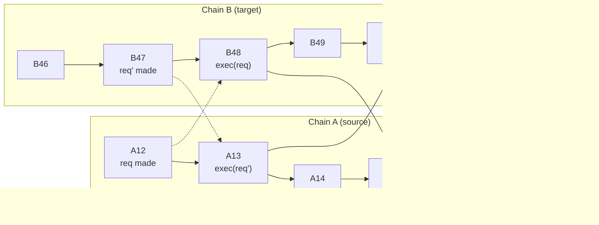

# Bidirectional calls: entities, API, properties

## TL;DR

A contract on the source chain asks for a transaction to be signed and
executed on a target chain, and is told the outcome at most once. The
response is final when it comes: the transaction executed, it reverted, or
it can never execute. Until then nothing arrives, and a transaction that
never executes is never answered. The rest of the document is what the
MPC, the signet contract and the library have to do for that to hold.

Organization:

* Section 1 names the entities and walks through the happy path.
* Section 2 defines the terms.
* Section 3 states what an application gets and what is assumed of the chains.
* Section 4 describes the library, signet contract and MPC nodes.
* Section 5 argues that Section 4 delivers Section 3.
* Section 6 collects notes: limits of the design and what is still open.
* Section 7 gives the canonical structures on the wire.

## 1. Entities and happy path

* *Source chain*: where the application contract lives and where requests,
  signatures and responses are published.
* *Target chain*: where the signed transaction executes. One contract
  may use several.
* *Application contract*: the contract a developer writes on the source
  chain. "The contract" below means this one.
* *Library*: code we ship, embedded in the application contract. Everything
  in Section 4.1 runs inside the application contract's own
  transactions and storage. A contract that bypasses the library is on its
  own.
* *Signet contract*: our contract on the source chain, through which
  requests, signatures and responses are published. It holds no per-
  application state.
* *MPC network*: the nodes that sign and attest.
* *Broadcaster*: whoever submits the signed transaction to the target
  chain. Untrusted; the design does not depend on who it is.

Happy path:

1. The application contract calls the library, which records the request
   and asks the signet contract to emit it.
2. The MPC signs the transaction, publishes the signature on the source
   chain, and starts looking for the transaction on the target chain.
3. Any entity can broadcast the signed transaction to the target chain.
4. When the transaction is in a final target-chain block, the MPC attests
   the outcome and publishes the attestation to the signet contract.
5. Once delivered to the application contract, the library accepts or drops
   it, and on acceptance runs the contract's response handler.

## 2. Vocabulary

* *Transaction*: the bytes of an unsigned target chain transaction.
* *Transaction ID*: the identifier under which the target chain records
  a submitted transaction, computable from the transaction and the signature
  in the encoding that chain accepts. One transaction can be signed more
  than once, for instance by two signing rounds for one request, and each
  signature gives a different transaction ID. Replay
  protection (Section 3.3) lets at most one of them execute, and all of
  them belong to the same request.
* *Request*: what the contract asks for, the tuple (tx, target, key, schema):
  the transaction, its target chain, the key parameters to sign it with
  (a derivation path, key version and signing scheme), and the schema of its
  output. The MPC decodes the output with that schema and encodes the
  response from it, in the source chain's types. Written `req`, with fields
  `req.tx`, `req.target`, `req.key` and `req.schema` (Section 7 maps them to
  the fields on the wire, `req.target` is `executionDest`). A request is
  *made* when the contract passes it to `sign_bidirectional` (Section 3.1).
  The same tuple can be made again, and then it is the same request.
* *Request ID*: rid(contract, req.tx, req.target, req.key), a collision-
  resistant hash in a length-committing encoding, so within one source
  chain two requests have the same rid exactly when they agree on all four.
  One execution has one rid (Section 5).
* *Admitted*: the MPC has found a request authentic and processable
  (Section 4.3) and added it to its backlog. Only an admitted request is
  ever signed or attested.
* *Publish*: to submit a signature or an attestation to the signet
  contract, which anyone may do. It is *published* once the event carrying
  it is final on the source chain.
* *Outcome*: a pair (kind, data), with three kinds.

  | kind | what happened to req.tx | data |
  |---|---|---|
  | Executed | included in a final target chain block, succeeded, and its return data decodes against req.schema | the decoded return data |
  | Failed | included in a final target chain block and reverted | empty |
  | Unviable | can never be included, because a transaction whose unsigned bytes are not req.tx, from the same key, has already used up req.tx's replay protection (Section 3.3) | empty |

  Empty data is a zero-length field; the kind is the whole information.
  Every outcome is final: once req.tx has executed or its replay protection is
  used up, no later block changes that. A transaction can become unviable in
  other ways on some chains, an expiry height or a timebound; the MPC reports
  only the replay-protection case.
  An expired transaction goes unanswered, as does one nobody broadcasts.

  A transaction that succeeded but whose return data does not decode
  against req.schema, because the schema is wrong or the target
  contract changed its return type, has no outcome. The MPC reports
  nothing, stops watching the request and logs why (Section 4.3). A node
  cannot tell a wrong schema from a changed contract, and the contract
  could not act on bytes it cannot decode.
* *Attestation key*: a signing key the MPC derives from its root key, the
  source chain, the contract, a reserved path and the request's key version,
  used for nothing but attestations to that contract.
* *Attestation*: a statement (rid, height, outcome) signed with the
  attestation key of rid's contract at the request's key version. The MPC
  nodes sign `attestationDigest(rid, att)` as defined in
  [Section 7.4.2.1](#7421-attestation-digest), where
  `att = (height, outcome.kind, outcome.data)`. The digest commits to its
  domain tag and the output length, so no signed statement can be read as
  two different outcomes. `height` is the height, in the target
  chain's own numbering (a slot on Solana),
  of the final block that holds the transaction the outcome describes:
  req.tx for Executed and Failed, the transaction that used up its replay
  protection for Unviable.
* *Response*: an attestation delivered to the contract that made rid's
  request.

How a request ends, as seen by the application contract:

* *Refused*: the library rejects it inside `sign_bidirectional`, and the
  caller learns it from the return value.
* *Accepted*: the library takes a response as the answer to the request,
  removes the request and runs the contract's response handler (Section
  3.1). A response the library does not accept is dropped without a trace:
  there is no rejected ending, and the contract is not told.
* *Unanswered*: no response is ever accepted, because none is ever
  published (the transaction neither executes nor becomes Unviable, its
  output does not decode,
  or the MPC did not admit the request) or because every published one is
  dropped.

A request is *outstanding* from the moment it is made until a response to
it is accepted; the library records it as an entry in `outstanding`
(Section 4.1). An unanswered request is outstanding forever, and from
inside the contract this is indistinguishable from a response that has not
arrived yet.

A request with the rid of an outstanding one is refused (Section 4.1),
whether it is the same request made again or one that differs in its
schema only. A retry needs a different transaction. Once a request was
answered, the application must not make one with its rid again. The
library cannot refuse it without remembering every answered rid, and it
is never answered: its execution happens-before the second making, so the
causal-order guarantee (Section 3.2) forbids accepting it.

*Happens-before*, for one application contract, is the smallest transitive
relation with these edges:

* on one chain, an earlier block, transaction or step within a transaction
  happens-before a later one;
* across chains, a target chain block happens-before the source transaction
  in which this contract accepts a response attesting that block.

Nothing else is an edge. A request being made does not happen-before its
execution, a dropped response adds no edge, and another contract's
acceptance adds none for this contract. Target chain state reaches this
contract only through the responses it accepts, and the causal-order
guarantee in Section 3.2 is a promise about that channel.

## 3. API and guarantees

### 3.1 API offered to the application contract

```
sign_bidirectional(
    transaction: SerializedTransaction,
    target: ChainId,
    key:         (DerivationPath, KeyVersion, SigningScheme),
    schema:      OutputSchema,
) -> RequestId | Refused
// the four arguments together are the request, written req below

// implemented by the application contract, called by the library
on_response(rid: RequestId, outcome: (kind, data))
```

The application configures the library with its attestation public key
(Section 2) and adds each new key version.

### 3.2 Guarantees

G1 to G3 are safety, G4 and G5 are liveness. G2 and G4 together give
"exactly one accepted response per request that G4 covers".

* G1 Causal order. The answer to a request is always about something newer
  than everything you had been told when you made it. Precisely: an
  accepted response to req reports target chain state that does not
  happen-before req was made.
* G2 At most once. The result of each execution is reported to you at most
  once. Precisely: for each execution, at most one response reporting it
  as the outcome of its own transaction is ever accepted, however often
  its request is made and however often it is attested. All such
  attestations carry one rid, so this is a statement about that rid.
* G3 Integrity and finality. What you are told is true, final, and about
  your transaction. Precisely: an accepted response to req carries the
  true, final outcome of req.tx, never of another transaction.
* G4 Delivery. If your transaction runs, you are told, as long as your
  schema fits its output and your handler does not fail. One rare
  fault on the MPC side can also leave a request unanswered, and anyone
  can repair it. Precisely: if req.tx is included in a final target
  block after req was made, a response to req is eventually accepted
  unless (i) the return data does not decode against req.schema, (ii) the
  response handler fails, or (iii) the transaction's ID depends on its
  signature and that signature is never published.
* G5 Unviable. If another of your requests takes this one's place and is
  answered, you are told that this one can never run. Precisely: suppose
  the transaction of another request has the same replay protection as
  req.tx on the same target chain, the same account and nonce on EVM
  for instance. If it is included after req was made and that request is
  answered Executed or Failed, a response to req saying Unviable is
  eventually accepted, unless the response handler fails or that answer
  cannot be checked (Section 6).

G4's exceptions (i) and (ii) are in the application's hands: a schema that
does not match what the target contract returns, and a handler that
fails. Exception (iii) is not. It concerns e.g., EVM target chains, where a
transaction can only be looked up once its signature is known. The
signature stays unknown if every correct node that signed loses it before
publishing it, or if a faulty node keeps it to itself. The fix is simple:
the executed transaction carries its signature, and anyone can publish it
(Section 6).

Beyond G5, nothing is promised for a transaction that never executes, for
a request the MPC does not admit, or for a request made again after its
transaction ran. Reporting any of them needs machinery the rest of this
design does without. G1 and G2 do not cover transactions that executed
before the contract upgraded to this library.

### 3.3 Assumptions

* Finality. A block the MPC treats as final stays in the chain. The MPC
  reads requests and attests outcomes only from such blocks.
* Replay protection. Executing a transaction uses up its replay protection:
  the account nonce on EVM, the spent output on a UTXO chain,
  the durable nonce on Solana. Each can be used up only once, and a
  transaction whose replay protection is used up can never execute. So the
  same bytes, however often they are signed, execute at most once, and a
  different transaction using the same nonce or output blocks ours for
  good. A Solana transaction with a recent blockhash has no such
  protection; see Section 6.
* Progress. All source and target chains keep producing final blocks.
  An outage delays delivery and changes nothing else. A correct node
  processes final blocks faster than the chains produce them, so it
  reaches the head from wherever it starts.
* One network per chain id. A chain id names a chain family, e.g., `eip155:1`
  for every Ethereum network, and an MPC deployment watches one network
  per family. So within a deployment an id names one network, and no two
  ids name the same one. Otherwise the same transaction could be made once
  under each id: two rids and two entries for one execution, with
  last_seen split between the ids.

## 4. Pseudocode and properties per entity

Each entity is an event handler over its own state. `drop` means the event
has no effect.

### 4.1 Library (inside the application contract)

The behaviour the application contract has to show. Marked `SDK` is what
`@sig-net/midnight` supplies; the rest is code the integrator guide gives
each contract to include, and C1 to C4 hold for a contract that does.

```
state (per application contract):
    attestation_key: KeyVersion -> PublicKey                // Section 3.1
    last_seen:   ChainId -> Height                          // 0 when starting
    outstanding: RequestId -> Entry
    Entry = { target: ChainId, known: Height, key_version: KeyVersion }
    // a rid is a hash and cannot yield target or key_version

on sign_bidirectional(req) from the application logic:
    rid = request_id(self, req)                            // SDK
    if rid in outstanding
      or req.key.key_version not in attestation_key:       // C1
        return Refused
    outstanding[rid] = { req.target, known: last_seen[req.target],   // C2
                         req.key.key_version }
    signet.sign_bidirectional(rid, req)
    return rid

on response(rid, att = (height, kind, data), sig):
    if rid not in outstanding:                             // C3a
        drop
    e = outstanding[rid]
    if not verify(                                         // SDK, with
        sig,                                               // attestationDigest
        attestationDigest(rid, att),
        attestation_key[e.key_version]
    ):                                                     // C3b
        drop
    if height <= e.known:                                  // C3c
        drop
    last_seen[e.target] = max(last_seen[e.target], height) // C3d
    delete outstanding[rid]                                // C4
    self.on_response(rid, (kind, data))
```

The check is here and not in the MPC because the nodes have no agreed
mapping between source and target chain heights, so no node can say what the
target looked like when a request was made; the contract can, from the
responses it has accepted. On chains where `response` and the
application's handler run in one transaction, a failing handler reverts
the whole transaction, C3d and C4 included: the entry stays outstanding and
the same response can be delivered again (Section 6).

The library relies on its state surviving contract upgrades and
migrations: a contract that keeps its key and loses `outstanding` and
`last_seen` will accept a response to a request it already answered
when a request with a rid used earlier is made again.
It also relies on every published response eventually reaching `response`.
Who delivers it is in Section 4.2.

Properties:

* C1 A request is refused while an entry with the same rid is outstanding,
  and if the library has no attestation key for its key version.
* C2 Every outstanding entry records last_seen[target] at creation.
* C3 A response is accepted only if it verifies, an entry for its rid is
  outstanding, and its height is strictly above that entry's recorded
  height. Acceptance raises last_seen to at least that height.
* C4 Entries are removed by acceptance only. No timers.

### 4.2 Signet contract (per source chain)

It holds no per-application state, verifies nothing, and anyone may call
it. It records the caller of `sign_bidirectional` as `contract` in the
event it emits, which is all that `authentic` in Section 4.3 rests on. It
emits three events:

* `SignRequest { contract, rid, req }`, when a contract asks for a
  signature.
* `Signature { rid, signature }`, when a signature is published, for the
  broadcaster and for nodes that were not in the signing round.
* `Response { contract, rid, att, sig }`, when an attestation is published.
  Where the chain allows it, the contract's `response` handler is called in
  the same transaction, with a bounded gas allowance, since it runs on the
  MPC's gas, and without letting its failure suppress the event. The
  library verifies what it receives (C3), so anyone may call `response`
  directly, which is how a response is delivered where the signet contract
  cannot call it, and again after a failed handler.

### 4.3 MPC network

Written as if the network were one process; the real one is a threshold
protocol whose result is what this process outputs, and Section 5 says what
that rests on. The state below is per source chain, so a rid from one chain
never meets a rid from another.

```

state:
    backlog: RequestId -> Entry
    Entry = { req, contract, signatures: Set<Signature> }
    // backlog is a function of the finalised source chain only,
    // the same on every correct node that processed the same height

    local: RequestId -> Local
    Local = { issued: Set<Signature>,         // participated in signing
              outcome: Found(att) | Parked,   // read on target chain
              attestation: (att, sig) }       // participated in attesting
    // outcome and attestation are empty at first
    // local may differ between nodes that processed the same height

on SignRequest { contract, rid, req } finalised on the source chain:
    if not authentic(contract, rid, req):                 // M1
        drop
    if rid in backlog or not processable(req):            // M2
        drop
    backlog[rid] = { req, contract, signatures: {} }
    signature = threshold_sign(req.tx, derived_key(contract, req.key))   // M1
    local[rid].issued.add(signature)       // stored before publishing
    publish_signature(rid, signature)

authentic(contract, rid, req): bool
    the request provably comes from `contract`, and rid recomputes from it

processable(req): bool
    req.target parses to a chain this MPC can watch
    key derivation is valid: parameters canonical, key derivable for the
      source chain, path not the attestation key's
    req.tx is non-empty, parses as an unsigned transaction in target's
      format, commits to the network this MPC watches for target (EVM:
      carries that network's chain id), and attaching any signature
      yields a well-formed signed transaction
    req.schema is well formed: it is empty, or it parses and names only
      types the MPC can decode from target and encode for the source chain

on Signature { rid, signature } finalised on the source chain:
    e = backlog[rid] if rid in backlog
    if e and signature verifies over e.req.tx
      under derived_key(e.contract, e.req.key):
        e.signatures.add(signature)

on target chain block at height h finalised on chain target:
    for (rid, e) in backlog for target and no local[rid].outcome:
        ours = { txid(s, e.req.tx)
                 for s in e.signatures + local[rid].issued }
        if some id in ours has receipt r in a final block at height h':  // M3
            for (rid', e') in backlog for target, other than rid, with e's
              account and e.req.tx's replay protection, and no
              local[rid'].outcome:
                attest(rid', (h', Unviable, empty))             // M4
            if decode(r, e.req.schema) gives (kind, data):
                attest(rid, (h', kind, data))
            else:
                local[rid].outcome = Parked, log why        // M3

attest(rid, att):
    e = backlog[rid]
    local[rid].outcome = Found(att)
    sig = threshold_sign(
        attestationDigest(rid, att),
        attestation_key(e.contract, e.req.key.key_version)
    )                                                   // M5
    local[rid].attestation = (att, sig)    // stored before publishing
    publish_response(e.contract, rid, att, sig)

on Response { contract, rid, att, sig } finalised on the source chain:
    e = backlog[rid] if rid in backlog
    if e and sig verifies over attestationDigest(rid, att)
      under attestation_key(e.contract, e.req.key.key_version):
        if att.kind is Executed or Failed:        // e.req.tx was included
            for (rid', e') in backlog for e.req.target, other than rid,
              with e's account and e.req.tx's replay protection, and no
              local[rid'].outcome:
                attest(rid', (att.height, Unviable, empty))     // M4
        delete backlog[rid], local[rid]
```

A node is *caught up* on a source chain when it has processed it up to its
finalised head. A node that is behind, after a restart for instance, does
not sign, attest or publish while it runs the handlers above: its backlog
still holds requests the chain has already answered, and it cannot tell
which of the signatures and attestations it holds are already published.
Once caught up, it acts on each entry only for what is missing: it does
not sign an entry that has a published signature or one it holds, and does
not attest an entry it holds an attestation for.

The MPC looks for a request's execution by transaction ID, under every
signature it holds for the request, in any final block, so a node that
starts looking late still finds it. A node holds the signatures published
for the request and those it took part in producing. An execution under a
signature it does not hold is not found (see Section 6 for alternatives).

When the transaction of one request is included, every other request
waiting on the same account and replay protection can never execute, and
the MPC attests Unviable for each, at that transaction's height. A node
learns of it in one of two ways: it finds the execution itself, or it
reads the `Response` that reports it. The second reaches every node that
reads the source chain. A node that is behind notes the outcome and
attests once caught up.

A repeated attestation has the same content (Section 5) and is dropped
(C3a).

A node has to be able to check a `Response` from the event alone, since a
`Response` removes the request on every node. The event of Section 7
allows that only when the output is empty; Section 6 says what is missing.

Properties:

* M1 The MPC signs a request only if it provably comes from the contract it
  names, with a key derived from that contract. The attestation key is
  derived from the contract, its source chain and the request's key version
  under a reserved path that no request on any signing API may name
  (`processable` covers this one); otherwise a contract could have its own
  attestation key sign an arbitrary hash and forge a response to itself.
* M2 The MPC drops a request that is not authentic, that it cannot
  process, or whose rid is already in the backlog, and keeps nothing for
  it. A rid already in the backlog is the same transaction, already being
  watched, so nothing is lost.
* M3 The MPC attests Executed or Failed only from the receipt of a
  transaction in a final block that was sent by the request's own account
  and whose unsigned bytes are req.tx. Only the network can send from
  that account. If the transaction succeeded but its return data does not
  decode, the MPC attests nothing, and the entry stays in the backlog,
  parked and unwatched.
* M4 The MPC attests Unviable for a request only when another request's
  transaction, from the same account, on the same target chain and
  with the same replay protection, was included in a final block: a node
  finds that execution itself, or reads a `Response` saying Executed or
  Failed. It attests at that block's height.
* M5 An attestation binds rid, height, kind and data, with data's length
  in the hash, and describes only target chain state final at that height.

## 5. Why the guarantees hold (sketch)

The sketches treat the MPC as one process, as Section 4.3 writes it. Three
properties of the network make that legitimate. None is specific to this
design. The network is n nodes, at most f < n/3 of them faulty, the rest
correct, with a signing threshold t, f+1 <= t <= n - f.

* Threshold (Section 2 of protocol_properties.md). Fewer than t nodes cannot
  produce a signature or an attestation, correct nodes alone can, and
  correct nodes eventually produce and publish what a request in their
  backlog needs.
* Agreement. Correct nodes hold the same backlog at a source height, so
  they admit the same requests and hold the same published signatures for
  them, and they compute the same attestation for a rid, as a function of
  final target chain state and the request's schema only.
* Distinct keys (ACCOUNT_DERIVATION.md). The derivation path contains the
  source chain's id and the requesting contract, so different (source
  chain, contract, key parameters) derive different keys, where the key
  parameters are a request's derivation path, key version and signing
  scheme. The id names a chain family, so the same contract address on
  two networks of one family derives the same key; a deployment watches
  one network per family (Section 3.3), so within it the key still names
  one contract. So the sender of an executed transaction tells the MPC
  which contract and key parameters asked for it. Assumed here: two
  signing schemes never share a key.

* G1, in short: an execution this contract has already accepted is at or below
  last_seen, so a request made later records it as known and C3c drops any
  response about it. In full: an accepted response to req describes a
  target chain block at height h (M5) with h > e.known (C3c). Suppose that
  block happens-before the making of req. The only edges into the source chain
  are this contract's acceptances, so the path runs along the target
  chain to a block at height h'' >= h, from there to the transaction in which
  this contract accepted a response attesting h'', and along the source chain
  to the making of req. That acceptance raised last_seen[target] to at least
  h'' (C3d) before req recorded it (C2; C3d runs before the handler), so
  e.known >= h and C3c drops the response. Contradiction. The diagram shows
  the case where the accepted response answered an earlier making of the same
  request.


```mermaid
flowchart LR
  subgraph A["Chain A (source)"]
    direction LR
    A12["A12<br/>req made"] --> A13["A13<br/>exec(req')"] --> A14["A14"] --> A15["A15<br/>resp(req, o)"] --> A16["A16<br/>req made again"]
  end
  subgraph B["Chain B (target)"]
    direction LR
    B46["B46"] --> B47["B47<br/>req' made"] --> B48["B48<br/>exec(req)"] --> B49["B49"] --> B50["B50<br/>resp(req', o')"]
  end
  B48 --> A15
  A13 --> B50
  A12 -.-> B48
  B47 -.-> A13
  style A16 stroke:#c00,color:#c00
```

Caption: Solid arrows are happens-before for the two contracts involved,
one on each chain; dashed arrows are cross-chain requests, which are
deliberately not part of the relation. The second making of req at A16 has
a path from B48 through A15; the first at A12 has none.

* G2, in short: one execution has one rid, so a second entry for it was
  created after the first acceptance and records a height at or above the
  execution. In full: suppose two responses reporting the same execution
  (height h) are accepted by entries e1 and e2. An accepted response is for a
  rid the MPC admitted (C3b), so its key parameters are canonical (M2) and its
  target names one chain (Section 3.3). Both then carry the same rid: the
  execution fixes the transaction and the target, and its sender fixes
  the contract and key (distinct keys, above). By C1 they were not outstanding
  together, so e2 was created after e1 was removed, after the first
  acceptance. By C3d last_seen[target] was already at least h then, so by C2
  e2.known >= h, and C3c drops the second response. Contradiction. The
  execution itself happening at most once is the replay-protection assumption,
  not something the library enforces.

* G3: the attestation key binds the source chain and the contract (M1), the
  attestation binds the rid (M5), the rid binds the transaction (a length-
  committing hash), and the MPC reports only the receipt of a transaction
  with req.tx's bytes from req.tx's account (M3). So the reported receipt
  is req.tx's own, and final (M5, finality assumption). For Unviable, M4
  attests only when another transaction from req.tx's account with the
  same replay protection was included in a final block. The node saw it
  itself, or a response reported it, and that response is true by M3.
  Such a transaction blocks req.tx for good (Section 3.3).

* G4, in three steps.
  1. The execution is above e.known: e.known is a height some accepted
     response attested before req was made (C2, C3d), hence final by then
     (M5), and the execution came after.
  2. It is attested: no exception applies, so the signature is published
     and the return data decodes. Every correct node then holds the
     signature (agreement, above) and finds the execution by its
     transaction ID (Section 4.3), whenever it started looking, and
     correct nodes compute the same attestation and publish it (threshold
     and agreement, above).
  3. It is accepted: by C4 the entry is still outstanding unless a
     response for the rid of req was accepted first, and any such response
     reports this execution too, since at most one signature executes and
     an execution and an Unviable exclude each other (replay protection,
     Section 3.3),
     and M3 attests only that receipt. So a response reporting the
     execution passes C3 and is accepted.

* G5: the other request's `Response` is final on the source chain, so
  every correct node reads it, and can check it by G5's premise. Req is
  still in each node's backlog unless it was answered before. Each node
  attests Unviable for req at the height in that response (M4), and they
  agree. The other transaction was included after req was made, so that
  height is above e.known, as in step 1 of G4, and the library accepts
  the response (C3).

## 6. Notes

* Solana with a recent blockhash has no replay protection in the sense of
  Section 3.3. It can be made to work if the MPC remembers completed rids
  for as long as a differently signed copy could still execute, about a
  minute.
* Lost signatures. An execution under a signature that is not published
  is not found, and its request goes unanswered. That takes every correct
  node of a signing round losing the signature before it publishes it, or
  a faulty node of the round withholding its share and keeping the
  signature to itself. The remedy needs nothing new: the executed
  transaction carries its signature, and anyone may publish it, after
  which every node finds the execution.
* Finding an execution without its signature. Where the transaction ID is
  computed from the unsigned bytes alone (Tron, Zcash from version 5), a
  node needs no signature and G4's exception (iii) does not arise. On EVM
  and Solana it does. EVM offers a way around it that this design does
  not use: a binary search on the account's nonce over block heights
  finds the block where req.tx's nonce was used up, and with it the
  transaction that used it. At least t nodes would need providers that
  serve account state at old blocks. On Solana, listing
  the account's transactions does the same.
* A `Response` cannot always be checked. The signature in a `Response`
  covers the output, but the event carries only the output's length. A
  node that does not have the output cannot check the response. Signing a
  hash of the output and putting that hash in the event would fix this.
* Agreement has no enforcement point. A change to `authentic`,
  `processable` or the attestation function must apply only to requests
  made at or after a source height the upgrade names; applied to requests
  in flight, it leaves them unanswered. Nothing in a request names the
  function version, so a misconfigured node splits the network silently.
* A failing `on_response`. The entry stays outstanding and the MPC has
  closed the request (Section 4.3), so the re-delivery is anyone calling
  `response` again. Removing the entry before the handler runs is not an
  alternative, since C3a would then drop the re-delivery.
* A key version can be retired only once no entry that recorded it is
  outstanding, and an unanswered request is outstanding forever. Until
  then a compromised key can forge responses to the requests made under
  it, and to no others (C3b).
* The MPC's backlog and the library's `outstanding` can grow without
  bound. An entry lives until a verified Response, and a request whose
  signature nobody broadcasts, or whose output does not decode (M3),
  never produces one. A cancel transaction that uses up the replay
  protection, itself requested through `sign_bidirectional`, ends both
  entries (G5), so an application has a way out, but nothing bounds the
  entries nobody clears.


## 7. Canonical Protocol Structures

The structures the library, the signet contract and the MPC agree on. They
are source-chain neutral: the fields, which of them each hash covers and
the order it walks them, over an abstract hash `H` and encoding `E`. Each
source chain binds `H` and `E` in its own SDK.

Naming: the `V1` suffix marks the types a contract stores or the signet
contract emits and the functions that hash, verify or construct them.
Shared vocabulary (`RequestId`, `OutputKind`, `Signature`, the enums, the
transaction parameter structures) carries none, nor do the signet
contract's entry points.

`OutputKind` and `HashDomain` are hashed by position. Their variant indices
are permanent, and variants may only be appended.

Types: `u8` to `u128` unsigned integers, `bool`, `bytes(N)`, `address` (a
source-chain contract), `enum`, `T[n]` a vector of capacity n, `hash` the
native output of `H`. `E[a: t, ...]` encodes a typed tuple, `bytes32(h)` is
a hash's 32-byte form.

Every protocol hash input starts with a `HashDomain` tag, encoded as `u8`.
The single append-only enum has at most 256 variants and assigns these indices:

| variant | u8 |
|---|---|
| `requestId` | 0 |
| `attestationDigest` | 1 |
| `evmType2TxHeader` | 2 |
| `evmType2TxWord` | 3 |
| `evmType2TxAccessEntry` | 4 |
| `evmType2TxStorageKey` | 5 |

`E` must preserve the leading tag: inputs with different tags must have
different encodings, including when their remaining tuple shapes differ.
Within each domain, `E` must encode the declared fields unambiguously.
The tags distinguish hash domains and fold steps. The counts commit to
the number of used entries within each step sequence.

The names of Section 2 map onto the fields below as follows.

| Section 2 | field |
|---|---|
| contract | `sender` |
| req.tx | `txParamType` with `txParams` |
| req.target | `executionDest` |
| req.key | `keyVersion`, `path`, `algo` |
| req.schema | `outputDeserializationSchema` |
| rid | `RequestId` |
| height, outcome | `blockHeight`, `outputKind` with the serialised output |

### 7.1 Request: SignBidirectionalEventV1

The request a contract makes. The first seven fields name the execution
and enter the request id, in this order. The rest are protocol fields and
stay out.

| field | type | in rid | meaning |
|---|---|---|---|
| `keyVersion` | `u8` | yes | MPC root key version, at least 1 |
| `sender` | `address` | yes | the requesting contract |
| `path` | `bytes(32)` | yes | key derivation path; the reserved response-key path is refused |
| `algo` | `enum MPCSignatureAlgorithm` | yes | signing scheme |
| `txParamType` | `enum TxParamType` | yes | which transaction structure `txParams` holds |
| `txParams` | per `txParamType` (7.3) | as its digest | the transaction |
| `executionDest` | `bytes(32)` | yes | CAIP-2 id of the target chain family, matched exactly; one fixed id per family, `eip155:1` for every Ethereum network. Which network the MPC executes on is set per deployment |
| `signatureDest` | `enum MPCDestination` | no | reserved, request construction refuses any value except `unused` |
| `params` | `bytes(64)` | no | reserved, request construction refuses any non-zero byte |
| `outputDeserializationSchema` | `bytes` | no | how the MPC decodes the execution output |
| `respondSerializationSchema` | `bytes` | no | no longer used where the MPC derives the response encoding from `outputDeserializationSchema` and the source chain's types; integrations not yet migrated still read it |

Enums: `MPCSignatureAlgorithm { ecdsa, reserved }`,
`MPCDestination { unused, reserved }`, `TxParamType { evmType2, reserved }`.

`RequestId` is `bytes(32)`. `Signature` is the MPC's ECDSA signature:
`bigR`, an affine point `{ x: bytes(32), y: bytes(32) }`, `s: bytes(32)`
and `recoveryId: u8`, the recovery flag that recovers the signer from the
supplied signature, with coordinates and `s` encoded as big-endian SEC1
values. When converting a high-`s` signature to low-`s`, replace `s` with
`n - s` (where `n` is the curve's group order) and flip the recovery parity
bit together. EVM transactions require the low-`s` form. The recovery flag
must match the supplied `s`, even if `bigR` retains the nonce point from
before that conversion.

### 7.2 Request id: RequestIdPreimageV1

The preimage is 7.1's first seven fields, in that order, with `txParams`
replaced by `txParamsDigest: bytes(32)`, the transaction type's digest `D`
of `txParams`.

```
rid = bytes32(H(E[
    HashDomain.requestId: u8,
    preimage: RequestIdPreimageV1
]))
```

`D` is defined with each transaction type (7.3 for `evmType2`). It covers
the entries up to their declared counts and nothing else, so one transaction
has one rid whatever capacities the requester compiled its structure with
and whatever bytes sit in unused slots.

### 7.3 EVM type 2 transaction: EvmType2TxParams

The transaction for `txParamType = evmType2`, an EIP-1559 transaction.
Every variable-length part is a capacity the requesting contract fixes (`w`
calldata words, `e` access-list entries, `k` storage keys per entry) plus a
count of how many leading slots are used. Field order is the EIP-1559 RLP
order.

| field | type | meaning |
|---|---|---|
| `chainId` | `u64` | EIP-155 chain id |
| `nonce` | `u64` | nonce of the derived sender |
| `maxPriorityFeePerGas` | `u128` | wei |
| `maxFeePerGas` | `u128` | wei |
| `gasLimit` | `u64` | |
| `to` | `bytes(20)` | recipient |
| `value` | `u128` | wei |
| `calldata` | optional `{ selector: bytes(4), noWords: u16, words: bytes(32)[w] }` | absent for a plain transfer; `words` are canonical ABI words, `noWords` of them used |
| `accessListEntryCount` | `u8` | used entries |
| `accessList` | `{ address: bytes(20), storageKeyCount: u8, storageKeys: bytes(32)[k] }[e]` | EIP-2930 entries, `storageKeyCount` keys used per entry |

The digest `D_evmType2(txParams)`:

```
noWords  = calldata present ? calldata.noWords  : 0
selector = calldata present ? calldata.selector : bytes(4) of zero
require noWords <= w,
        accessListEntryCount <= e,
        and storageKeyCount <= k for every used entry

acc = H(E[
    HashDomain.evmType2TxHeader: u8,
    chainId: u64,
    nonce: u64,
    maxPriorityFeePerGas: u128,
    maxFeePerGas: u128,
    gasLimit: u64,
    to: bytes(20),
    value: u128,
    calldata present: bool,
    selector: bytes(4),
    noWords: u16,
    accessListEntryCount: u8
])

for each calldata word at index < noWords, in order:
    acc = H(E[
        HashDomain.evmType2TxWord: u8,
        acc: hash,
        word: bytes(32)
    ])

for each access-list entry at index < accessListEntryCount, in order:
    keys = hash zero
    for each storage key at index < entry.storageKeyCount, in order:
        keys = H(E[
            HashDomain.evmType2TxStorageKey: u8,
            keys: hash,
            key: bytes(32)
        ])
    acc = H(E[
        HashDomain.evmType2TxAccessEntry: u8,
        acc: hash,
        entry.address: bytes(20),
        entry.storageKeyCount: u8,
        keys: hash
    ])

D = bytes32(acc)
```

Each count is hashed beside its entries, so the encoding commits to its
length. Slots past a count are skipped, and an absent calldata contributes
only its absence.

The request id of an EVM type 2 request is 7.2 with
`txParamsDigest = D_evmType2(txParams)`. `txParamType` names the type of
`txParams`, so a request whose `txParams` is an `EvmType2TxParams` must have
`txParamType = evmType2`, and is refused otherwise.

### 7.4 Responses

The MPC publishes these responses to a `SignBidirectionalEventV1` request.

#### 7.4.1 Signature Responded Event

`SignatureRespondedEventV1`, the signature a request asked for:

| field | type | meaning |
|---|---|---|
| `requestId` | `RequestId` | the request it answers |
| `signature` | `Signature` | over the transaction the request describes, by the request's key |

#### 7.4.2 Respond Bidirectional Event

`RespondBidirectionalEventV1` attests the requested transaction's outcome:
`executed`, `failed` or `unviable`. The first two
attest execution of the transaction signed in `SignatureRespondedEventV1`.
An `unviable` outcome attests that a different transaction used up the
requested transaction's replay protection.

The event carries:

| field | type | meaning |
|---|---|---|
| `requestId` | `RequestId` | the request it settles |
| `blockHeight` | `u64` | height of the final target chain block, in that chain's numbering |
| `outputKind` | `enum OutputKind { executed, failed, unviable }` | the outcome's kind |
| `serializedOutputLength` | `u64` | byte width of the serialised output |
| `digest` | `bytes(32)` | the [attestation digest](#7421-attestation-digest) |
| `signature` | `Signature` | over `digest`, by the attestation key of `requestId`'s contract at the request's key version |

##### 7.4.2.1 Attestation Digest

The attestation digest, over the serialised output the request's schema
produced (empty for `failed` and `unviable`):

```
digest = bytes32(H(E[
    HashDomain.attestationDigest: u8,
    requestId: bytes(32),
    blockHeight: u64,
    outputKind: enum,
    serializedOutputLength: u64,
    serializedOutput: bytes(serializedOutputLength)
]))
```

##### 7.4.2.2 Output Recovery

The output itself travels off chain. Clients are responsible for recovering
it from the target chain so they can deliver the exact serialised
output the MPC attested to the application contract. Each target chain
integration must document how the MPC obtains the output so clients can
follow the same procedure.

The recovery method is chain-specific. For example, on EVM chains the MPC
reads a mined call's return data with the `debug_traceTransaction` RPC method,
using `callTracer`'s top call frame. A client retrieves that data, decodes it
with the request's `outputDeserializationSchema` and re-serialises it in
the source chain's encoding, which that schema determines, reproducing
the MPC's conversions.

As a convenience, MPC nodes may serve the serialised output they attest in
a public cache. This helps dApp developers who lack access to a node that
supports the required recovery method. For example, EVM RPC providers often
make `debug_traceTransaction` available only on paid tiers.

A node configured to provide this cache writes the serialised output to
`<prefix>/<networkId>/<signetContractAddress>/<requestId>.bin` before posting
the attestation to the source chain. Here `networkId` identifies the source
network and `signetContractAddress` its signet contract. Clients can fetch
the bytes by request ID from the endpoint advertised for their deployment
and retry while they are not yet available. Providing a cache is optional.

For `failed` and `unviable`, the serialised output is empty. It is also
empty for an `executed` transaction that returns nothing, a plain transfer
or a call without a return value, which requires an empty output schema.
Whichever route supplies the bytes, they remain untrusted until the
application contract's library recomputes the attestation digest and
verifies the signature against the attestation key (Section 4.1). Incorrect
or forged bytes fail verification.
