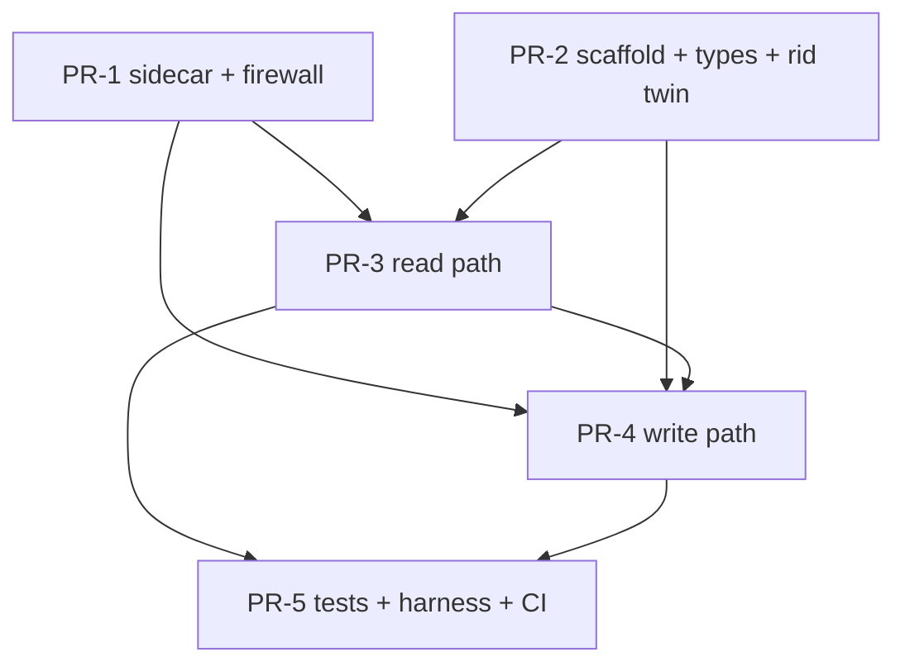

# Signet on Midnight (SGN2): MPC-side implementation, broken into PRs

Companion to [`midnight-spec.md`](./midnight-spec.md) (the WHAT) and [`midnight-spec-decisions.md`](./midnight-spec-decisions.md) (the WHY). This slices the **MPC-repo** work into PRs for the MPC team. It is **phased for the Sept 1 feature freeze**: Phase 1 is a small feature-gated stack that merges before freeze in trusted mode; Phase 2 hardens it and adds security over time.

**This is a clean-room build.** The prior SGN1 integration on `feat/chain-midnight` is **not** reused (no porting, no reworking its modules, no inheriting its goldens). We keep the general `mpc` chain-integration architecture and use the existing chains as structural templates: `chain-canton` (out-of-process publisher), `chain-ethereum` (finality-gated fetch), `chain-solana` (subscription).

**Scope.** `sig-net/mpc` only. The Compact contracts and TS SDK in `sig-net/midnight-integration` are built and belong to the contract team; they appear here as cross-repo inputs. **Phase 1 is bidirectional-only** (matches the deployed dumb-store contract). Plain-`Sign` and payment are out of scope for V1.

## Timeline and delivery strategy

- Today ~Jul 22. Freeze **Sept 1**. Target: PR stack **finalized with tests by ~Aug 8-11**, **1 week review**, **merged ~Aug 18** (2 weeks before freeze).
- Serge's `ChainIndexer` refactor (single `run()`) lands ~Aug 5. We build on the **current** traits and migrate afterward as a small adapter swap (Phase 2). Book a short call with Serge before finalizing the indexer seam.
- **The gate that makes an unproven integration safe to merge before freeze:** a chain is only spawned when its config is supplied, so Midnight is **off by default**. Keep Midnight out of production config until rung 3 (execution proofs, Phase 2) lands. This is the spec's hard line: do not let real value depend on Midnight-derived keys before execution proofs.

## Baseline and assumptions

- **Starting point is `main`, empty of Midnight.** No `chain-midnight` crate, no `Chain::Midnight`, no `derive_epsilon_midnight`. Phase 1 adds them fresh on a new branch off `main`.
- **Build on the existing trait structure.** Implement `ChainStream` / `ChainIndexer` / `ChainPublisher` the way the current chains do (per the add-a-new-chain checklist). Migrating to Serge's single-`run()` `ChainIndexer` is a tracked Phase-2 follow-up, expected to be a thin adapter change, not a redesign.
- **The sidecar is the dependency firewall and comes first.** We build against the unstable Midnight-node alpha branch, which conflicts with the workspace Polkadot deps. All of that instability and the ZK toolchain live in the nested-workspace `midnight-publisher` (own `Cargo.lock`, own `Dockerfile`), so the main workspace stays polkadot-free. This is the encapsulation leadership asked for.
- **The epsilon derivation is consensus-critical.** `derive_epsilon_midnight` reproduces the settled epsilon-v2 constants exactly (contract-address hex64 sender, v2 formula, path from the record's `path` field). Golden-pin it; it is not a redesign (decisions §A, `mpc-crypto`).
- **Phase 1 trust model: trusted-RPC + threshold independence.** No discovery proofs. The rid recompute-and-drop stays (it blocks one contract squatting another's keys), and threshold independence stays (a single lying RPC cannot forge). The proof ladder is Phase 2.

## Cross-repo inputs (contract team, `sig-net/midnight-integration`)

- **Compiled `signet-contract`** (dumb store) v2-ZKIR artifacts + prover keys, toolchain-pinned (compactc 0.33.0-rc.2). Blocks PR-1, PR-5.
- **The `calculateRequestId` circuit + TS twin `signet-requests.ts`** as the golden oracle for the Rust rid twin. Blocks PR-2.
- **Compiled reference `caller-contract`** + committed state fixtures at 6/8/16/27 fields. Blocks PR-3, PR-5.
- **Record / notification / response struct definitions** frozen per spec §3 (Rust structs mirror them byte-for-byte). Blocks PR-2.

---

## Phase 1: trusted-mode bidirectional slice (5 feature-gated PRs)

All five land behind the config gate (Midnight only spawns when configured), trusted mode, tested against the reference caller only. Target: mergeable before freeze.

**PR-1 feat(midnight-publisher): sidecar + dependency firewall (three seams, minimal)**
- Scope: the nested-workspace sidecar that isolates the Midnight alpha + ZK toolchain from the main workspace. Own `Cargo.lock`, own `Dockerfile` (toolkit + Node/toolkit-js + compactc + prover keys). Bind `127.0.0.1`, native intent mode, inject `funding_seed` at runtime. Implement all three seams just enough for the reference caller: `/respond` (prove + submit), `/state` (decode `ContractState`/`StateValue`, with `at=<blockhash>` so two reads either side of a block reveal what it wrote), `/block` (decode finalized block body → per transaction, each call's address, its own `communication_commitment`, and the calls it claims). `/block` deliberately does NOT reconstruct written values: a transcript carries no insert record, so that would mean hand-modelling the ledger VM, while a state diff is the chain's own answer.
- Touches: `chain-signatures/midnight-publisher/**` (new).
- Depends: cross-repo (compiled contract + keys). Size: L.
- Spec: §5.5; decisions §B.8, §B.9, §D.
- Done when: proves + submits a respond to finality against a local ledger-9 stack; faithfully decodes contract state at 6/8/16/27 fields and a notify block body; nothing listens on `0.0.0.0`.
- Notes: mechanism-never-authority. Holds a funding (gas) wallet, no signing shares. This PR is the build-enabler; land it first so everything else compiles polkadot-free.

**PR-2 feat(chain-midnight): crate scaffold, wiring, record types + rid twin (no-op, gated)**
- Scope: new `chain-midnight` crate implementing the current traits as a wired no-op; `Chain::Midnight` + all match arms (`caip2` = `midnight:mainnet`, Abi respond format, finality/checkpoint values); `derive_epsilon_midnight` (settled v2); CLI args + `publishers()`/`spawn_indexers` arms; the config gate. Plus the SGN2 record structs and the request-id Rust twin `calculateRequestId(record) = persistentHash(record)` with goldens.
- Touches: `chain-signatures/chain-midnight/**`, root `Cargo.toml`, `primitives/src/chain.rs`, `crypto/src/kdf.rs`, `node/src/cli/**`, `node/src/stream/mod.rs`, `chain-midnight/tests/goldens/*.json`, `tests/kdf_goldens.rs`.
- Depends: cross-repo (rid circuit/TS twin oracle, struct defs). Runs parallel to PR-1. Size: L.
- Spec: §3.1, §3.2, §5; checklist §1-§5.
- Done when: `main` builds with a gated no-op Midnight chain; rid twin byte-matches `pureCircuits.calculateRequestId` on a fixed vector set; epsilon passes a golden; `into_str_args` round-trips `into_config`.
- Notes: the rid twin and epsilon are the consensus-critical, golden-pinned pieces; pin the rid vector set jointly with the contract team.

**PR-3 feat(chain-midnight): read path (discovery, reader, rid recompute, convert)**
- Scope: `MidnightStream`/`MidnightIndexer` over `chain_subscribeFinalizedHeads` + `chain_getBlock` + notify-call filter; read each new notification by diffing the central contract's state across the block (`/state?address=&at=`), with the call's cross-contract provenance from `/block`; **a general reader** that resolves any integrator's layout (recursive flattening, structural bucket detection for the 16+ field chunk tree, notification-carried ordinal, trailing-zero re-pad, cons-node `List` walking, count-keyed map walk with poisoned-entry skip) and decodes **any capacity tier** via capacity-split enumeration disambiguated by the rid recompute; anchored caller-ledger read (`midnight_contractState(caller, at=finalized hash)`); rid recompute-and-drop; convert to `IndexedSignRequest` (SignBidirectional kind). Basic `catchup_range` block-walk. Emits `ChainEvent::SignRequest` / `Block`.
- Touches: `chain-midnight/src/indexer.rs`, `chain-midnight/src/reader.rs`, `chain-midnight/src/convert.rs`, `chain-midnight/src/reassembly.rs`.
- Depends: PR-1 (`/block`, `/state`), PR-2 (types, twin). Size: L (a mechanical port of the tested `signet-midnight` TS reader; see notes).
- Spec: §5.1, §5.2, §5.3, §3.3.
- Done when: the reader decodes records at the 6/8/16/27-field fixtures and across capacity tiers (each pinned to its `contract-info.json` ordinal); a stream-tier test emits `SignRequest` from a finalized notify tx; a spoofed/mismatched record and a poisoned entry are dropped without blocking a genuine one; tx reassembly is golden byte-equal vs ethers.
- Notes: arbitrary-integrator compatible by design (any layout, any tier). This is a **mechanical port of the tested TS reader** in `sig-net/midnight-integration` `signet-midnight` (`signature-state-reading.ts` chunk-tree walk, `signature-requests-state-reader.ts` capacity enumeration, `signet-requests.ts` descriptors), which is the port oracle; the 6/8/16/27-field fixtures are the acceptance pins. Fold the capacity-split enumeration into the rid recompute so access-list splits stay unambiguous (spec §5.2). **Split option (recommended):** carve the pure reader/decoder (bytes to record, all fixtures, no network) into its own PR ahead of the live pipeline, taking the stack to 6. Probe P4 validates same-block behavior.

**PR-4 feat(chain-midnight): write path (sign to prove to publish, bidirectional)**
- Scope: `ChainPublisher` impl routing to `/respond`. Both bidirectional responds: `postSignatureResponse` (raw chain signature) and `postRespondBidirectional` (the attestation, triggered by the destination chain's `ExecutionConfirmed`). Attestation uses `signetAttestationDigest` (nested `persistentHash`, not keccak), fixed path `"midnight response key"`, requester-scoped sender. Node arms.
- Touches: `chain-midnight/src/client.rs`, `chain-midnight/src/convert.rs`, `node/src/respond_bidirectional.rs`, `node/src/sign_bidirectional.rs`, `node/src/stream/ops.rs`.
- Depends: PR-3 (a signable request), PR-1 (`/respond`). Size: M.
- Spec: §3.5 (corrected digest), §5.3.
- Done when: a request signs, the raw signature posts to Midnight (proved), and after `ExecutionConfirmed` the attestation posts and verifies against the derived response key; `0xdeadbeef` failure output encodes per ABI.
- Notes: **internal fallback if the 2 weeks slip:** land `postSignatureResponse` (raw sig, the demonstrable e2e) first and the attestation second. Both are ZK-proved writes; the attestation also needs the execution trigger, so it is the heaviest last mile.

**PR-5 test+ci(midnight): stream + e2e tests, harness, goldens, gate**
- Scope: stream-tier test (parsing, rid/epsilon/entropy goldens, `Block` progression, checkpoint resume, respond parsing); full-cluster e2e (submit via reference caller, sign, proved respond, verify against `derive_key(root_pk, derive_epsilon_midnight(...))`); harness plumbing (`MidnightStack`/sandbox, spawner `.chain()`); CI workflow with the locked nested-workspace build + lockfile purity guard; assert Midnight is off by default.
- Touches: `integration-tests/**`, `chain-midnight/tests/**`, `.github/workflows/midnight.yml`.
- Depends: PR-3, PR-4; cross-repo (fixtures, reference caller). Size: L.
- Spec: §5.2, §5.5, checklist §7.
- Done when: stream test green without a cluster; e2e signs + verifies end-to-end on a local ledger-9 stack; CI fails on lockfile impurity or a stale golden.
- Notes: prover RAM is heavy, so background the run; the integrator claim-circuit *prove* step stays gated until a zkir-v3 prover ships (does not block e2e signing).

---

## Phase 2: hardening and generality (backlog, after freeze)

Sequenced later; none blocks the Phase-1 merge. Grouped by theme:

- **Trait migration:** adapt the indexer to Serge's single-`run()` `ChainIndexer` once it lands (thin adapter; coordinate on the call).
- **Reader follow-ups:** the P9 tier proving-cost guidance table, cross-compiler-version encoding-drift handling (CI watch on Compact release tags), and fuzz/perf hardening. The core general reader and capacity-tier decoding ship in Phase 1 (PR-3).
- **The proof ladder (spec §5.4):** rung 2 inclusion + 2b provenance (P10), **rung 3 execution proof (the value gate: flip Midnight on in production only after this)**, rung 4 finality (GRANDPA + committee tracking).
- **Plain-`Sign`:** blocked on the contract-side notify pair + record kind; then a small reader/convert addition via `txParamType` (no dumb-store change).
- **Ops:** catch-up robustness, monitoring/alerting on head-staleness, full CI matrix, then enabling Midnight in production config once rung 3 is live.

---

## Dependency graph (Phase 1)

**Critical path:** PR-1 and PR-2 in parallel, then PR-3 → PR-4 → PR-5.

## Risks

- **Scope vs 2 weeks is tight, more so solo.** The heaviest items are the reader + enumeration (PR-3, though it ports the tested TS reader rather than inventing it) and the two proved-respond paths + execution trigger (PR-4). Mitigations: split PR-3's pure reader into its own PR for parallel review; the PR-4 fallback (raw-sig respond first, attestation second). If it still does not fit, the honest lever is the merge date; flag it to Serhii early.
- **Alpha instability** (Midnight node branch): the sidecar isolates it, but expect churn; pin hard.
- **Trait timing:** Serge's refactor lands right as we finalize. Low risk by team agreement (build on current, migrate after); the call de-risks the seam.
- **Review bandwidth:** a complex, unfamiliar (ZK/Midnight) integration in 1 week. Mitigation: the gated 5-PR stack is reviewable incrementally and low-risk because it is off by default.

## Probe and gate register

- **P1-proper** (contract-state to raw storage-key mapping): blocks the Phase-2 rung-3 proof.
- **P4** (same-block concurrency, first-wins): validate on PR-3.
- **P10** (inclusion proof + CCC verifiability): Phase-2 rung 2.
- **P11** (in-circuit keccak): informational; the module uses the persistentHash digest, so PR-4 pins that, not keccak.
- **P12** (response-key pinning): resolved in the reference caller (post-deploy `initialise`); no MPC action.
- **zkir-v3 prover gate** (decisions §G.7): the integrator claim-circuit *prove* step is upstream-gated; PR-5 exercises the flow but cannot prove the claim circuit until a v3 prover ships. The MPC respond path and the dumb-store contract are v2 ZKIR and unaffected.

## Out of scope for V1

- **Payment** (spec §8): a separate contract beside the dumb store, later.
- **Plain-`Sign`**: Phase 2, and blocked on the contract-side notify pair first.
- **The GraphQL indexer as a discovery source**: non-normative optional second source only (decisions §B.7).
- **The SGN1 integration on `feat/chain-midnight`**: not reused; a reference read only if a decode detail needs cross-checking.
