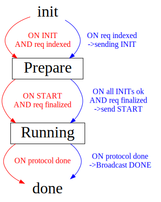
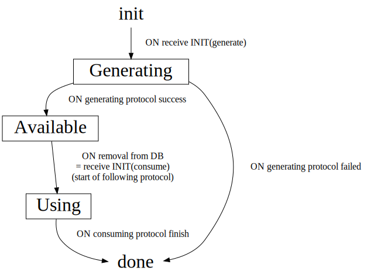
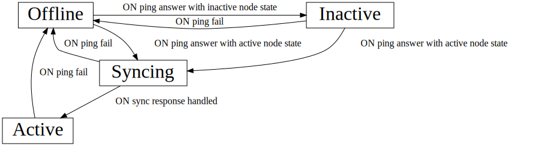
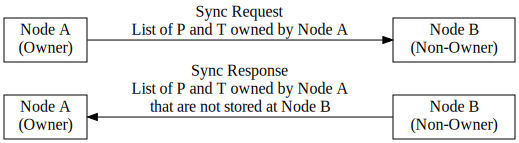

# MPC Node Specification

This document describes how an MPC node is supposed to interact with other
nodes, in a way that the network can execute signature requests in a stable and
reliable manner.

It's a high level specification, describing the distributed algorithms and
messages.

## Definitions

### Protocols

The MPC network has three protocols that it serves.

- Triple Generation
- Pre-signature Seneration
- Signature

These are distributed algorithms. The execution of such an algorithm across the
network will be called `protocol invocation` in this document.


### Participant Roles

Each protocol invocation (triple generation, pre-signature generation,
signature) has a list of `Participants`. One of the participants is the `Owner`
who initiates the protocol.

The `Owner` of a protocol will usually follow different steps than the rest.

The `Owner` has full control over protocol invocations and inputs that it
owns. All other participants follow blindly and must not make any decisions
about the non-owned protocol invocation on their own. This makes it easier to
avoid many common distributed faults, such as two nodes deciding differently on
the same invocation. It is not byzantine fault-tolerant, however, which this
specification explicitly not is trying to achieve.

## Protocol State Machine

The following graph shows the lifetime of a protocol invocation.
Each participant has its own instance of this state machine.

The arrows in blue show how the `Owner` transitions between states, while the
red arrows are for all other `Participants`. Red arrows generally only wait on
messages by the owner, while the owner (blue) sends these messages whenever
itself transitions forward.

For the signature protocol, all participants must check that requests were
indexed and finalized, as noted in the graph.




### States

`init` and `done` are implicit states. All other states must be explicitly
stored and ideally persisted.

#### Prepare

In the `Prepare` state, nodes establish the protocol inputs, such as the
participants list. Nodes should not send messages to other nodes about this
protocol yet, nor should they process messages that they receive.

Why can we not send messages, yet? This is due to the black box assumption on
the underlying cryptography. Signing messages and sending them out might reveal
information. This could lead to security vulnerabilities if we later invoke the
same protocol again but with a different set of participants, for example.

Nodes in the `Prepare` state may receive messages from other nodes that are
already in the `Running` state. In that case, nodes should either reject
messages or keep them in a buffer. If rejected, the sender (in `Running` state)
must retry sending the rejected message. If buffered, the receiver should
process the buffered messages right after it transitions to the `Running` state.

#### Running

In the `Running` state, nodes continuously poke the local message generators and
exchange messages to progress the protocol.

Messages sent to participants that are offline or reject the message must be
retried until either the receiver accepts the message or the protocol invocation
globally times out.

For recovery, we use the
[Event-Sourcing](https://dev.to/alisamir/understanding-event-sourcing-a-detailed-guide-4cjp)
pattern, while the protocol is running. The actual latest state is only held in
memory but the stored events allow to recover it from persisted data.

Specifically, this means tha all received messages during the `Running` state
must be persisted before they are applied. These can be replayed on boot for
recovery after a crash. After a protocol finishes, events can be discarded.

Note: Unlike fully event-driven architectures, the MPC network does not need to
have a separate even store component. The Event-Sourcing pattern is only applied
locally within one node.

### Owner Transitions

The owner of the protocol invocation progresses the protocol:

- When a new valid request is registered (indexed for the signature protocol,
  initiated by background task for triple/pre-signature generation)
    - Select a list of participants, based on the own view of which nodes are
      active and hold the relevant data in their storage. We heavily rely on
      state sync for this selection of participants to be good on the first try.
    - Asynchronously send an INIT message to all the participants and wait until
      all messages have been received. (HTTP success response)
    - Transition to `Prepare` state
- Once all INIT messages have been answered with a success response
    - Wait for finality of the request (for signatures only)
    - Send out a START message all participants
    - Transition to `Running` state
    - Start poking own generator and sending out the corresponding messages

Owners must also handle the following error case:
- Not all participants answered the INIT message with an HTTP success response
    - Select a new set of participants and send another round of INIT messages
        - Participants must overwrite the previously stored participants list
    - Wait again for all participants to answer

Other error cases can be handled with a global timeout to abort and retry for
signatures.

## Triple and Pre-Signature State Machine

Triples and Pre-Signatures are persistently stored on each node. They go through
the following lifecycle. Nodes must keep track of them in order for state sync
to work.



### States

`init` and `done` are implicit states. Both are represented by not having any
information about the P or T in storage. All other states must be explicitly
stored and ideally persisted.

#### Generating

A P or T in the `Generating` state has an active protocol invocation that will
generate it on success. It is treated the same way as `Available` for state
sync. But the storage does not actually hold the P or T, yet.

#### Available

In the `Available` phase, a P or T share is currently ready to be used in a
protocol. This state always implies that the P or T is available in state. As
soon as it is removed from persistent storage, we must persist the state change
to `Using`.

#### Using

A P or T in the `Using` state is currently being used in a protocol invocation.
We need to track this in order for state sync to not delete any data that's
still in use.

Only transition from `Using` to `done` when either the protocol finishes
successfully, or we hit the global protocol timeout. Once that transition
happens, the node can delete all info about the P or T and its ID from
persistent storage.


## Participant Selection

When a proposer selects a list of participants for a new protocol invocation, it should check these conditions:

- Participants must be online
- Participants must hold the relevant P and T shares

To enable the first, nodes keep a connection status for every peer. For the
second part, they keep a directory of each owned P and T with a list of share
holders. Both data structures are further specified below.

### Node Connection Status



Nodes keep pinging each other, checking their peers status.

Peers that don't respond are marked as `Offline`.

Peers that respond but indicate in their status response that they are not actively participating in the MPC network, are marked as `Inactive`.

Peers that respond and are participating in the MPC network are first listed as
`Syncing` and receive a sync request. Only after the response for that has been
answered, can the connection status transition to `Active`. Only peers with a
connection status `Active` are valid for inclusion in the participant list of
any protocol invocations.

### Share holder directory

An owner of a P and a T must always know which peers are holding a share of it.
It should keep this information up-to-date in a directory that's fully persisted.


```
# Example directory of node A

Triple 0: [Node B, Node C, Node D]
Triple 1: [Node B, Node C, Node D]
Triple 2: [Node B, Node D]
```

Note that this directory only contains entries for inputs owned by the node.

To keep this list up-to-date, nodes implement state sync.

### State Sync

Nodes may sometimes lose their persisted database. The network has to recover
from that without causing instability. That's why we have state sync, which
updates the directory used for participant selection.

State sync runs everytime a node connects to another, either after a fresh boot,
or when re-connecting after the connection was lost for another reason.



During state sync, the owner sends a list of Pre-signatures and Triples that it expects the other node to hold a share of. Specifically, it sends all owned IDs which satisfy:

- Is in the current directory of the owner
- The non-owning peer node (Node B) is in the list of valid participants in the owner's directory
- The owner currently holds the input data as `Available`, `Generating`, or `Using`.

The receiver (B) can optionally use the sync request to delete all inputs
owned by node A that are not in the list, if B holds them as `Available`,
`Generating`. Do not delete anything in `Using`, as it suggests the protocol has
not finished globally yet, even if on the owner's view it already has finished.

Node B must always respond with a list of IDs that were in the request but node
B no longer holds the corresponding input in storage, in any state.

Node A (owner) uses the response to update its directory. Specifically, for all
entries listed in the response, delete node B from the list in the directory, no
matter which state it is in right now.
