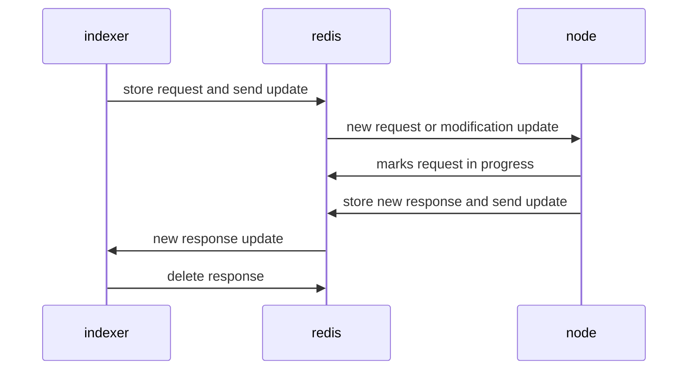

# Persistent Sign Queue

In our multi-party computation network, the very basis of processing a request is to first receive one and then be able to process it. This indexing and sending it to the node for processing can be erroneous, such as the node/indexer crashing or failing to index for various reasons: the node might have crashed and not have completed the request, or the indexer might have sent the request too early before finalization. To alleviate this, requests are stored, such that recovery and modifications are possible. Similarly, responses are stored for cases where the indexer also crashes and fails to publish.

## Requirements

### Request Persistence

Requests should be persisted and not deleted till they are completed (i.e. published to the corresponding chain/network).
- If a request had to be modified (in the case of finalization), an update should be sent to the process/node processing it.
- Duplicate requests should not be possible while the request has not been published yet (given that hash(request) equals the id for uniqueness of requests).
- Either the node or indexer cleans up requests if it stays in persistence for too long (by timeout or some configuration).

### Response Persistence

The response alongside the request should also be persisted, such that when an indexer fails to publish, it should be able to pick back up and retry.

## Redis Representation

- Requests/Responses are stored in a map, where the mapping is from `sign_id` to `Request` or `Response`.
  - `Request` and `Response` are their own separate maps.
  - The request can be modified with additional fields like finalized or in-progress.
- To save the node from constantly scanning the map for new changes, a bidirectional updates channel is needed to tell each side of modifications or new requests.
  - For requests, is is a single queue of updates since the node does not care about which chain the request is from.
  - For responses, it is a queue for each `indexer[chain]` since it is bit of a waste for each `indexer[chain]` to deserialize the response just to find out that it does not belong to that indexer.

### Lifecycle

1. request is indexed by indexer[chain].
2. request is persisted onto redis into the map: update is sent.
  - if request needs modification: request modified in redis & modification update is sent
3. request update is seen by node.
4. request is marked as in-progress by node.
  - if node crashes, it scans all requests in redis on startup and retries
5. request is completed by node and response is created.
6. response is added onto redis map: update is sent.
7. response update is seen by indexer[chain]
8. response is published by indexer[chain]
  - if indexer crashes, it scans all responses in redis on startup and retries
9. request and response are both deleted from their redis maps.

