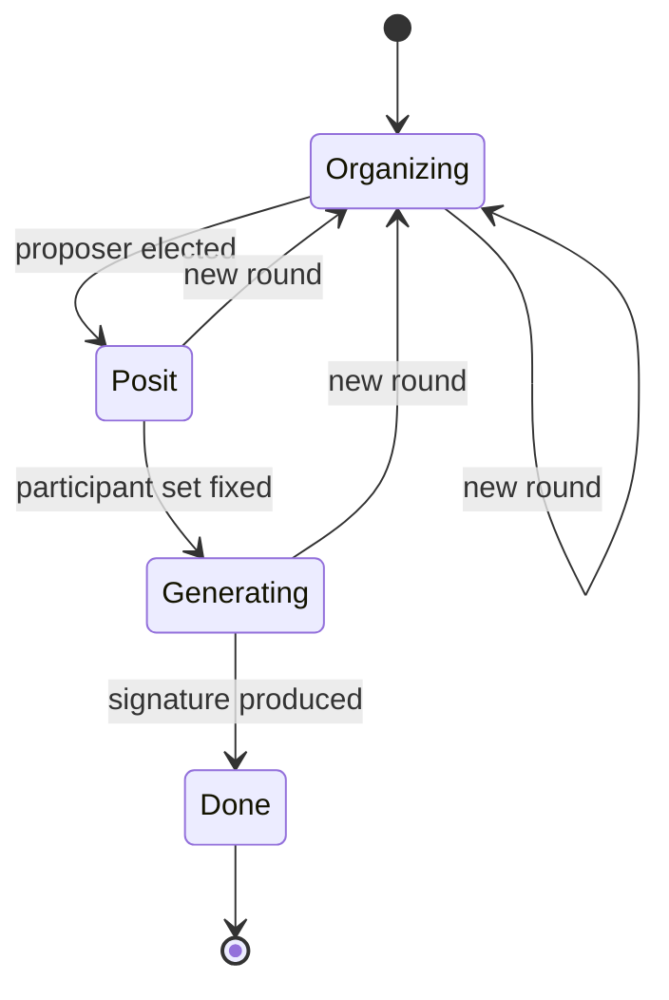
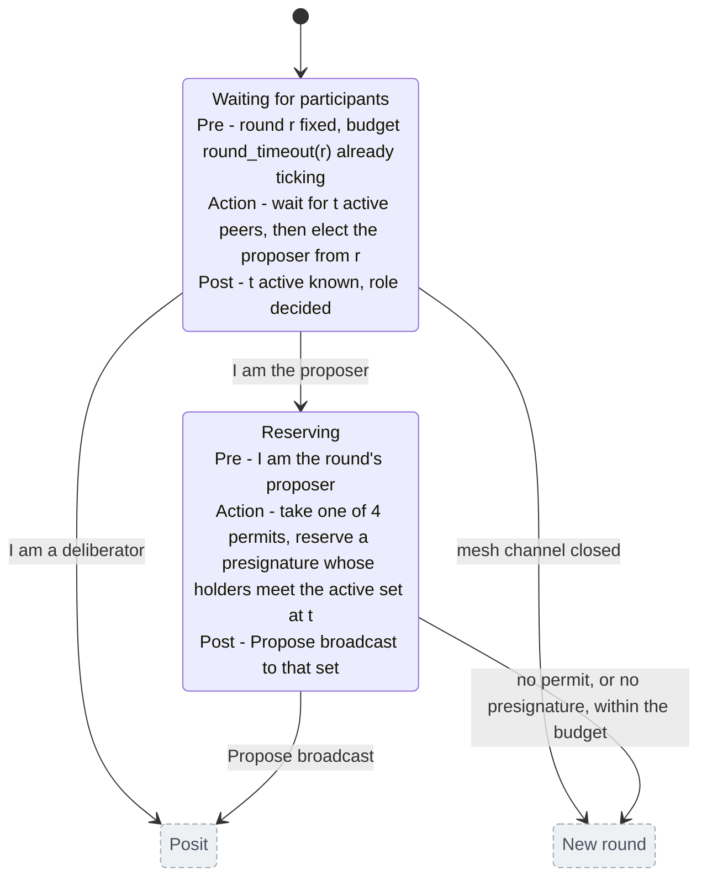
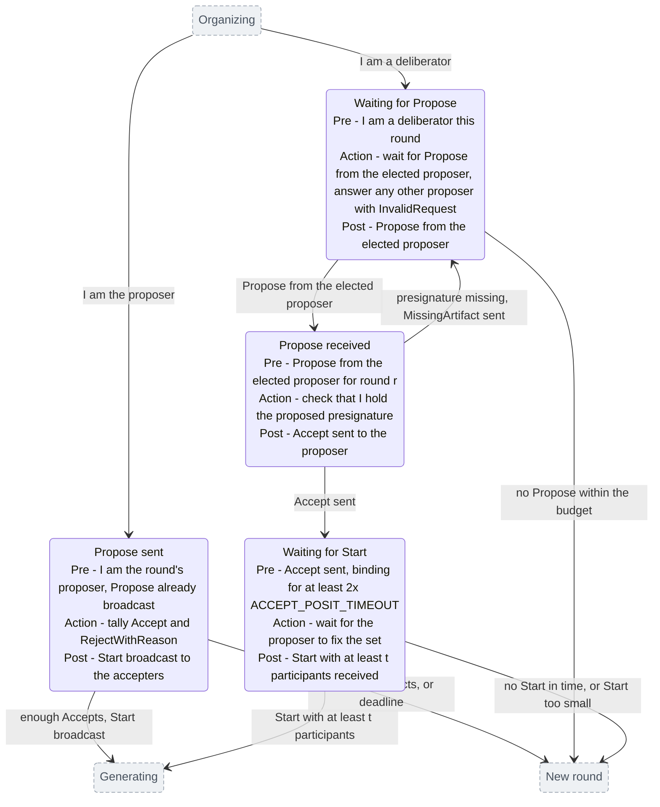
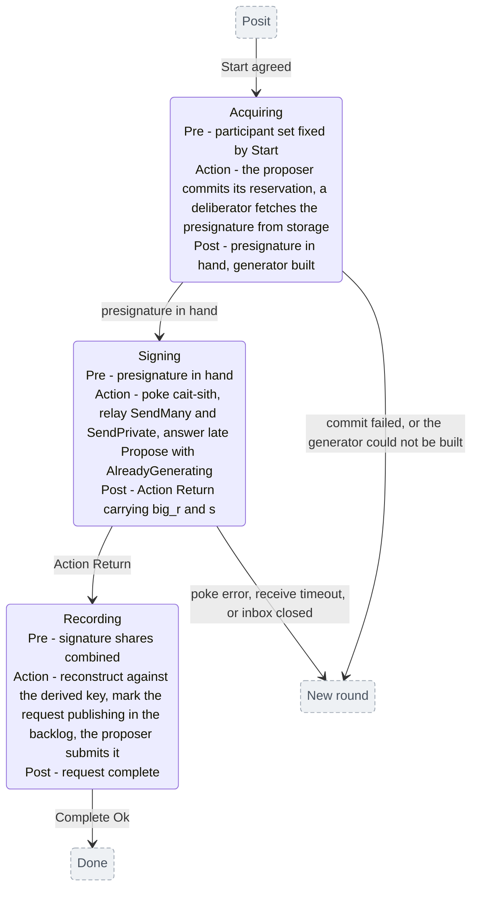
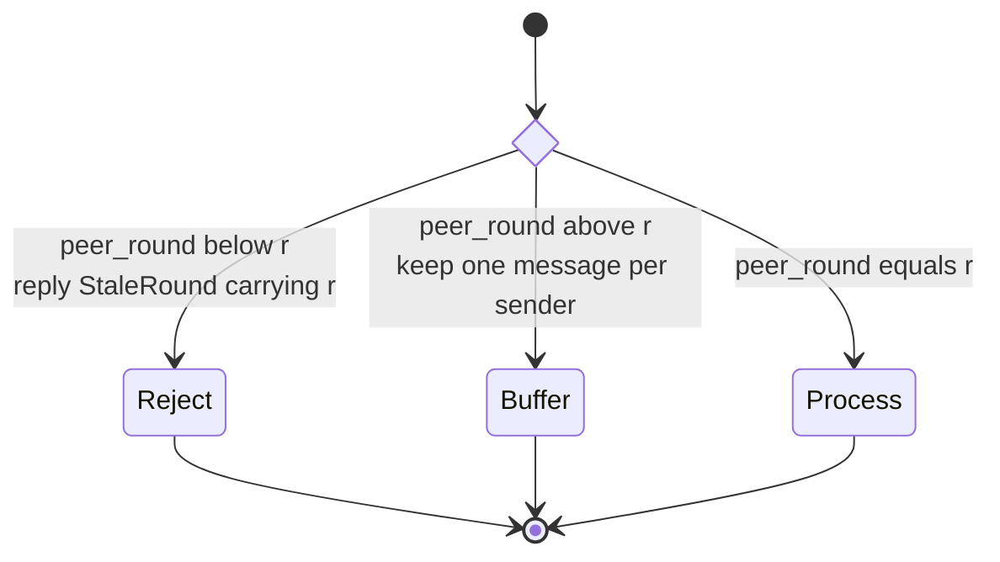

# Posit: a hierarchical state machine

Scope: one sign request, one node, as implemented in
`chain-signatures/node/src/protocol/request/` (`task.rs`, `organize.rs`,
`posit.rs`, `state.rs`) plus the generation tail in `protocol/signature.rs`. The
cait-sith signing math and the presignature/triple pipelines are out of scope.

Two levels. The top level is the `SignPhase` enum, one name per state. Each
phase then gets its own diagram showing what happens inside it and where it can
leave. States drawn grey and dashed in a detail diagram belong to another phase;
they are there to show where the edges land.

## 1. Top level

Every recoverable failure is the same transition, `state.reorganize()`: bump the
round, reset the budget, release the permit, re-enter `Organizing`. There is no
other back edge, no state is skipped going forward, and no failure path leaves
the machine. The three detail diagrams below say what triggers each one.

## 2. Inside Organizing

`Waiting for participants` is the one state in the whole machine that consumes
budget without checking it: it waits on `mesh_state.changed()` with no timeout
at all. If the mesh gate holds longer than `round_timeout(r)`, the budget is
already zero when it returns, and the round that follows fails on its first
await without a message being sent.

## 3. Inside Posit

The two lanes never meet. A node takes one or the other per round, decided by
`is_proposer`, which is a pure function of `r`. `Propose received` is the only
instantaneous state; the other three can hold for a full round budget.

The edge back from `Propose received` to `Waiting for Propose` is not an abort:
the round is not bumped. A deliberator that lacks the presignature sends
`MissingArtifact` and resumes waiting for a `Propose` that a correct proposer
will not resend, so it sits out the rest of the round and leaves via the timeout.

## 4. Inside Generating

`Recording` has no exit to a new round. Reconstruction failure returns `None`
from `build_publish_state`, which skips the backlog marking, but the proposer's
`rpc.publish` call sits outside that branch and runs anyway, and the task
returns `Ok` either way. Only the proposer submits; every node marks the
backlog.

## 5. The round filter

Every incoming posit message passes the same three-way test before any state
above sees it:

Three rules make this work:

1. A node never jumps forward to a peer's round on sight. If it did, any peer
   could name a round that makes itself proposer and do so every time. It
   finishes its own round first and only catches up at the next bump.
2. A `StaleRound` reject carries the rejector's round, so the lagging node
   catches up in one bump instead of one round at a time.
3. Rejects are never answered with a reject, otherwise two nodes ping-pong.

Buffered messages are replayed only in `Waiting for Propose`, and only once
`highest_seen_round == r`.

## 6. State variables

Two variables survive a round; everything else is rebuilt.

| Variable | Lives in | Changes when |
|---|---|---|
| `r` — round | `SignState.round`, mirrored into `SignEntry.round` (`Arc<AtomicUsize>`) | a new round: `r := max(r+1, highest_seen_round)`. Never decreases, and survives a task respawn. |
| `highest_seen_round` | `SignState` | a peer message or a `StaleRound` reject reports a round above it. Raising it also clears the buffer. |

Derived from `r` alone, with no messaging:

- proposer of the round: `participants[(entropy[0] + r) % n]` (`organize.rs`)
- round budget: `round_timeout(r)` (`mod.rs`). Round 0 gets 20s; round 1 starts
  at a 2s floor and each later round grows 1.15x up to a 600s ceiling. Short
  early rounds rotate quickly past dead proposers, long later rounds outlast
  the skew between nodes that indexed the request at different times.

So all nodes agree on who proposes and how long the round lasts as soon as they
agree on `r`. Rounds are the only synchronisation the protocol has.

## 7. The round budget

`TimeoutBudget` starts its clock in `reset()`, whose only caller is
`bump_round()`. The budget therefore starts at the round bump, before `t` active
participants are known; round 0's clock starts at task spawn. Every state draws
from the same budget, whatever is left of it.

| State | Bounded by |
|---|---|
| Waiting for participants | nothing |
| Reserving | remaining budget |
| Waiting for Propose | remaining budget |
| Propose sent | remaining budget |
| Waiting for Start | remaining budget, floored at `2 * ACCEPT_POSIT_TIMEOUT` |
| Acquiring, Signing | the generation protocol's own timeouts |

`Waiting for Start` is the only state with a floor under its wait. That floor is
what keeps an `Accept` binding: a node that promised to participate cannot walk
away just because its own budget ran out.

## 8. Invariants worth checking

- **Rounds are monotone per request**, including across a respawn
  (`carried_round`). Peers read a round reset as time travel; `set_round` is the
  only write path.
- **Exactly one proposer per round**, because election reads only `r`,
  membership and entropy — never the local active set. Filtering by local state
  is what caused the permanent divergence in #907.
- **A node walks one lane of `Posit` per round**, never both.
- **`Accept` is sent exactly once per round**, on the edge out of
  `Propose received`.
- **The proposer's `Start` set is a subset of the accepters**, so every node in
  `Generating` has agreed to the same presignature for the same round.
- **`Generating` is not preempted by a new round**; a node only leaves it by
  finishing or failing.

## 9. Observations the model surfaces

Stated as consequences of the machine, not as bug reports.

1. **The new-round edge has no exit but another round.** No round cap, no
   deadline spanning rounds, and `round_timeout` saturates at 600s rather than
   growing without bound. The one failure terminal, `Complete(Err(Aborted))`,
   needs a closed proposer semaphore, and `Semaphore::close` is never called, so
   no request ever fails from inside the machine. A wedged request rotates until
   something outside removes it; the delayed watcher only increments a metric.
2. **A late accepter burns a full round.** A node that catches up mid-round
   sends `Accept` after the proposer already broadcast `Start`. The proposer is
   in `Generating` and drops `Accept` there, so the late node waits out its
   deadline in `Waiting for Start` and only rejoins at `r+1`.
3. **`MissingArtifact` costs a whole round**, for the reason given under §3.
4. **The buffer holds one message per sender.** If a sender's later message for
   the same future round overwrites its `Propose`, the deliberator reaches that
   round with nothing to act on. Today only the proposer sends both, and it
   sends `Start` only to nodes that accepted (which a lagging node cannot have
   done), so this is currently unreachable rather than guarded against.
5. **`Done` overstates completion.** `Complete(Ok)` fires after `rpc.publish`,
   before any on-chain confirmation, and also fires when reconstruction failed
   and the backlog was never marked. The publish/confirm lifecycle lives in the
   spawner and indexer, not in this machine.
6. **`pause_proposing_until` is a hidden mode.** For up to `generation_timeout`
   a node declines proposership and takes the deliberator edge out of
   `Waiting for participants`. Since election is by round, nobody else proposes
   that round either, so the round is spent waiting for a `Propose` that will
   not come.
7. **`Waiting for participants` is unbounded**, and whatever time it spends is
   subtracted from the round that follows.

## 10. Files

- `request/task.rs` — `SignPhase`, the driver loop
- `request/organize.rs` — election, permit, presignature reservation, `Propose`
- `request/posit.rs` — `Propose`/`Accept`/`Start`, the round filter
- `request/state.rs` — round, budget, buffering
- `protocol/signature.rs` — the generation tail and publish
- `protocol/posit.rs` — shared vote types; the `Posits` map there is used by the
  triple and presignature protocols, signing uses `SinglePositCounter`
