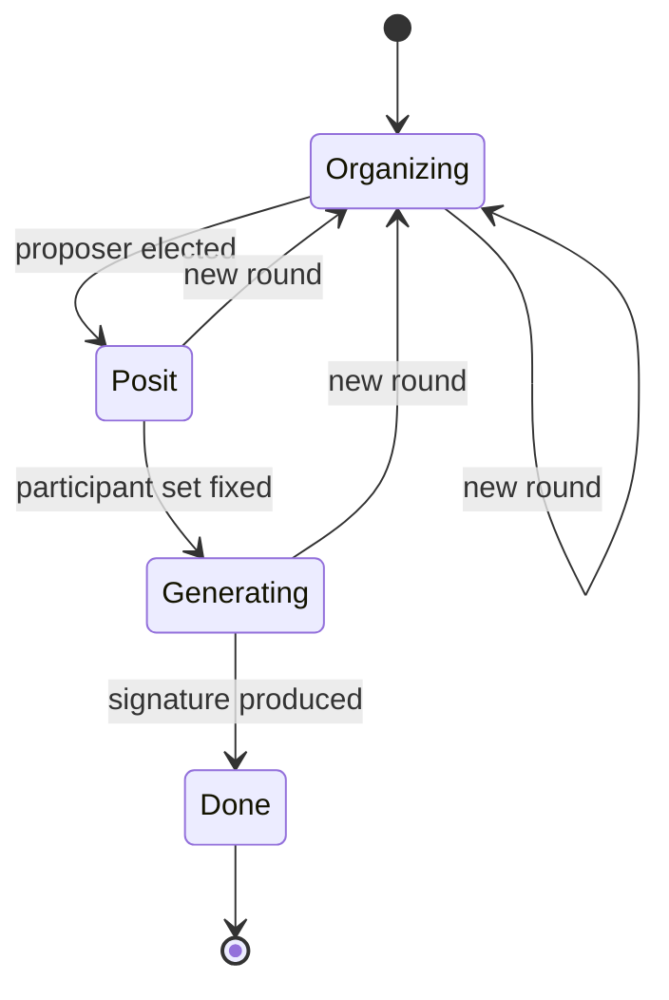
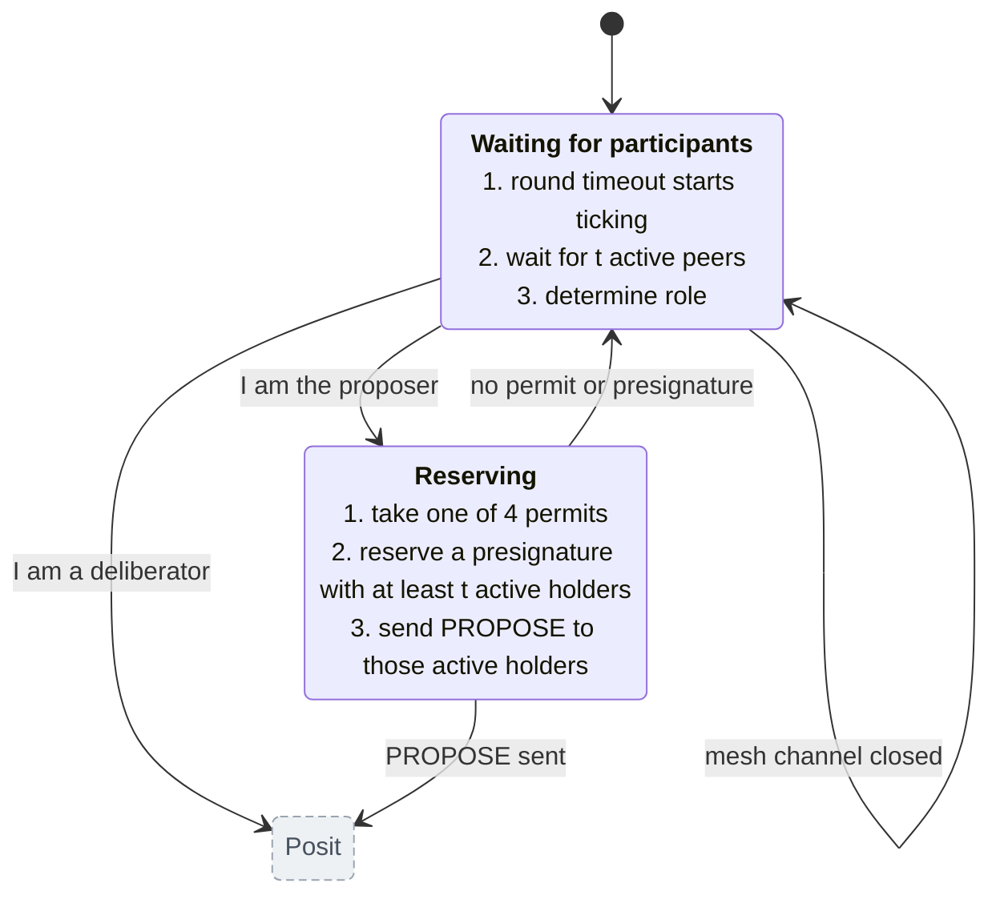
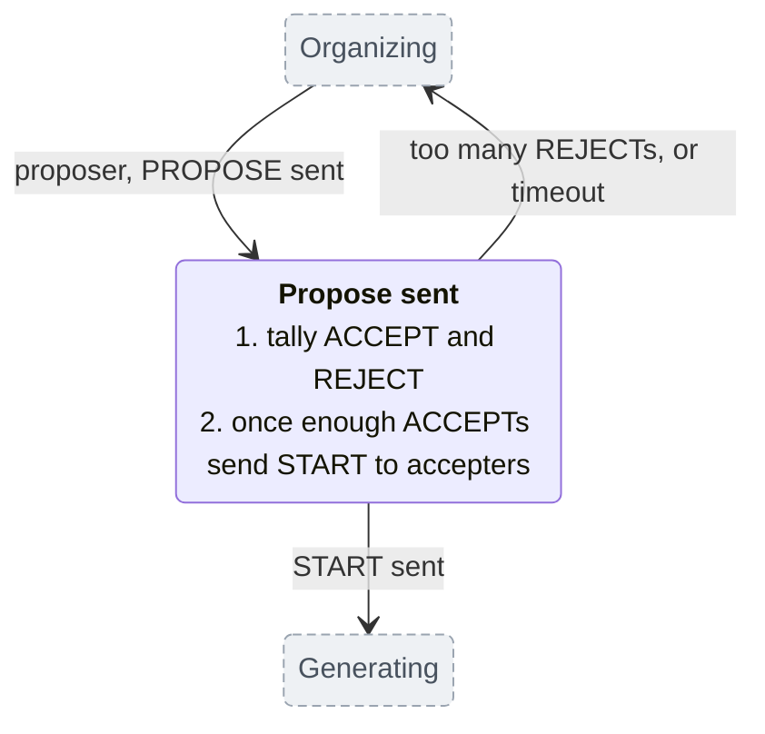
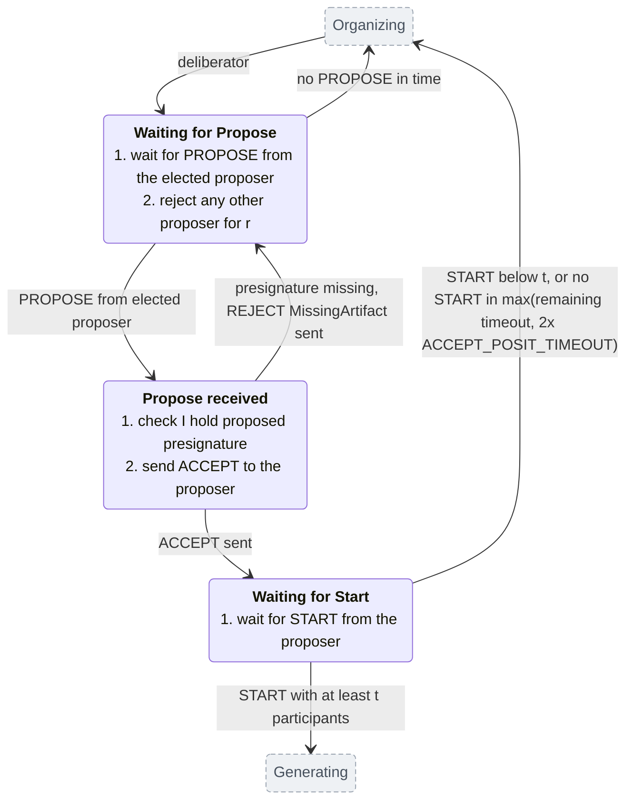
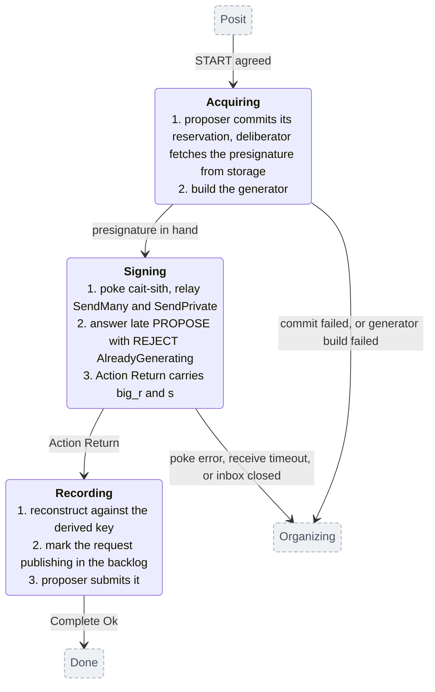
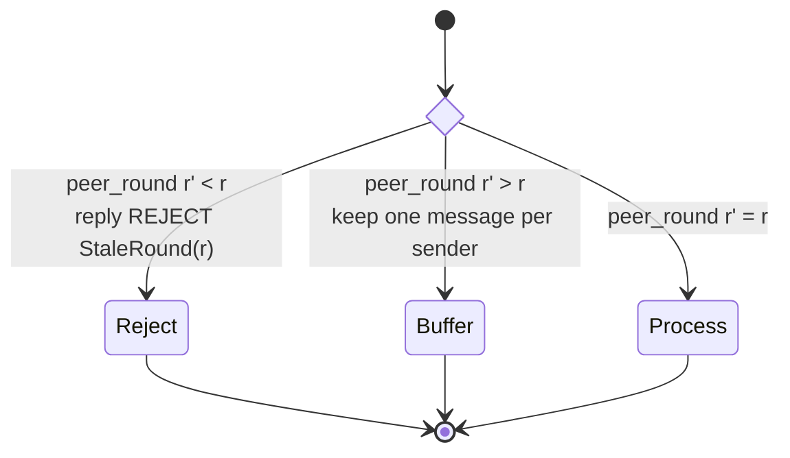

# Posit state machine

Describes the current implementation in
`chain-signatures/node/src/protocol/request/` (`task.rs`, `organize.rs`,
`posit.rs`, `state.rs`) plus the generation tail in `protocol/signature.rs`. The
cait-sith signing math and the presignature/triple pipelines are not depicted here.

The top level state machine matches the `SignPhase` enum. Each
phase then gets its own diagram showing what happens inside it and where it can
leave. States drawn grey and dashed in a detail diagram belong to another phase;
they are there to show where the edges land.

## 1. Top level

A task enters `Organizing` when `SignatureSpawner` spawns it for a request, at
round 0. That is usually a newly indexed request, but not always: on restart or
after catchup, `requeue_pending_sign_requests` re-sends every backlog entry
still in `PendingGeneration` and each is spawned the same way. If governance is
not `Running`, the request is retained and `spawn_tasks` starts it once
governance is; a respawn on a governance change re-enters `Organizing` at the
round carried in `SignEntry.round`, not 0.

Every recoverable failure calls `state.reorganize()`: bump the round, reset the
round timeout, release the proposer's permit if held, re-enter `Organizing`.
That is the only back edge, and no failure leaves the machine. The detail
diagrams below say what triggers each one.

### State each node keeps

Running these machines needs little memory. Per in-flight request a node holds:

- **the current phase** — where it is in the diagrams above;
- **`r`, the round** — the one real driver: it fixes the proposer and the round
  timeout, and every node agrees on it without messaging (§5);
- **`highest_seen_round`** — the largest round any peer has mentioned, so one
  bump can jump straight to it;
- **the round's timeout clock**, and, for a proposer, its concurrency permit;
- **a one-slot-per-sender buffer** of messages for a future round (§5);
- optionally **`pause_proposing_until`**, a deadline until which it declines to
  propose.

A round bump resets only the timeout clock and releases the permit. Everything
else in the list carries across it: `r`, `highest_seen_round`, the buffer (which
is why it exists — it waits for the node to reach `highest_seen_round`), and
`pause_proposing_until`. A respawn keeps less: only `r` survives, via
`SignEntry.round`; `highest_seen_round`, the buffer, and the pause all start
empty again. The proposer's ACCEPT/REJECT tally is transient, rebuilt inside each
`Propose sent`.

Not per request: the mesh's active set (a shared `watch`) and the governance
membership and threshold; the third election input, entropy, comes with the
request itself. Per node across requests:
`dead_ids`, an LRU of retired `sign_id`s bounded at `MAX_DEAD_IDS` (4096). A
late posit message for a retired request is dropped by it. Without this check,
it would allocate an inbox that nothing ever drains.

## 2. Inside Organizing

`Waiting for participants` has no timeout of its own. It blocks on
`mesh_state.changed()` until `t` peers are active, and returns early only if the
mesh channel closes.

The round timeout `round_timeout(r)` is already running while it waits, because
it started when the round began. If the wait outlasts the round timeout, the
states after it get no time at all: the proposer's permit wait and presignature
fetch and the deliberator's wait for `PROPOSE` are each given the time left in the round, which
is now zero, so they fail on the first poll and round `r` ends without a
`PROPOSE` going out. The next round restarts the clock, so the cost is one wasted
round, with a different proposer.
Optimization: start round timeout when enough active peers.

## 3. Inside Posit

Posit is two independent machines, one per role; a node runs exactly one for
round `r`, chosen by `is_proposer`: the proposer elected for `r` (§5), unless it
is throttling (§8.6).
Each starts at `Organizing` and ends at `Generating` (agreement) or back at
`Organizing` (new round).

### 3a. Proposer

### 3b. Deliberator

Timeout details are in §6.

`Propose received` is the only instantaneous state; the others can hold for the
full round timeout.

The edge back from `Propose received` to `Waiting for Propose` is not an abort:
the round is not bumped. A deliberator that lacks the presignature sends
`REJECT MissingArtifact` and resumes waiting for a `PROPOSE` that a correct proposer
will not resend, so it sits out the rest of the round and leaves via the timeout.

Shrinking the holder set on `REJECT MissingArtifact` is proposal 2 in §9.

### Who each message goes to

None of the four messages is a cluster-wide broadcast.

| Message | Recipients |
|---|---|
| `PROPOSE` | the holders of the reserved presignature intersected with the active set, not all members |
| `ACCEPT` | the proposer only |
| `START` | the accepters only, a subset of the `PROPOSE` set |
| `REJECT` | whoever sent the message being rejected |

A member outside the `PROPOSE` set is never told that round `r` is running. It
sits in `Waiting for Propose` until its timeout expires and bumps to `r+1`,
where it may be elected proposer and reserve a *second* presignature for a
request that is already being signed. That is the waste the `pause_proposing_until`
flag exists to limit after the fact.

Sending `PROPOSE` to every member would help, cheaply: the tally is keyed
on `SinglePositCounter::participants` and `process_action` drops senders outside
that set, so extra replies cannot move `enough_rejects` or `meets_totality`. It
would be a notification, not a vote. See also open questions on "active" checks below.

It only half-solves the problem, though. A member holding the presignature but
absent from the active set at reservation time would `ACCEPT`, go uncounted, and
wait for a `START` that never comes. And the excluded member still cannot tell
"round `r` succeeded without me" from "round `r` still running", which is what it
needs. The narrow addressing is a symptom; the missing round-outcome signal is
the cause.

What the excluded member would do with that signal is stop. The cost of not
stopping is three things, not one. It burns the round for every peer still
waiting; in the rounds where it is elected proposer it takes one of the
`MAX_CONCURRENT_PROPOSERS` (4) permits, which is proposer-only, so a
deliberator holds none; and in those same rounds it reserves a presignature
that it returns to the pool on timeout. So the permit is held intermittently
rather than for the whole wait, and the steady cost is the wasted rounds and
the repeated reservations.

Open question: whether to send every message to every member, rejects included.
Doing so needs the one-slot-per-sender buffers (§5) revisited first, since more
messages per sender per round is exactly what they cannot represent.

## 4. Inside Generating

`Recording` has no exit to a new round. Reconstruction failure returns `None`
from `build_publish_state`, which skips the backlog marking; the proposer's
`rpc.publish` call still runs but validates the signature again internally and
trashes the request on failure. Either way nothing is submitted, nothing is
marked for republish, and the task still returns `Ok`: a reconstruction failure
is silently recorded as success.

Only the proposer submits, though every node reconstructs the signature and
marks the backlog. That asymmetry has no failover: if the proposer goes offline
before its respond transaction lands, no other node takes over, even though
each of them holds the complete signature. See
[#1063](https://github.com/sig-net/mpc/issues/1063).

The round timeout does not reach here, but generation is not untimed: every
`recv` in the generator is wrapped in a deadline measured from when the
generator was built, and expiry aborts the attempt into a new round. That is one
generation-wide deadline, not a per-round one.

## 5. Bumping rounds

A node at round `r` runs every incoming posit message, carrying its sender's
round `r'`, through a three-way test before any state above sees it.

Three rules make this work:

1. A node never jumps forward to a peer's round on sight. If it did, any peer
   could name a round that makes itself proposer and do so every time. It
   finishes its own round first and only catches up at the next bump.
2. A `StaleRound` REJECT carries the rejector's round, so the lagging node
   catches up in one bump instead of one round at a time.
3. A REJECT is never answered with a REJECT, otherwise two nodes ping-pong.

Buffering keeps one slot per sender, and a message above `highest_seen_round`
clears the whole buffer and raises `highest_seen_round` to `r'`; one below it is
dropped. On replay the node takes senders in arbitrary order, and only once
`highest_seen_round == r`, in `Waiting for Propose`.

One slot per sender means a second message from the same sender for the same
round overwrites the first, in arrival order. Two layers do this: the ingress
`PositMailbox`, which overwrites whenever the new round is `>=` the buffered
one, and the per-round buffer above. The design argument for why one slot
suffices is that a sender never has two live messages for one round: to a
proposer a peer sends only ACCEPT or REJECT, and to a deliberator the proposer
sends PROPOSE and then START, where START is only ever sent to a node whose
ACCEPT it already received.

**That argument assumes per-sender delivery order, which this system does not
have.** Posit messages travel over HTTP, so two messages from one sender can
arrive in either order, and neither buffer detects it: the later arrival simply
overwrites the earlier and the loser is dropped without a trace. Causality makes
the bad interleaving unlikely rather than impossible — START follows the node's
own ACCEPT, which follows PROPOSE, so losing the START needs a PROPOSE delayed
past a full round trip. The consequence is a lost round, not a wrong signature
(§8.4).

The two round-surviving variables, in detail:

| Variable | Lives in | Changes when |
|---|---|---|
| `r` — round | `SignState.round`, mirrored into `SignEntry.round` (`Arc<AtomicUsize>`) | a new round: `r := max(r+1, highest_seen_round)`. Never decreases, and survives a task respawn. |
| `highest_seen_round` | `SignState` | a peer message or a `StaleRound` reject reports a round above it. Raising it also clears the buffer. |

Both the proposer and the round length follow from `r` alone, with no messaging,
which is why agreeing on `r` is all the nodes need:

- proposer of the round: `participants[(entropy[0] + r) % n]` (`organize.rs`)
- round length: `round_timeout(r)` (§6)

## 6. The round timeout

`round_timeout(r)` starts when the round begins: at the round bump
(`bump_round`), or at task spawn for round 0. It starts before `t` participants
are known, and every state shares whatever is left of it.

Round 0 gets 20s. Round 1 starts at a 2s floor and each later round grows 1.15x,
up to a 600s ceiling. Short early rounds rotate quickly past dead proposers;
long later rounds outlast the skew between nodes that indexed the request at
different times.

| State | Time limit |
|---|---|
| Waiting for participants | none |
| Reserving | round timeout |
| Waiting for Propose | round timeout |
| Propose sent | round timeout |
| Waiting for Start | round timeout, but at least `2 * ACCEPT_POSIT_TIMEOUT` |
| Acquiring, Signing | the generation protocol's own timeouts |

`Waiting for Start` is the only state with a floor under its wait. That floor
keeps an `ACCEPT` binding: a node that promised to participate cannot leave just
because the round timeout ran out.

## 7. Invariants

- **Rounds are monotone per request**, including across a respawn
  (`carried_round`). Peers read a round reset as time travel; `set_round` is the
  only write path.
- **At most one proposer per round**: exactly one node is elected, though it
  may decline (§8.6). Election reads only `r`, membership and entropy — never
  the local active set. Filtering by local state is what caused the permanent
  divergence in #907.
- **`ACCEPT` is sent at most once per round**, on the edge out of
  `Propose received`; a deliberator that never gets a `PROPOSE` sends nothing.
- **The proposer's `START` set is a subset of the accepters**, so every node in
  `Generating` has agreed to the same presignature for the same round.
- **`Generating` is not preempted by a new round**; a node only leaves it by
  finishing or failing.

## 8. Observations the model surfaces

1. **No way to leave the state machine except by generating.** No round cap, no
   cross-round deadline, and `round_timeout` saturates at 600s. The one failure
   terminal (`Complete(Err(Aborted))`) needs a closed proposer semaphore, which
   nothing closes, so no request ever fails from inside the machine. This is
   the desired behavior.
2. **A late accepter burns a full round.** A node that catches up mid-round
   sends `ACCEPT` after the proposer already sent `START`. The proposer is
   in `Generating` and drops `ACCEPT` there, so the late node waits out its
   timeout in `Waiting for Start` and only rejoins at `r+1`.
3. **`REJECT MissingArtifact` costs a whole round**, for the reason given under §3.
4. **One slot per sender assumes an ordering which is not guaranteed.** Both
   buffers overwrite on arrival, including for an equal round, so if a sender's
   `PROPOSE` and `START` for one round arrive out of order the later arrival
   wins and the other is dropped silently, costing that node the round.
   Causality makes it unlikely, not impossible: `START` follows the node's own
   `ACCEPT`, which follows `PROPOSE`, so it takes a `PROPOSE` delayed past a
   full round trip. This is the constraint to revisit before sending more
   messages per sender per round (§3).
5. **`Done` overstates completion.** `Complete(Ok)` fires after `rpc.publish`,
   before any on-chain confirmation, and also fires when reconstruction failed
   and the backlog was never marked. The publish/confirm lifecycle lives in the
   spawner and indexer, not in this machine — and publishing has no failover,
   so a proposer that dies here stalls the request
   ([#1063](https://github.com/sig-net/mpc/issues/1063)).
6. **`pause_proposing_until` is a hidden mode.** For up to `generation_timeout`
   a node declines proposership and takes the deliberator edge out of
   `Waiting for participants`. Since election is by round, nobody else proposes
   that round either, so the round is spent waiting for a `PROPOSE` that will
   not come. Could be improved by more information being sent around.
7. **`Waiting for participants` is unbounded**, and whatever time it spends is
   subtracted from the round that follows.

## 9. What the logs show

Analysis 1: 48h Cloud Logging sweep, 2026-08-17 to 2026-08-19, all three networks: devnet
(12 nodes), testnet (9 nodes), mainnet (1 of the 7 participant nodes runs in
our cluster).
Analysis 2: Devnet, full day 2026-08-20

Good news
- **Presignature pipeline is healthy.** Analysis 1: ~964 completions
  per hour on devnet, start:completed exactly 1:1 on both networks, and the two
  proposer-side starvation signals ("skipping presignature due to inactive
  participants", "proposer timeout waiting for presignature") are zero in
  steady state. Both fire only in a burst coinciding with the shared devnet
  Redis master being replaced (each cluster runs one shared Redis, so a node
  cannot lose its storage alone). Steady-state churn is therefore not pool
  starvation.
  Analysis 2: 3 presignature timeouts in a day, against 7470 generations
  started and 7008 completed. `MissingArtifact` is rare on the sign path and
  bursty rather than steady. Counted apart over the analysis-1 window, the
  sign-path reject ("deliberator does not have access to proposed
  presignature") fired 298 times against >=5000 for the presignature
  protocol's separate missing-triples reject; over a recent 6h window the two
  were 0 and 2.
- **No reconstruction failures (§8.5).** The
  silent-success branch has never been observed firing; fixing it is insurance
  against a latent path, not an active leak.
- **Round desync within expectations.** Across 179 `(sign_id, round)`
  pairs on all 12 pods, pods enter the same round within ~200 ms and
  `received Propose from non-proposer` is 0 all day. The correction traffic is
  trivial next to ~3250 rotations/hour: 1153 StaleRound rejects (median gap 3)
  and 4919 future-round buffers (median gap 1, 89% of them gap 1).

Not so great
- **Frequent reorganization on devnet.** ~100k reorganizes in 48h on
  devnet against exactly zero on testnet; the midday baseline hour had 3815
  reorganizes across only 79 distinct sign_ids. ~83% of reorganize reasons are
  "deliberator timeout waiting for Propose": rounds ending because no PROPOSE
  ever arrived.
- **The delayed watcher fired for ~3.1k distinct requests on devnet and ~0.7k
  on testnet (§8.1);** on testnet each node logs the same delayed request, so
  the per-node uniform count is one request counted nine times.
- **No proposer.** Analysis 2: 71.8% of rotations are "deliberator timeout
  waiting for Propose". Nodes differ widely in how many requests they hold a
  running task for, the count `sign_queue_size` reports, so election keeps
  picking nodes with no task for the request:
  `sign_queue_size` ranges from 1 to 20 across the 12 devnet pods against an
  identical 19-entry Ethereum backlog, stable across repeated sampling. That
  reading is from metrics rather than logs, so per-pod log ingestion gaps do
  not affect it.
- **Duplicate deliveries are real (§8.4).** ~20k "posit ACCEPT duplicate
  ignored" on devnet, episodic, half from one node, in the presignature posit
  layer. Harmless in themselves: the tallies are sets, so a duplicate costs a
  log line. They do prove the channel is not exactly-once, which is why §8.4
  is worth acting on, though reordering itself stays unobserved (zero REJECT
  duplicates, START-from-non-proposer, or conflicting-proposer anywhere).

Improvement proposals, in recommended order of attack. Requests never expire
by design, so the rotation has to be ended by information, not time.

1. **Answer posits for completed requests.** `dead_ids` silently drops them
   today; replying REJECT Completed lets a straggler end its task on the next
   message it sends. To be Byzantine fault tolerant, f+1 such rejects should
   be seen before moving on. One new reject reason, no new message type. It is
   the minimal form of the round-outcome signal (§3). It covers the subset of
   "no proposer" where the elected node already completed and retired the
   request. Three preconditions, none of them satisfied today:
   - `dead_ids` cannot be the trigger as it stands. `retire_task` writes it
     on four paths (completion, task exit, interruption, `AbortChain`), so an
     aborted request is indistinguishable from a finished one. Replying
     Completed for an abort would stop peers on a request nobody has signed.
     The retire reason has to be carried into the entry.
   - Local completion is not publication. `Complete(Ok)` fires after
     `rpc.publish` and before any on-chain confirmation (§8.5), and publishing
     has no failover ([#1063](https://github.com/sig-net/mpc/issues/1063)).
     If the publish then fails, every peer that stopped on this signal is
     unable to rejoin and generation is left with fewer participants than
     before. Failover plausibly has to land first.
   - The stop has to be revocable. A node can finish generation, send
     Completed, and then regress on a checkpoint divergence; `respond()` is
     never observed, so it must generate again, but its peers are already
     holding f+1 Completed and will not join. `add_request` clears the local
     tag on re-admission, which handles the node itself and not its peers, so
     the peer-side stop needs its own way back.
2. **Prune the pool.** Record `MissingArtifact` in the holder set. A `REJECT
   MissingArtifact` is a peer stating it does not hold that share. Feed it to
   `remove_holder_and_prune`, which sync already uses, so the holder set in
   Redis reflects it and later reservations skip that peer. Do not remove
   holders for active-set absence: that is transient, and deleting on it would
   discard usable presignatures during a network blip. Pruning stays keyed on
   the holder count falling below `t`, never on liveness. Ranked here for
   recovery value after storage incidents rather than for steady-state churn,
   which the sign-path reject counts above do not support.
3. **SKIP.** A proposer that cannot propose (no presignature, no permit,
   paused) says so; receivers end round `r` at once instead of timing out on
   silence. Silent rounds dominate the churn. One class of them is now
   accounted for, a proposer that already completed and retired the request,
   which 1 covers; SKIP covers the rest and sharpens the diagnosis, since a
   round that stays silent after SKIP has an absent proposer, not an unwilling
   one.

## 10. Open design questions

Each is a decision about what the machine should do rather than a description
of what it does, so none of them changed the model above. Recorded here to be
settled separately.

1. **Does governance belong in this state machine?** Governance transitions
   are rare, and carrying them as spawner state costs a branch on paths that
   run for every request. The alternative is to keep no governance state in
   the machine and kill and recreate the spawner on a governance change. What
   has to hold: that no in-flight request needs to survive the recreation,
   which is the same question as whether a governance change may abort
   running signatures.
2. **Should `pause_proposing_until` exist?** §8.6 records it as a hidden mode.
   It is set only when enough rejects arrive and the rejects say a quorum is
   already generating, and cleared when the node commits to generating itself.
   Removing it costs little per occurrence: the node reorganizes, is usually
   not the proposer at `r+1`, and waits for a PROPOSE that the generating
   group makes unnecessary; if it is elected again it is rejected again. The
   objection is that those waits are silent rounds, the exact pattern §9
   measures, so removing the pause without a round-outcome signal trades a
   hidden mode for more churn. A flat delay on entering reorganization, for
   any reason, would keep the back-off without a per-node mode only that node
   knows about.
3. **Is the `active` check worth its complexity?** Reservation requires `t`
   active holders and PROPOSE goes only to active holders, so `active` filters
   twice before the posit asks the same question and gets a real answer. It is
   a pure optimization: it saves calling nodes known to be offline, and costs
   a second source of truth about who is available. Removing it also changes
   the arithmetic in §3, since `enough_rejects` is relative to the size of the
   PROPOSE set, so a wider set is harder to trip.
4. **Should a deliberator check `from == proposer`?** The check exists twice,
   for PROPOSE and for START. Election is a pure function of round, membership
   and entropy, so among nodes that agree the check can never fire, and §9
   confirms `received Propose from non-proposer` is zero all day. It only
   fires against a node that disagrees, which is when it matters. Keeping it
   depends on what the machine is meant to defend against.
5. **What should trigger state sync?** Today it is the `inactive -> active`
   edge. Every node already syncs on start, so a `REJECT MissingArtifact` in
   steady state says something larger than one missing share is wrong. Two
   candidates, not exclusive: sync all artifacts rather than keying on a
   liveness edge, and treat the reject itself as a trigger. Overlaps proposal
   2 above, which uses the same signal for a different purpose.
6. **Is one buffering layer enough?** §5 describes two, the ingress
   `PositMailbox` and the per-round buffer, both keeping one slot per sender
   and both overwriting on arrival. Filtering rather than overwriting at
   ingress may remove the need for the second. §8.4 is the constraint:
   whatever remains has to survive PROPOSE and START arriving out of order.
7. **Is the ordering problem in §8.4 real?** `r` is a nonce and two messages
   can carry the same one, but an honest proposer cannot send START without
   first receiving an ACCEPT, which itself follows PROPOSE. The out-of-order
   case therefore needs a PROPOSE delayed past a full round trip. A rule that
   START may not overwrite a buffered PROPOSE for the same round closes it
   without new messages or state; the question is whether that is cheap
   insurance or dead code.
