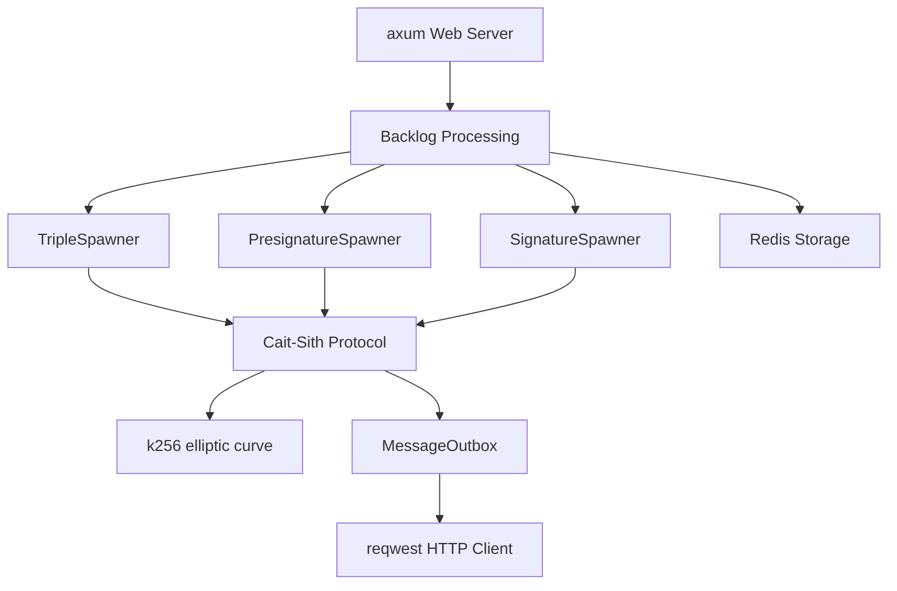

# Rust MPC Codebase Performance & Overhead Audit

This audit report identifies performance bottlenecks, resource overheads, and scaling issues within the Signet MPC distributed codebase. The codebase is analyzed against high-performance, low-latency requirements.

---

## 1. Executive Summary

Below are the top optimizations identified in this audit, ranked by expected cumulative gain in CPU, memory, networking, and latency.

### Top 20 Highest-Impact Optimizations

| Rank | Issue / Optimization | Primary Crate | Impact Area | Expected Gain |
| :--- | :--- | :--- | :--- | :--- |
| **1** | Avoid seeding HPKE CSPRNG from OS entropy for every encryption | `mpc-keys` | Cryptography / CPU | Eliminate OS system calls on message send |
| **2** | Offload blocking Cait-Sith crypto `poke` in presig/signature generation | `mpc-node` | Async Runtime / Latency | Prevent Tokio worker thread starvation |
| **3** | Deduplicate Ed25519 signatures and CBOR serialization on broadcasts | `mpc-node` | CPU / Cryptography | $N \times$ reduction in broadcast CPU time |
| **4** | Replace JSON serialization with binary (Borsh) in Redis storage | `mpc-node` | CPU / Memory | $3-5\times$ smaller payload size, zero allocations |
| **5** | Optimize `sysinfo` process/system metric collection frequency | `mpc-node` | CPU / Memory | Eliminate heavy `/proc` parsing loop |
| **6** | Replace `tokio::sync::RwLock` with synchronous `parking_lot::RwLock` | `mpc-node` | Async Runtime / Locks | Eliminate task spawning in `Drop` & lock queues |
| **7** | Remove `tokio::spawn` task storms in debug registry page | `mpc-node` | Async Runtime | Avoid spawning 2 tasks per generator lifespan |
| **8** | Avoid `format!("{:?}")` string allocation in indexer KDF derivation | `mpc-node` | CPU / Memory | Eliminate dynamic formatting/alloc on indexer ticks |
| **9** | Remove double CBOR serialization in hpke signed message wrapper | `mpc-node` | CPU / Memory | Save 1 vector allocation per packet |
| **10** | Eliminate redundant HKDF expansion in `derive_delta` | `mpc-node` | Cryptography / CPU | Save 1 full HKDF run per signature request |
| **11** | Prevent `to_base58` evaluation inside disabled tracing statements | `mpc-node` | CPU | Save point serialization / formatting on hot path |
| **12** | Direct point comparison in `check_ec_signature` (no SEC1 encoding) | `mpc-crypto` | CPU / Memory | Eliminate SEC1 serialization and allocations |
| **13** | Implement connection pooling/backpressure for message outbox | `mpc-node` | Networking | Prevent task storms when peers are slow or offline |
| **14** | Replace `is_finished` polling loop with event-driven `select!` in sync | `mpc-node` | Async Runtime / CPU | Zero-CPU waiting for synchronization broadcasts |
| **15** | Eliminate unnecessary clones of `MessageData` on broadcasts | `mpc-node` | Memory / CPU | Zero-copy message forwarding to outbox |
| **16** | Avoid re-serializing CBOR payloads during client HTTP retries | `mpc-node` | CPU / Memory | Zero-allocation retries for outbound requests |
| **17** | Cache derived user addresses in Solana indexer | `mpc-node` | CPU | Save key derivation point multiplication |
| **18** | Parallelize transaction fetching in Solana indexer catchup | `mpc-node` | Networking / Latency | Faster catchup under dense load |
| **19** | Optimize Redis transaction script execution and pool sizes | `mpc-node` | Database / Latency | Lower latency database operations |
| **20** | Streamline message routing to bypass outbox queues where possible | `mpc-node` | Latency / Memory | Direct-dispatch for co-located test nodes |

---

## 2. Hotspot Table

| Rank | File | Function / Section | Type | Estimated Impact |
| :--- | :--- | :--- | :--- | :--- |
| **1** | [hpke.rs](file:///home/entropy/void/mpc.overhead/chain-signatures/keys/src/hpke.rs#L71-L91) | `PublicKey::encrypt` | Cryptography / OS | Critical: Blocks on `/dev/urandom` system calls |
| **2** | [mod.rs (protocol)](file:///home/entropy/void/mpc.overhead/chain-signatures/node/src/protocol/mod.rs#L163-L221) | `spawn_system_metrics` | CPU / System | High: Periodically parses `/proc` process lists |
| **3** | [message/mod.rs](file:///home/entropy/void/mpc.overhead/chain-signatures/node/src/protocol/message/mod.rs#L778-L795) | `SignedMessage::encrypt` | Cryptography / CPU | High: Re-signs Ed25519 and re-serializes per receiver |
| **4** | [presignature.rs](file:///home/entropy/void/mpc.overhead/chain-signatures/node/src/protocol/presignature.rs#L176) | `PresignatureGenerator::run` | Async Runtime | High: Cait-Sith math blocks Tokio thread |
| **5** | [signature.rs](file:///home/entropy/void/mpc.overhead/chain-signatures/node/src/protocol/signature.rs#L1215) | `SignatureGenerator::run` | Async Runtime | High: Cait-Sith math blocks Tokio thread |
| **6** | [triple_storage.rs](file:///home/entropy/void/mpc.overhead/chain-signatures/node/src/storage/triple_storage.rs#L57-L84) | `ToRedisArgs` / `FromRedisValue` | Serialization | Medium: Inefficient JSON string encoding |
| **7** | [presignature_storage.rs](file:///home/entropy/void/mpc.overhead/chain-signatures/node/src/storage/presignature_storage.rs#L47-L74) | `ToRedisArgs` / `FromRedisValue` | Serialization | Medium: Inefficient JSON string encoding |
| **8** | [protocol_storage.rs](file:///home/entropy/void/mpc.overhead/chain-signatures/node/src/storage/protocol_storage.rs#L269-L301) | `remove_reserved` | Lock / Task Spawn | Medium: Spawns tokio tasks inside destructors |
| **9** | [debug.rs](file:///home/entropy/void/mpc.overhead/chain-signatures/node/src/web/debug.rs#L60-L76) | `register_task` / `unregister_task` | Task Spawn | Medium: Spawns tokio tasks for registry updates |
| **10** | [indexer.rs](file:///home/entropy/void/mpc.overhead/chain-signatures/node/src/indexer.rs#L129-L134) | `derive_entropy_from_sign_id` | CPU / Memory | Low: String formatting allocations |
| **11** | [kdf.rs](file:///home/entropy/void/mpc.overhead/chain-signatures/node/src/kdf.rs#L12-L27) | `derive_delta` | Cryptography | Low: Redundant HKDF expansion run |
| **12** | [kdf.rs (crypto)](file:///home/entropy/void/mpc.overhead/chain-signatures/crypto/src/kdf.rs#L93-L114) | `check_ec_signature` | Cryptography | Low: Point comparisons via uncompressed encoding |
| **13** | [sync/mod.rs](file:///home/entropy/void/mpc.overhead/chain-signatures/node/src/protocol/sync/mod.rs#L209-L231) | `SyncTask::run` | Async Runtime | Low: Busy polling of synchronization joins |
| **14** | [node_client.rs](file:///home/entropy/void/mpc.overhead/chain-signatures/node/src/node_client.rs#L149-L179) | `post_cbor_response` | CPU / Memory | Low: Serializes payload again on HTTP retries |

---

## 3. Analysis Methodology

### A. Dependency Graph Analysis
* **Primary Cryptography Stack:** Cait-Sith (secp256k1) $\rightarrow$ `k256` (pure Rust curve arithmetic) $\rightarrow$ `x25519-dalek` / `curve25519-dalek` (patched).
* **Storage / DB Stack:** `deadpool-redis` connection pool $\rightarrow$ `redis` async client driver.
* **Network Stack:** `axum` (hyper HTTP) for RPC / webhook ingestion, `reqwest` client for node-to-node HPKE messaging and sync.
* **Overhead Risk:** Multiple serialization libraries (`borsh`, `ciborium` CBOR, `serde_json` JSON) coexist. Intercrate mappings cause redundant transformations.



### B. Async Task Graph Analysis
* Each sign request spawns a dedicated long-running async `SignTask`.
* Sub-tasks are spawned asynchronously for each triple (`TripleGenerator`) and presignature (`PresignatureGenerator`) run using Tokio.
* Unbounded `tokio::spawn` is used to send HTTP network frames in `MessageOutbox::send`.
* The system metrics collector runs blocking system-call operations inside a `spawn_blocking` loop.

### C. Data Flow Analysis (Tracing)

```
[Incoming HTTP Post/WS Event]
      │
      ▼
[Deserialization (CBOR / JSON)] ──► Allocates temporary buffers
      │
      ▼
[Backlog Insertion (Redis)] ────► Allocates & serializes to JSON string
      │
      ▼
[MPC Spawner Matching] ────────► Allocates and clones participants Vec
      │
      ▼
[Cait-Sith Poke Execution] ────► Performs heavy EC arithmetic (Projective -> Affine)
      │
      ▼
[Message Outbox Compaction]
      │
      ▼
[Encryption / Signing] ────────► Ed25519 signature + CBOR double-serialization + HPKE + CSPRNG OS call
      │
      ▼
[HTTP Client Send] ────────────► Spawns unbounded Tokio tasks, serializes CBOR body
```

---

## 4. Component Audit Details

### 4.1 CPU & Cryptography Overhead

#### 1. HPKE Randomness Seeding OS Block
* **Location:** `chain-signatures/keys/src/hpke.rs:72` (in `PublicKey::encrypt`)
* **Why it is expensive:** `<rand::rngs::StdRng as rand::SeedableRng>::from_entropy()` is called for every single message encryption. Seeding a generator via `from_entropy()` performs blocking OS system calls (e.g., reading `/dev/urandom` or using `getrandom`) to populate the generator state. Under intensive node-to-node protocol message exchanges, this generates massive kernel/user space context switching and blocks worker threads.
* **Recommended Fix:** Replace with `rand::thread_rng()` which utilizes thread-local caching seeded once from the OS, performing user-space cryptographic expansion (ChaCha) subsequently:
  ```rust
  let mut rng = rand::thread_rng();
  let (encapped_key, mut sender_ctx) = hpke::setup_sender::<Aead, Kdf, Kem, _>(
      &hpke::OpModeS::Base,
      &self.0,
      INFO_ENTROPY,
      &mut rng,
  )?;
  ```

#### 2. Periodical Process/System Table Parsing Loop
* **Location:** `chain-signatures/node/src/protocol/mod.rs:163-221` (in `spawn_system_metrics`)
* **Why it is expensive:** The collector loops every 5 seconds, instantiating `System::new_all()` (which allocates and populates stats for *all* processes on the system, parsing `/proc` for every pid on Linux) and calls `system.refresh_all()`. It then allocates a *second* `System` object via `System::new_with_specifics` to sample CPU metrics, and queries `Disks::new_with_refreshed_list()` twice. Under load, this spawns huge garbage collection pressure and CPU usage.
* **Recommended Fix:** Reuse a single `System` instance across iterations, and only refresh the specific metrics needed:
  ```rust
  let mut system = System::new();
  // Loop:
  system.refresh_cpu();
  system.refresh_memory();
  // Only refresh disks periodically
  ```

#### 3. Redundant Ed25519 Signatures and CBOR Serializations on Broadcasts
* **Location:** `chain-signatures/node/src/protocol/message/mod.rs:778-795` (in `SignedMessage::encrypt`)
* **Why it is expensive:** During broadcast operations (`SendMany`), `encrypt` is called for every target peer. This method serializes the inner message payload to CBOR, computes an Ed25519 signature of the CBOR bytes, wraps it in `SignedMessage`, and serializes the wrapper again. Since the payload and signature are identical for all $N$ peers (only the HPKE envelope is recipient-specific), doing this in a loop results in $N$ Ed25519 signing operations and $2N$ CBOR serializations instead of 1.
* **Recommended Fix:** Pre-serialize and pre-sign the payload once, and pass the pre-built `SignedMessage` or its inner components to the HPKE encryption loop:
  ```rust
  // Perform once:
  let inner_payload_bytes = cbor_to_bytes(msg)?;
  let signature = sign_sk.sign(&inner_payload_bytes);

  // For each recipient:
  let signed_msg = SignedMessage { msg: inner_payload_bytes.clone(), sig: signature, from };
  let outer_bytes = cbor_to_bytes(&signed_msg)?;
  let ciphered = cipher_pk.encrypt(&outer_bytes, ...)?;
  ```

#### 4. Redundant HKDF Expansion in `derive_delta`
* **Location:** `chain-signatures/node/src/kdf.rs:20-21` (in `derive_delta`)
* **Why it is expensive:** The first `hk.expand(info.as_bytes(), &mut okm).unwrap();` writes the expansion outcome into `okm`. Immediately after, the second `hk.expand` is called and overwrites `okm` with the point coordinates, discarding the first result entirely. This is a wasted cryptographic operation.
* **Recommended Fix:** Remove the first redundant expansion.

#### 5. Expensive EC Point Serialization in `check_ec_signature`
* **Location:** `chain-signatures/crypto/src/kdf.rs:100-109` (in `check_ec_signature` / `into_signature`)
* **Why it is expensive:** It compares `expected_pk == found_pk` by serializing both elliptic curve points into uncompressed SEC1 byte arrays (`to_encoded_point(false)`) and then comparing the byte slices. Serializing points is CPU-heavy and allocates heap buffers.
* **Recommended Fix:** Compare the `AffinePoint` or `VerifyingKey` structs directly, which performs fast, zero-allocation coordinate equality checks:
  ```rust
  if expected_pk == found_pk.as_affine() {
      return Ok(());
  }
  ```

---

### 4.2 Memory & Serialization Overhead

#### 1. Inefficient JSON Storage for Redis Artifacts
* **Location:** `chain-signatures/node/src/storage/triple_storage.rs:57-84` & `presignature_storage.rs:47-74`
* **Why it is expensive:** Completed triple pairs and presignatures (which consist of EC points and scalars) are serialized as string JSON records into Redis. JSON serialization involves heavy string manipulation, formatting floating point/integers, and base58/hex conversions. JSON strings are also $3-5\times$ larger than their native binary representations.
* **Recommended Fix:** Use `Borsh` (already configured in the workspace) or CBOR (`ciborium`) to store binary buffers in Redis, avoiding all string formatting allocations.

#### 2. Double CBOR Serialization in hpke Signed Message Wrapper
* **Location:** `chain-signatures/node/src/protocol/message/mod.rs:778-795` (in `SignedMessage::encrypt`)
* **Why it is expensive:** It serializes the payload, signs it, and then serializes the whole `SignedMessage` wrapper structure. This results in double buffer allocations (`Vec<u8>`).
* **Recommended Fix:** Restructure the protocol envelope to avoid double serialization.

---

### 4.3 Async Runtime Overhead

#### 1. Starving Tokio Event Loop with Cryptographic Math
* **Location:** `chain-signatures/node/src/protocol/presignature.rs:176` and `chain-signatures/node/src/protocol/signature.rs:1215` (in `PresignatureGenerator::run` and `SignatureGenerator::run`)
* **Why it is expensive:** Cait-Sith cryptographic operations (`poke()`) are executed directly on the async task threads. Since Tokio worker threads are cooperative and expect quick yields, running heavy CPU-bound cryptographic operations (which can take several milliseconds to complete) blocks the thread. This stalls network frames reception, indexer polling, and heartbeats.
* **Recommended Fix:** Wrap these `poke()` runs in `tokio::task::spawn_blocking` (similar to how it is done in `triple.rs`):
  ```rust
  let action = tokio::task::spawn_blocking(move || {
      (protocol.poke(), protocol)
  }).await?;
  ```

#### 2. Unnecessary Async Locks (`tokio::sync::RwLock` / `Mutex`)
* **Location:** `chain-signatures/node/src/storage/protocol_storage.rs:214`, `checkpoint_storage.rs:18`, `backlog/mod.rs:227-230`, and debug `TASK_REGISTRY`.
* **Why it is expensive:** Async locks are used to guard local, in-memory collections (`HashMap`, `HashSet`) where the lock is never held across `.await` points. Async locks have significantly higher overhead than synchronous locks (wasted futures scheduling, queue allocations). Furthermore, because async locks cannot be locked in synchronous contexts, this forces spawning a tokio task inside `Drop::drop` (e.g., in `remove_reserved` in `protocol_storage.rs` and debug registry drops), creating task spawn storms.
* **Recommended Fix:** Replace them with synchronous `parking_lot::RwLock` or `parking_lot::Mutex`. This eliminates all task spawning on `Drop`.

#### 3. Task Spawn Storm inside Axum Debug Task Registry
* **Location:** `chain-signatures/node/src/web/debug.rs:69, 180` (in `register_task` and `unregister_task`)
* **Why it is expensive:** Spawns a tokio task (`tokio::spawn`) just to lock an async registry Mutex and insert/remove debug page details *every single time a generator is created or dropped*. Spawning two tokio tasks for every triple, presignature, and signature generator lifespan adds massive scheduler overhead.
* **Recommended Fix:** Change `TASK_REGISTRY` to a synchronous `parking_lot::RwLock` and register/unregister synchronously without task spawns.

---

### 4.4 Networking Overhead

#### 1. Unbounded Task Spawning and Lack of Backpressure in Outbox
* **Location:** `chain-signatures/node/src/protocol/message/mod.rs:950`
* **Why it is expensive:** For every partition to be sent, a new task is spawned via `tokio::spawn` to send the HTTP POST request. There is no pool limit, rate limit, or backpressure constraint. Under high load or during peer network failures, this can stack up thousands of pending tasks and TCP connections, consuming file descriptors and memory.
* **Recommended Fix:** Implement a bounded semaphore or channel worker pool for outgoing request dispatches.

#### 2. Busy Polling of Synchronization Broadcast Joins
* **Location:** `chain-signatures/node/src/protocol/sync/mod.rs:209` (in `SyncTask::run`)
* **Why it is expensive:** Uses a 100ms polling interval (`sync_check_interval`) to check if the broadcast sync task has completed by calling `handle.is_finished()`. This introduces up to 100ms of latency in processing sync state and wastes CPU cycles.
* **Recommended Fix:** Integrate the broadcast `JoinHandle` directly inside `tokio::select!` using `futures::future::OptionFuture`.

---

## 5. Categorized Optimizations

### 5.1 Quick Wins (Less than 1 Day)
* **HPKE RNG Seeding:** Change `<rand::rngs::StdRng as rand::SeedableRng>::from_entropy()` to `rand::thread_rng()` in `hpke.rs`.
* **String Allocation in Hashing:** Change `hasher.update(format!("{:?}", sign_id).as_bytes())` to `hasher.update(&sign_id.request_id)` in `indexer.rs`.
* **Redundant HKDF Expansion:** Remove the first expansion in `derive_delta` (`kdf.rs`).
* **Direct Point Comparison:** Compare `AffinePoint` directly in `check_ec_signature` to bypass SEC1 encoding.
* **Poll-to-Event in Sync:** Remove `is_finished` polling and place the sync join handle directly in the select loop.
* **Evaluate `to_base58` Lazily:** Avoid evaluating base58 formatting directly in disabled tracing log statements.

### 5.2 Medium Effort Optimizations (1–7 Days)
* **Offload Cait-Sith Poke:** Implement `spawn_blocking` wrapper for presign and signature pokes in `presignature.rs` and `signature.rs`.
* **Replace Async Locks:** Refactor `ProtocolStorage`, `CheckpointStorage`, and backlog maps to use `parking_lot` synchronous locks, eliminating tokio task spawning on `Drop`.
* **Clean up Debug registry:** Refactor Axum debug task registry to use synchronous locks to eliminate token task spawns.
* **Deduplicate Broadcast Signatures:** Restructure `SignedMessage::encrypt` to accept pre-signed payloads, running Ed25519 signing only once per broadcast partition.
* **Avoid CBOR re-serialization on client retry:** Cache serialized CBOR bodies in `NodeClient` requests instead of re-running CBOR serialization on every retry attempt.

### 5.3 Major Refactors (Architectural)
* **Borsh Binary Storage in Redis:** Migrating `TriplePair` and `Presignature` Redis serialization from JSON to Borsh binary encoding. This will require writing migration paths or clearing the Redis cache during deployment, and will drastically reduce CPU usage and Redis space.
* **Message Outbox Connection Pooling and Backpressure:** Redesigning the outbox to use a bounded network dispatcher pool to enforce rate limits and apply backpressure on fast-producing generator tasks.

---

## 6. Performance Roadmap

| Recommendation | Crate / File | Est. Effort | Risk | Expected CPU Savings | Expected Memory Savings | Expected Latency Reduction |
| :--- | :--- | :--- | :--- | :--- | :--- | :--- |
| **HPKE RNG Seeding** | `mpc-keys/hpke.rs` | 1 hour | Low | **High** | None | **High** |
| **Deduplicate Broadcast Signatures** | `mpc-node/message/mod.rs` | 1 day | Medium | **High** | Low | **Medium** |
| **Offload Cait-Sith Poke** | `mpc-node/protocol` | 2 days | Medium | Medium | Low | **High** (spikes) |
| **Replace Async Locks** | `mpc-node/storage` | 3 days | Medium | Low | Low | Low |
| **Borsh Redis Serialization** | `mpc-node/storage` | 4 days | High | **High** | **High** | **Medium** |
| **System Metrics Refresh** | `mpc-node/protocol/mod.rs` | 2 hours | Low | **High** | **Medium** | Low |
| **Debug Registry Spawns** | `mpc-node/web/debug.rs` | 4 hours | Low | Medium | Low | Low |
| **Direct Point Comparison** | `mpc-crypto/kdf.rs` | 2 hours | Low | Medium | Low | Low |
| **Sync Event-Driven Select** | `mpc-node/sync/mod.rs` | 2 hours | Low | Low | None | Low |
| **Indexer Hash Allocations** | `mpc-node/indexer.rs` | 1 hour | Low | Low | Low | Low |
| **Redundant HKDF Expansion** | `mpc-node/kdf.rs` | 30 mins | Low | Low | None | Low |
